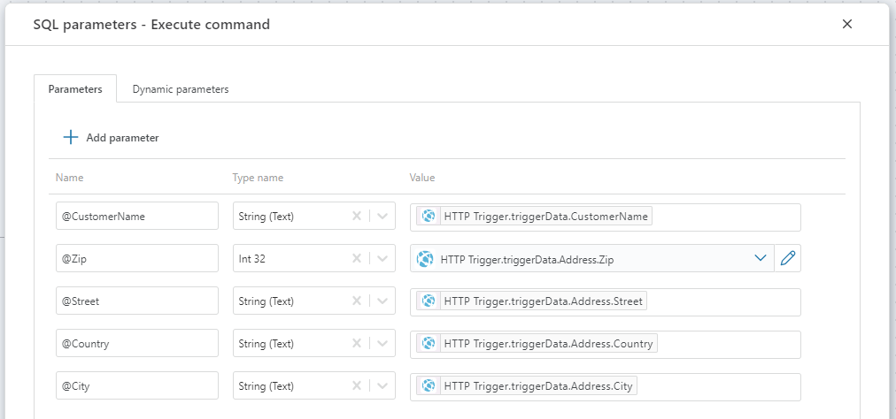
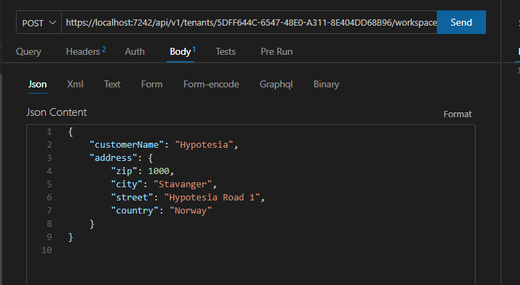

# HTTP trigger

When a Flow is executed from an HTTP request, the HTTP trigger defines how to convert the HTTP request body to a business object.  
You can also get the HTTP endpoint of the Flow from the HTTP trigger. The HTTP endpoint is the URL used to execute the Flow from a 3rd party application.

> [!Note]
> You must define at least one API Key with `Execute` permissions in order to execute a Flow from a 3rd party application. A Flow will have no public HTTP endpoint unless at least one API key is defined in the tenant.

## Properties

| Name                 | Type     | Description                         |
|----------------------|----------|-------------------------------------|
| Title                |          |  |
| Output data type           | Required |The type of data returned by the HTTP trigger after processing the request. |
| Default data | Optional | Default input data used if no data is provided in the request; useful for testing with mock data. |
| Show endpoints |  | Option to display HTTP trigger endpoints, providing the URL for external application calls.|
| Data variable name          | Optional | Name of the variable containing the data. |
| Description          | Optional |  Additional notes or comments about the trigger's purpose or configuration.   |

## Default data
While developing a Flow that will be executed from 3rd party clients like Profitbase InVision or custom apps, you most likely want to test the Flow by executing it from the Designer. This way, you don't have to switch to the 3rd party apps to do test runs.  
If the Flow expects a parameter, you can use the `Default data` property to define a mock business object that is used when the Flow executes. Note that the Default data object is also used as parameter data if no data is passed from the caller (3rd party app), so remember to remove the Default data definition when you're done developing the Flow (unless you want to enable a fallback value if 3rd party clients do not provide a value to the parameter).


<br/>

## Example

This example demonstrates how to run a Flow from the [Thunder Client](https://marketplace.visualstudio.com/items?itemName=rangav.vscode-thunder-client) Visual Studio Code plugin.  

The Flow will add a new customer to a database. The name and address of the customer is passed to the Flow via the HTTP request body.

The customer object looks like this:
```json
{
    "customerName": "Hypotesia",
    "address": {
        "zip": 1000,
        "city": "Stavanger",
        "street": "Hypotesia Road 1",
        "country": "Norway"
    }
}
```
<br/>

#### 1) Create a new Flow

Create a new Flow from the Portal or from the `File` menu in the Designer.

#### 2) Add an HTTP trigger

Add an HTTP trigger to the Flow. This is where you define the shape of the customer object passed in from the caller. By defining the customer object, you can reference it and its properties later in the Flow.  

**1)** Select the HTTP trigger and click the `Data Definition` in the `Properties panel` to define the customer object.  

**2)** Choose `CSharp` as format, and define the following types.  

```csharp
public class Customer
{
    public string CustomerName {get;set;}

    public Address Address {get;set;}
}

public record Address(int Zip, string City, string Street, string Country);
```
> [!NOTE]
> If you need to use multiple types to define the data type of a request body, the main type must be defined at the top.


#### 3) Add the new customer to the database

**1)** Add a SQL Server [Execute command](../actions/sql-server/execute-command.md) action and connect the output and input ports of the HTTP trigger and Execute command action.  

**2)** Select the Execute command action and define the following `SQL parameters` in the `Properties panel`.


**3)** Define the following `SQL expression ` in the `Properties panel`.
```sql
INSERT INTO Customers (CustomerName, Zip, City, Street, Country) VALUES(@CustomerName, @Zip, @City, @Street, @Country)
```

#### 4) Run the Flow from Thunder Client in VS Code.

**1)** Select the HTTP trigger and click `Show endpoints` in the `Properties panel`.  

**2)** Copy the `Short running` URL to the clipboard.  

**3)** Switch to the Thunder Client in VS code and create a new request.  
       1. Use `POST` as HTTP verb  
       2. Paste the URL from step 2)  
       3. Copy the Customer JSON object above and paste it into the JSON Content field  
       4. Press `Send` to execute the Flow. If everything is defined correctly, you should now have a new customer row in the database. If you do not see the expected result, you can inspect the [Execution logs](../flows/execution-logs.md) to investigate any issues.
       
