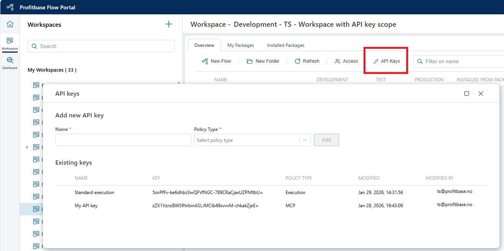

# API Keys

API keys are used to authenticate and authorize API calls to Profitbase Flow. It is required in order to [execute Flows from 3rd party applications](../flows/running-flows/from-third-party-app.md) or make metadata API calls. 
You can define API keys at both the [Tenant](../tenants/api-keys.md) and Workspace level.  

The following apply:
- API keys defined at the [Tenant leve](../tenants/api-keys.md) are used by default. If no API keys are defined at the Workspace level, Tenant-level API keys are valid for all API calls.
- If API keys are defined for a Workspace, those keys must be used for API calls to resources within that Workspace. Tenant-level API keys remain valid for other Workspaces that do not have Workspace-level keys.
- If you want Workspace-level permissions for execution, but still allow Tenant-level permissions for metadata operations (such as upgrade, rename, or clone), you can define API keys only for the relevant policy. For example, to require Workspace-level API keys for execution while allowing metadata operations to use Tenant-level API keys, define a Workspace API key for the `Execute` policy only, and not for the `Configuration` policy

 

 

### Policy types

The policy type determines the scope of the API key.

| Policy         | Permission                         |
|----------------|------------------------------------|
| Execute        | Grants permissions to execute a Flow via its HTTP endpoint. |
| Configuration  | Grants permissions to make metadata API calls to Flow. |
| MCP            | Grants permissions to call a Flow as an MCP tool. |
| A2A            | Grants permissions to call a Flow as a remote agent using the A2A protocol. |

When making an API call to Flow, the API key must be included in [the query string or in the request header](../api-reference/execute-flow/run.md). 