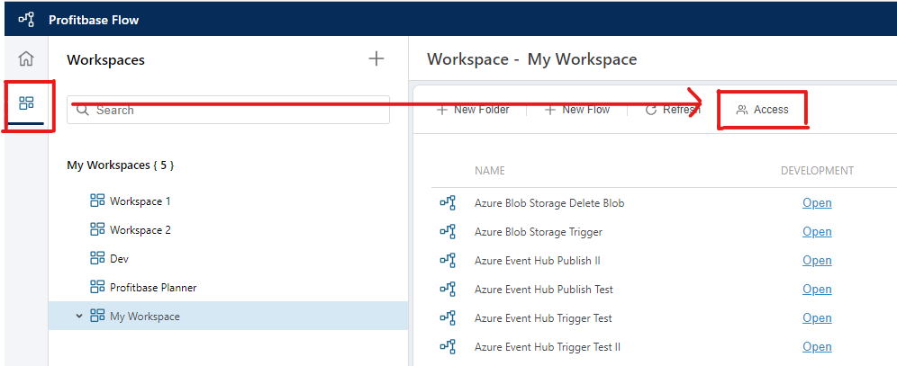

# Workspace Access control

By default, only Tenant administrators have access to a Workspace. In order for non-admin users to get access to a Workspace or Flows in the Workspace, they must be granted access to the Workspace by adding them to the list of allowed users. You can do this from the Workspace details screen in the Flow Portal.  

1) From the left menu, open the Workspaces panel
2) Select a Workspace and click the **Access** button
3) Select (or unselect) the user(s) that you want to grant or deny access to the Workspace  

  

> [!NOTE]
> Permissions apply to the entire Workspace, meaning permissions can not be specified for individual Flows or artifacts such as Workspace Objects and Workspace Variables.