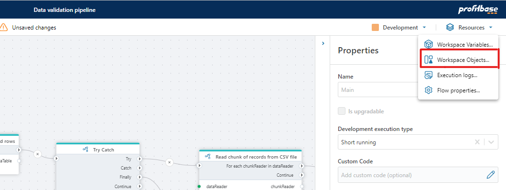

# Workspace Objects

Workspace Object are reusable objects that consist of multiple values. For instance, a Workspace Object can represent a SQL Server connection with properties like server name, database name, username, and password. Instead of defining distinct connection for every SQL Server action within a Flow, you can reuse an existing connection object and maintain its settings in one central location.  

> [!IMPORTANT]
> Properties containing sensitive information will not be available through the user interface after the current browser session has ended. This means that you will not be able to view the value of a sensitive field after you reload the page in the browser.

## Creating Workspace Objects

Workspace Objects are created automatically when you configure an Action or Trigger that require them. For example, if you are confiuring a SQL Server action, you must specify a SQL Server connection. When you do, a SQL Server Connection object is created. The next time you create a SQL Server action, you can reuse the existing SQL Server Connection object.

## Editing and deleting Workspace Objects

To edit or delete a Workspace Object, open the Workspace Objects editor from the Resources -> Workspace Objects menu in the Flow Designer.

> [!NOTE]
> If you edit a Workspace Object which contains secrets such as usernames, passwords or API keys, you must re-enter all secrets before saving. Secrets will not be displayed when opening a Workspace Object for edit.

