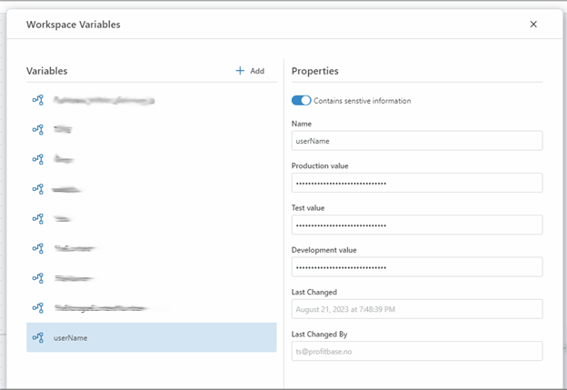

# Workspace Variables


Workspace Variables are simple values that can be shared by all Flows in a Workspace, for example connection strings, usernames, database names or any other type of shared value that you want to use in multiple Flows. Workspace Variables can also be used in Workspace Objects.

Environments and Workspace Variables are closely related. Each Workspace variable can hold one distinct value pr environment. For example, you may define a _ConnectionString_ variable that points to different databases for Development and Production. This functionality enables you to deploy a Flow to different environments without having to make manual changes to the configuration of the Flow when it's deployed to the target environment.  
[Read more about Environments here](../environments.md)


<br/>

  
  
  
<br/>

## Workspace variables containing sensitive information

If a Workspace variable contains sensitive information, such as usernames or passwords, it is strongly advised to toggle the "Contains sensitive information" button "on" for the variable. This will ensure that Workspace variables with this flag enabled will never have their values exposed outside Profitbase Flow. 

## Using Workspace variables

To use a Workspace variable in a field or expression, use the following syntax:  
`
${variable-name}
`

**Example**  
```csharp
${MyConnectionString}
```
