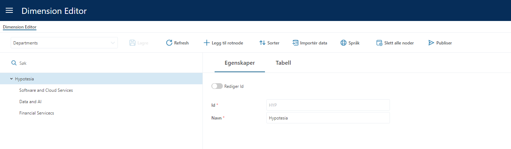
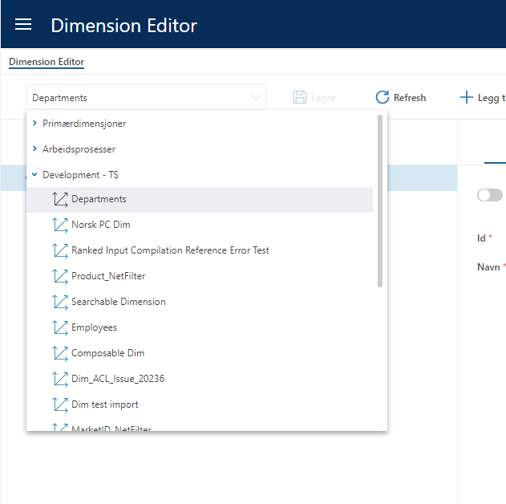
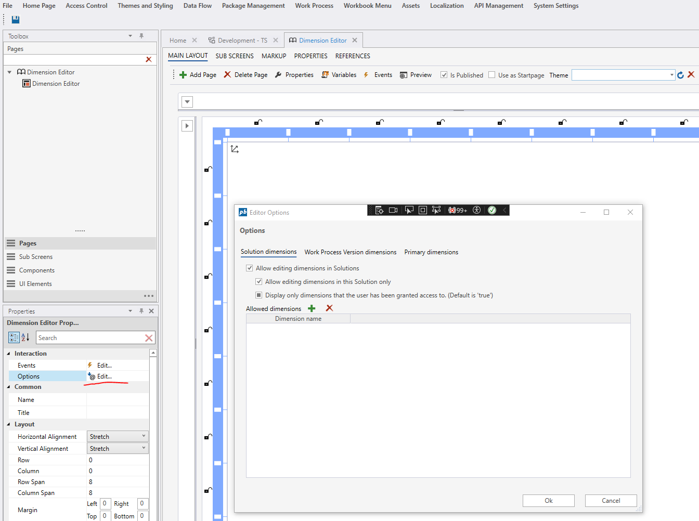
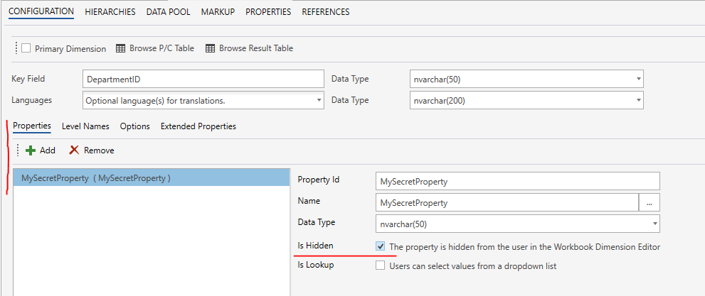
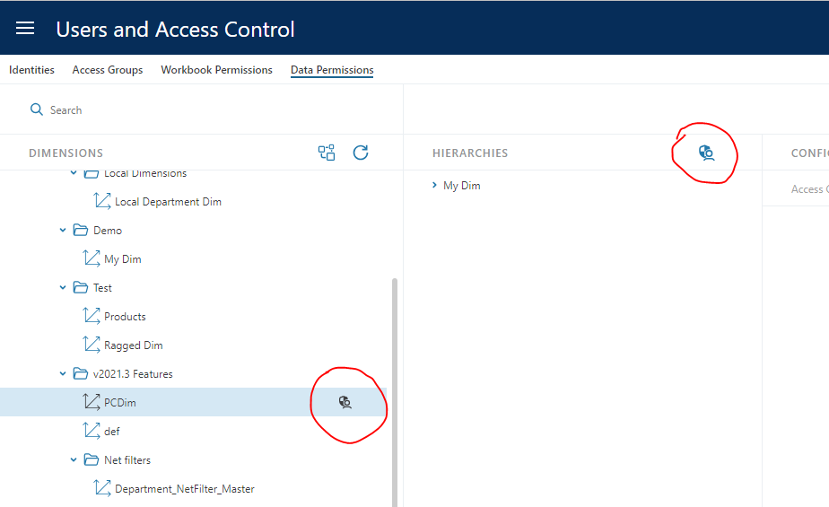
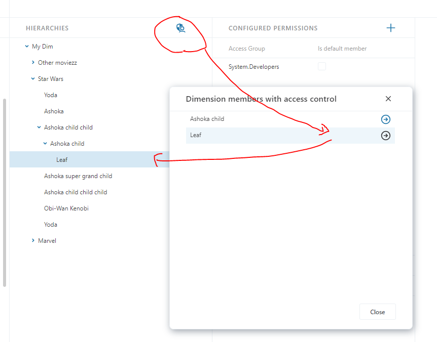

# InVision 2023.7 change log

Change log for InVision version 2023.7 (November 2023) release.

## Dimension editor

### GUI redesign

The user interface of the Dimension editor has been redsigned to make it more intuitive and easier to work with.

All dimensions can now be selected from a single dropdown without having to choose Solution first as a separate step.  

### New display options

We have added more options that gives Solution developers more control over what which dimensions are available in a Dimension Editor.

- Solution dimensions:  Specify whether or not users can select dimensions that are in Solutions (that is not associated with Work Processes)
- Work Process Version dimensions: Specify whether or not users can select dimensions from Solutions that are associated with Work Processes.
- Primary dimensions: Specify whether or not users can select dimensions that are categorized as `Primary dimensions`.
- Allowed dimensions: Solution developers can specify a list of dimensions (by name) that the users can select. Typical use cases for this feature is that you may want to create Workbooks for different business areas, and that you only want to expose certain dimensions for editing in each Workbook.

Note that the these settings apply to the specific Dimension Editor Workbook component only. Other Dimension Editors are not affected.

### Support for hidden dimension properties

We now support defining hidden dimension properties. This feature makes it possible to use the Dimension Editor to manage the structure of a dimension, while preventing users from editing certain properties / attributes. Hidden properties are configured in the Dimension configuration screen in the Designer.

 

## Access control

### Improved discoverability of access control permissions applied to dimensions

Users can now easily identity which dimensions have access control permissions defined, and which members the permissions are applied to.

An icon to the right of the dimension indicates whether access control permissions are configured.

Display a list of all members with access control permissions applied, and quickly navigate to the member in the dimension.
**NOTE!** Because the top node displayed in the ACL editor is NOT an actual dimension member (it's simply the hierarchy name), that values is not displayed in the popup.

### Solution access control permission enforcement change

All Solutions that **does not** have any permissions defined, will now be accessible to _all_ users. Previously, if _any_ Solution had access control permissions defined, users were locked out of all Solutions that they did not have explicit access to. The new behavior is that users are only locked out of a Solution if that specific Solution has access control permissions defined, and the user have not been granted access.  

 

## Spreadsheets

- **Fix:** Pasting invalid values from Excel into dropdown cells is now rendered as blanks instead of the text pasted. Because we now display cells with invalid data as blanks, the user gets a visual indication that the values they pasted did not get accepted.  
- **Fix:** The Unique constraint check on spreadsheet cells is now enforced also when there are no cell validation rules.
- **Fix:** Custom styling of cells now works in conjunction with cell validation rules styling.

 

## Runtime stability and resilience  

- Dataflow executions are now _throttled_ if the server receives too many requests. This may be cause users having to wait longer for completion of submitted work, such as having financial reports updated after a "Save" in Planner.
- Prevent failing Dataflows during Work Process deployments from blocking new deployments indefinitely.
- InVision will now automatically retry running SQL Scripts that fails because of deadlocks
- Transaction pipeline now has a timeout of 300 seconds (5 minutes) for inserting data. This prevents indefinite waits if SQL Server for some reason decides to suspend the operation.
- Dataflow Worker now waits for an amount of time (default is 10 minutes) before shutting down after completing its final job. This shortens the wait time for the first user that submits a new job when the pressure on the system is low.
