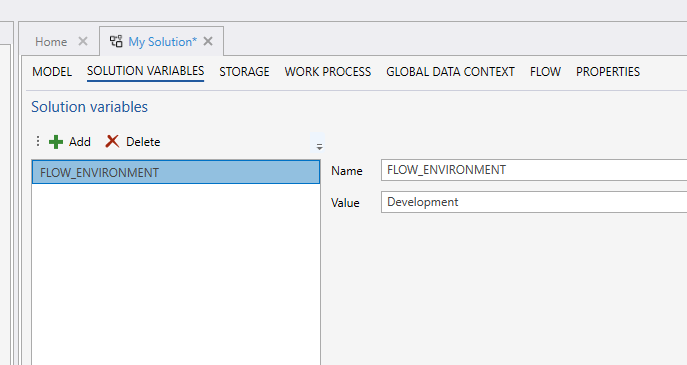
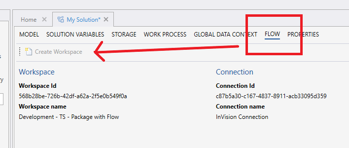
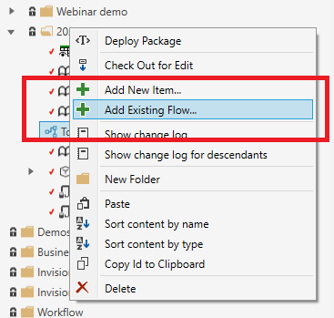

# Changelog 2024.1

<br/>
<br/>

### SQL Script embedding  

You can now embed sql expressions from SQL Scripts in other components by using macros. This enables defining commonly used SQL queries once, and reuse them in multiple components such as SQL Reports and Views.

**Example**  
The example below shows how to embed the query defined in `SharedScript` into the current query using a macro.

```csharp
namespace Local
{
	using System; 
	using System.Collections.Generic;
	using System.Threading.Tasks;
	using Profitbase.Invision.Scripting.Dynamic;
	
	public class MyMacros : MacroExpansionProvider
	{			
		public async Task<string> Import()
		{
			var sqlExpression = await this.ObjectModel.SqlScript("SharedScript").Metadata().GetSqlExpression();
			return sqlExpression;
		}
    }
}
```

### Workbook 

#### Support for Extension Pages and Subscreens

We've added support for Extension Pages and Subscreens in Workbooks. This enables adding custom pages, including popups, and subscreens to Workbooks deployed from Packages without loosing the customizations when the Package is upgraded. 

This feature enables extending standard Workbooks in Profitbase standard solutions such as Planner with custom screens instead of having to create separate Workbooks outside of the Packages.  

Extension pages and Extension Subscreens supports all features that normal pages and subscreens do. When you add an Extension Page to a Workbook, it appears in the nav bar like any other page. If you need to navigate to the Extension Page or perform an action on a component in an Extension Page from a component in a regular page, you can edit the action list of the trigger component and execute the action of the component in the Extension Page. When a Package is upgraded, you will not loose the changes unless the trigger component itself has been removed.


<br/>
<br/>

#### Workbook Component handers using JavaScript by default

When adding new action handlers for Workbook components, the default language is now `JavaScript` instead of Eaze. This adds greater flexibility when defining business logic, and it is more familiar to most developers.

<br/>
<br/>

### Workbook Menu - Open Workbook in new or current browser tab  

You can now specify whether a Workbook is opened in a separate browser tab or not when a user clicks the Workbook menu item. The default behavior is that the Workbook is opened in the current browser tab.  


<br/>
<br/>

### Change tracking on Access Control

Any changes made to access control is now logged. The change log is available only to admins by quering the database directly.

<br/>
<br/>

### Dimension - Support for hidden properties

You can now specify whether a property in a Dimension should be visible to the user in the Dimension Editor or not. Hidden properties are typically used in Master Data Management solutions where some properties are system properties and should never be changed by users.

<br/>
<br/>

### Flow integration

InVision 2024.1 is the first version that ships with full support for [Profitbase Flow](../../flow/flow.md). Flow will be our  data integration, business logic, and business process automation platform going forward. 

<br/>
<br/>

#### Solution Variables

The Solution Variables feature is not strictly a Flow feature, but in 2024.1, the Flow subsystem for InVision is the only service that has implemented support for Solution Variables.  
Solution Variables enables defining key-value pairs that can be used by developers throughout the Solution.  



**Built-in Solution Variables**  

`FLOW_ENVIRONMENT`  
Valid values are `Development`, `Test` or `Production`.  

A Flow is either in a Development, Test or Production environment, possibly having different implementations in each environment or accessing different resources.  
When executing a Flow, you can optionally specify which environment you want to target. If you don't specify the environment, the environment specified by `FLOW_ENVIRONMENT` will be used.  

<br/>
<br/>

#### Link an existing Solution to a Flow Workspace

When you create a new Solution, a separate Flow Workspace is automatically created and linked the Solution. However, if you have an existing Solution created before Flow was released, you need to create the Flow Workspace before you can add any Flows to the Solution. You do this from the `Flow` tab in the Solution screen in the Designer.



> [!NOTE]
> Before you can link a Workspace to an existing Solution, you need to ensure that API keys to Flow has been set up properly. You can find the [API keys](../../flow/tenants/api-keys.md) in the Flow portal.
> 

<br/>
<br/>

#### Executing short-running Flows

You can execute short-running Flows from Workbooks or from Forms. The maximum execution time of a short-running Flow is 5 minutes. A short-running Flow executes faster than a long-running Flow, and a short-running Flow can return a value to the caller, while long-running Flow can not.

Read more:  
[Run short-running Flow from a Workbook](../../invision/docs/flows/how-to/run-flow-from-workbook.md)  
[Run short-running Flow from a Form](../../invision/docs/flows/how-to/run-flow-from-form-schema.md)

<br/>
<br/>

#### Executing long-running Flows

Long-running Flows are similar to InVision Dataflows, and will execute as background tasks without execution time limit. You should execute a Flow as long-running if there is a chance it will take more than 5 minutes to complete.

Read more:  
[Run long-running Flow from a Workbook](../../invision/docs/flows/how-to/run-long-running-flow.md)

<br/>
<br/>

#### Create Flow, Clone and Delete Flows

You can create, clone and delete Flows from the Solution Explorer just like any other Solution object.

> [!NOTE]
> You can only perform these operations if the Solution is linked to a [Flow Workspace](../../flow/workspaces.md).

<br/>
<br/>

#### Add an existing Flow to a Solution

If you have created a Flow from the Flow Portal or the Flow Designer instead of from the InVision Solution Explorer, and you need it to be part of the Solution, you can add it to the Solution by right-clicking a Folder in the Solution Expolrer and choose `Add existing Flow`.  



> [!NOTE]
> You can only add existing Flows from the Flow Workspace that the Solution is linked to.

<br/>
<br/>

#### Edit Flow API keys

Any service, including InVision, that wants to call Flow HTTP APIs must use [API keys](../../flow/tenants/api-keys.md) for authentication and authorization.  

To edit the Flow API keys, go to `System Settings` -> `Edit` -> `Flow` from the `Application menu` in the Designer and copy the [API keys from the Flow Portal](../../flow/tenants/api-keys.md).  
  

<br/>
<br/>

### Stored Procedures

You can now add Stored Procedures to a Solution, which adds yet another option to define reusable business logic that can be executed by the database server.  

[Read more about Stored Procedures here](../../invision/docs/stored-procedures.md)

<br/>
<br/>

### Performance  

Users will experience significant performance improvements in both the web and desktop interfaces

- Large Solutions now opens in ~1 second in the Designer
- Loading filters in Workbooks is much quicker
- Loading Worksheets and Tables with dropdowns is much quicker


<br/>

### See Also
- [Change Log 2025.1](changelog25_1.md)
- [Change Log 2024.4](changelog24_4.md)
- [Change Log 2024.3](changelog24_3.md)
- [Change Log 2024.2](changelog24_2.md)
- [Change Log 2024.1](changelog24_1.md)
- [Change Log 2023.7](changelog23_7.md)
- [Change Log 2023.6](changelog23_6.md)
- [Change Log 2023.5](changelog23_5.md)
- [Change Log 2023.4](changelog23_4.md)
- [Change Log 2023.3](changelog23_3.md)
- [Change Log 2023.2](changelog23_2.md)
- [Change Log 2023.1](changelog23_1.md)
- [Change Log 2022.5](changelog22_5.md)
- [Change Log 2022.4](changelog22_4.md)
- [Change Log 2022.3 pt 2](changelog22_3_2.md)
- [Change Log 2022.3 pt 1](changelog22_3_1.md)
- [Change Log 2022.2](changelog22_2.md)
- [Change Log 5.2](changelog52.md)
- [Change Log 5.1](changelog51.md)
- [Change Log 5.0](changelog5.md)
- [Change Log 4.1](changelog41.md)
- [Change Log 4.0](changelog40.md)
