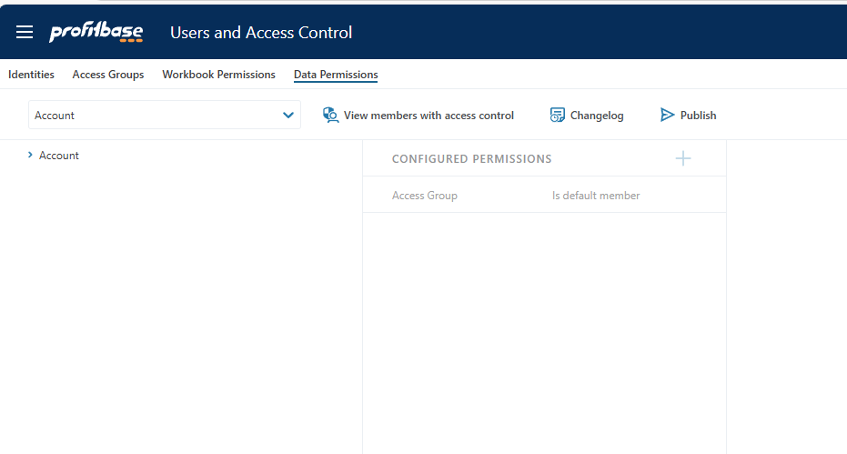

# Changelog 2025.1

Release of Profitbase InVision 2025.1, a service update introducing several enhancements and new features. Additionally, be sure to check out the [February 2025 release of Flow](../../flow/changelog/changelog25_february.md).

## Access Control UI

We've updated the user interface for defining dimension permissions to align with the experience in the Dimension Editor. Users can now select dimensions directly from the dimension selector dropdown, eliminating the need to choose a Solution first.

## New Components

**Toolbar**

In Forms, you can now add toolbars using the new Toolbar component. This provides an alternative button layout and simplifies grouping actions together. We've included a set of standard button icons, making it easy to create toolbars with common functionalities such as saving, deleting, refreshing, copying, and uploading data.

*Read more here: [Toolbar Component Documentation](../docs/forms/formschemas/controls/toolbar.md)*

**Heading**

We've introduced a new Heading component that simplifies the creation of headings. Beyond simple text headings, you can also design creative headings reminiscent of 1995-style designs.

## Improvements

**Input: Enter Key Pressed Event**

The Input control now supports the Enter key pressed event. This enhancement allows users to type a search term and press enter, facilitating the use of an Input as a filter component without data binding.

**Subscreen: Execute Expression Action**

Subscreens now support the Execute Expression action, enabling operations such as variable assignment and displaying toast notifications from subscreens.

**Improved Look of the Workbook Menu**

All items in the Workbook menu now display an icon based on their type. This update provides a more uniform appearance and enhances navigation.

## Bug Fixes

- **Row Locking Out of Sync When Using Inline Filters:** Resolved an issue where row-lock icons in row headers were misaligned with data when filters were applied to data grids.
  
- **Dropdown TreeView Not Displaying Validation Errors:** The Dropdown TreeView control now supports displaying validation errors.
  
- **Error When Adding Style Sheet Without First Selecting a Theme:** In the Designer, adding a style sheet without selecting a theme previously caused an error. This is no longer possible.
  
- **Timeout Issue When Building Dependency Graph for Entire Solution:** For large Solutions, building the entire dependency graph could result in a timeout. This operation now runs as a background service to prevent timeouts.
  
- **Missing Scrollbar in Flow Log Viewer:** The Flow execution log in InVision now displays scrollbars correctly.

 

### See Also

- [Change Log 2025.3](changelog25_3.md)
- [Change Log 2025.2](changelog25_2.md)
- [Change Log 2025.1](changelog25_1.md)
- [Change Log 2024.5](changelog24_5.md)
- [Change Log 2024.4](changelog24_4.md)
- [Change Log 2024.3](changelog24_3.md)
- [Change Log 2024.2](changelog24_2.md)
- [Change Log 2024.1](changelog24_1.md)
- [Change Log 2023.7](changelog23_7.md)
- [Change Log 2023.6](changelog23_6.md)
- [Change Log 2023.5](changelog23_5.md)
- [Change Log 2023.4](changelog23_4.md)
- [Change Log 2023.3](changelog23_3.md)
- [Change Log 2023.2](changelog23_2.md)
- [Change Log 2023.1](changelog23_1.md)
- [Change Log 2022.5](changelog22_5.md)
- [Change Log 2022.4](changelog22_4.md)
- [Change Log 2022.3 pt 2](changelog22_3_2.md)
- [Change Log 2022.3 pt 1](changelog22_3_1.md)
- [Change Log 2022.2](changelog22_2.md)
- [Change Log 5.2](changelog52.md)
- [Change Log 5.1](changelog51.md)
- [Change Log 5.0](changelog5.md)
- [Change Log 4.1](changelog41.md)
- [Change Log 4.0](changelog40.md)
