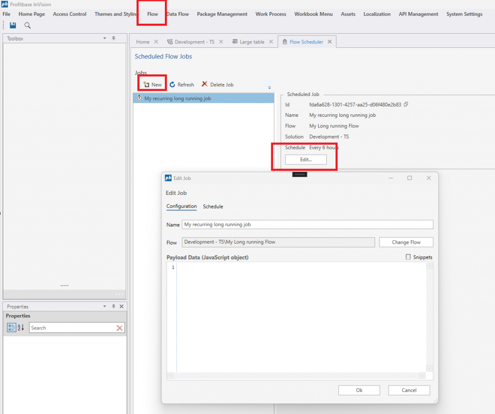

# Changelog 2025.2

Profitbase InVision 2025.2 is a minor release that adds support for scheduling Flows from InVision, and adds overall improvements to performance and stability.

## Scheduling Flows from InVision

In addition to using the built-in scheduler in Profitbase Flow, you can now also schedule Flows from InVision Workbooks and the InVision Designer. This enables creating management dashboards for InVision solutions, including scheduling related Flows which drive business logic, data integrations and financial calculations.

 

## Other improvements

- **Performance and reliability:** Spreadsheet component updated to latest version. This results in faster spreadsheet rendering and scrolling for large data sets.
- **Performance and reliability:** Reduced number of times SQL Server system objects are queried during Work Process Version deployments. This results in faster and more reliable Work Process Version deployment operations.
- **Performance and reliability:** Lookup table changes now emits cache invalidation notifications whenever metadata is modified.
- **Performance and reliability:** When dimensions are deployed, referencing ranked input tables are now compiled only if the **Automatically recompile when Ranked Input column source is updated** is checked or set to default (null).

 

### See Also

- [Change Log 2025.4](changelog25_4.md)
- [Change Log 2025.3](changelog25_3.md)
- [Change Log 2025.1](changelog25_1.md)
- [Change Log 2024.5](changelog24_5.md)
- [Change Log 2024.4](changelog24_4.md)
- [Change Log 2024.3](changelog24_3.md)
- [Change Log 2024.2](changelog24_2.md)
- [Change Log 2024.1](changelog24_1.md)
- [Change Log 2023.7](changelog23_7.md)
- [Change Log 2023.6](changelog23_6.md)
- [Change Log 2023.5](changelog23_5.md)
- [Change Log 2023.4](changelog23_4.md)
- [Change Log 2023.3](changelog23_3.md)
- [Change Log 2023.2](changelog23_2.md)
- [Change Log 2023.1](changelog23_1.md)
- [Change Log 2022.5](changelog22_5.md)
- [Change Log 2022.4](changelog22_4.md)
- [Change Log 2022.3 pt 2](changelog22_3_2.md)
- [Change Log 2022.3 pt 1](changelog22_3_1.md)
- [Change Log 2022.2](changelog22_2.md)
- [Change Log 5.2](changelog52.md)
- [Change Log 5.1](changelog51.md)
- [Change Log 5.0](changelog5.md)
- [Change Log 4.1](changelog41.md)
- [Change Log 4.0](changelog40.md)
