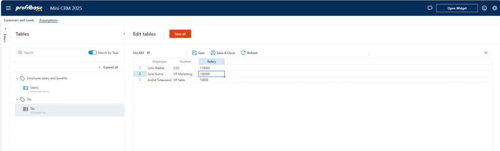
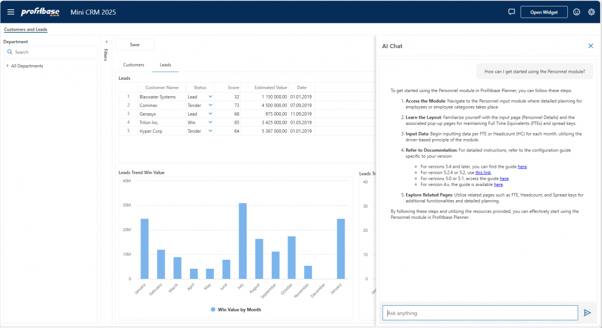
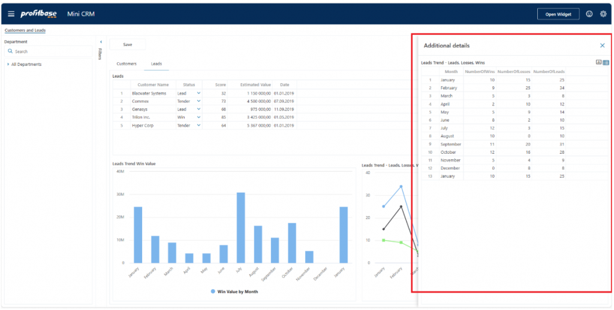
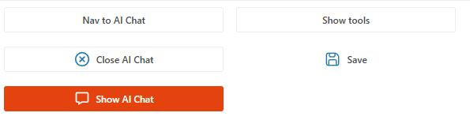

# Changelog 2025.3

InVision 2025.3 introduces the **Table Explorer**, **AI Chat**, new **page rendering options**, and improved support for customizing the **Workbook header toolbar**.

 

##  New Features

###  Table Explorer

The **Table Explorer** lets users quickly and easily find and edit related financial or operational data in a single place—eliminating the need to navigate across multiple tabs, pages, or Workbooks.  

To support this, InVision 2025.3 introduces a **table tagging system** that enables developers to categorize tables by:
- Business domain
- Financial modeling concepts (e.g., cash flow, sales)

Tags, table names, and descriptions help users locate related tables and edit them collectively.  

[Read more here](../docs/tableexplorer.md)

 

### AI Chat

You can now **create AI chats** and embed them into Workbooks, enabling users to have **ChatGPT-like conversations in natural language**, based on:
- Business data and documents stored in Profitbase
- Data from your other business systems

[Read more here](../docs/ai-chat/overview.md)

 

### Display Page in Drawer

A **Drawer** is a panel that slides in from the right, displaying a Workbook Page.

**Use cases**:
- Provide supporting tools or context to primary page data
- Easy dismissal by users

**Drawer features**:
- Resizable and closable by the user
- Can be opened or closed programmatically using `Navigate To`, `Show`, or `Hide` actions  

[Read more here](../docs/workbooks/drawers.md)

 

## Enhanced Customization

### App Header Button
The new **App header button** component allows you to add **custom actions** to the Workbook toolbar. These buttons visually match built-in buttons.

**Features**:
- Conditional enabling/disabling
- Available in both:
  - Standalone **Workbook components** – [Read more here](../docs/workbooks/components/uielements/app-header-button.md)
  - **Forms** – [Read more here](../docs/workbooks/components/uielements/app-header-button.md)

 

### Button – Image Selector Support
You can now choose from a **range of built-in icons** when selecting an icon for Workbook buttons. This helps maintain visual consistency with the current application theme.

 

### See Also

- [Change Log 2025.2](changelog25_2.md)
- [Change Log 2025.1](changelog25_1.md)
- [Change Log 2024.5](changelog24_5.md)
- [Change Log 2024.4](changelog24_4.md)
- [Change Log 2024.3](changelog24_3.md)
- [Change Log 2024.2](changelog24_2.md)
- [Change Log 2024.1](changelog24_1.md)
- [Change Log 2023.7](changelog23_7.md)
- [Change Log 2023.6](changelog23_6.md)
- [Change Log 2023.5](changelog23_5.md)
- [Change Log 2023.4](changelog23_4.md)
- [Change Log 2023.3](changelog23_3.md)
- [Change Log 2023.2](changelog23_2.md)
- [Change Log 2023.1](changelog23_1.md)
- [Change Log 2022.5](changelog22_5.md)
- [Change Log 2022.4](changelog22_4.md)
- [Change Log 2022.3 pt 2](changelog22_3_2.md)
- [Change Log 2022.3 pt 1](changelog22_3_1.md)
- [Change Log 2022.2](changelog22_2.md)
- [Change Log 5.2](changelog52.md)
- [Change Log 5.1](changelog51.md)
- [Change Log 5.0](changelog5.md)
- [Change Log 4.1](changelog41.md)
- [Change Log 4.0](changelog40.md)
