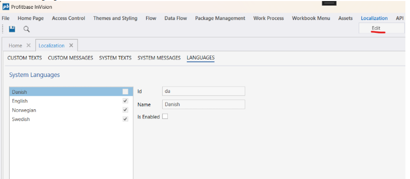
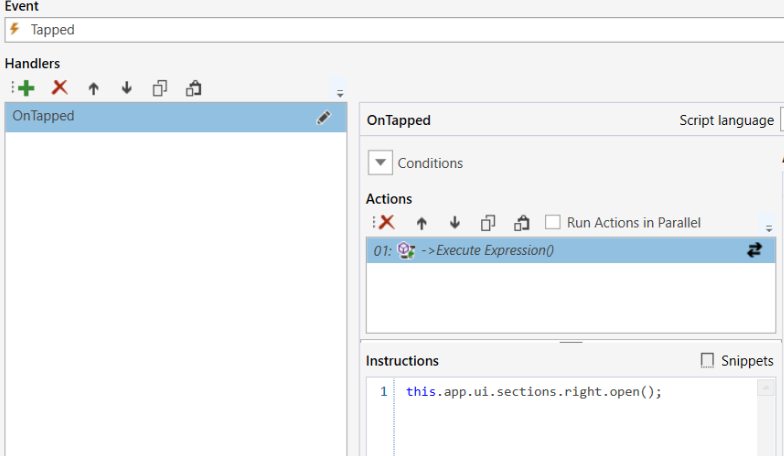
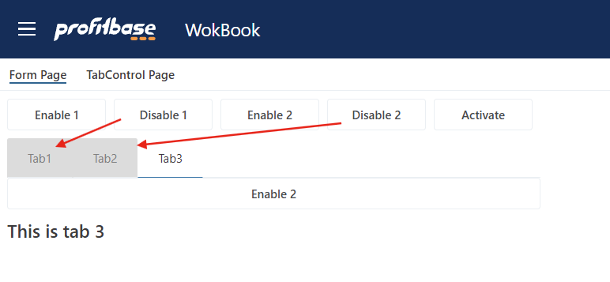
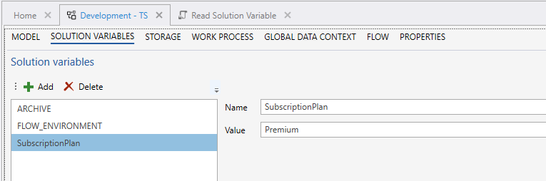
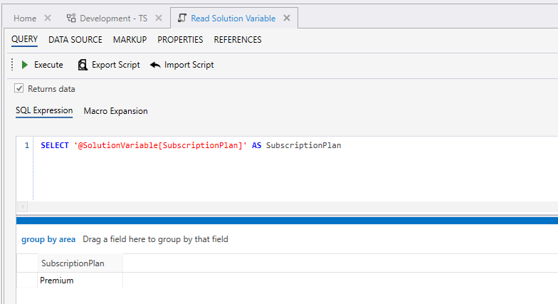

# Changelog 2025.4


The 2025.4 release of InVision focuses primarily on developer features and numerous improvements to the underlying platform and infrastructure. Continue reading below to learn about the new features and enhancements for building InVision solutions.

<br/>

##  Authentication and session timeout enhancements

Users can now be idle for long periods of time before the session automatically times out, forcing a reload the application manually (triggering a re-authentication).

##  Disable languages from being selected by users

InVision comes with a set of languages natively supported by the platform. However, you don’t necessarily implement support for all the languages when building solutions. To prevent users from selecting a language you haven’t implemented support for, you can now specify which language options you want users to be able to select from, for example only English.

You can now configure this behavior from the [Localization](../docs/translationsloc.md) settings in the Designer, by selecting which language options should be available to end users.  




<br/>

## Workbook actions and APIs to programmatically open and close sections

You can now open and close Workbook sections (top, left and right) either programmatically or using Workbook [component actions](../docs/workbooks/programmingmodel/interactionmodel/workbookactions.md). This offers authors of highly dynamic Workbooks more flexibility in how to build user interfaces, by automatically showing or hiding sections of the UI based on choices made by the user – or the general state of the application.



<br/>

## Table columns now support the Default value property for new non-null columns

The Default value [property](../docs/tables/columnproperties/basiccolproperties.md) is now automatically applied when the schema of a table changes. This is useful when you add a new PK (or non-nullable) column to an existing table. The Default value can be a value or a function, for example NEWID().


<br/>

## Improved reusability for TableView – selection options can now be configured at Workbook component level

When using [TableViews](../docs/tableview.md) to list data, you can now specify the selection behavior and rules per instance instead of on the object definition level. This means you can now reuse the same TableView multiple times, but with different selection configuration. For example, you may have a Workbook with a limited (or read-only) functionality, but you want to reuse the same TableView that’s available to power users with admin permissions in another Workbook.


<br/>

## Support for programmatically enabling and disabling tabs in Forms

You can now programmatically enable and disable tabs in Forms using the new [enable and disable APIs](../docs/forms/formschemas/controls/tabcontrol.md#enabletab-and-disabletab).

**Example**

The example below shows how to programmatically enable the tab named “tab1”.

```
this.controls.myTabControl.enableTab('tab 1');
```



<br/>

## Support for stopClickEventPropagation to more Form controls

The following [controls](../docs/forms/formschemas/controls.md) now support the **stopClickEventPropagation** and click events:

- Button
- SplitButton
- DatePicker
- Dropdown
- RichText
- TextArea
- ToggleButton
- Image
- Input

The stopClickEventPropagation makes it easier to control the focus of elements in list controls using complex item templates.

## Support for reading Solution Variables using Directives

You can now read Solution Variables using Directives, for example in SQL scripts, custom queries, etc. This gives developers a built-in mechanism to define global variables that are easier to use than the Lookup function, when there’s no need for conditional lookups.



<br/>



<br/>

## Misc

- Deprecation notice for Dataflows is now always visible in the Designer, both in the editor screen, and in the “New object” dialog.
- The ordering of Work Process Versions are now the same in both the Workbook menu and the Work Process Version manager.
- Fixed an issue that prevented installing PowerShell modules from NuGet.

<br/>

### See Also

- [Change Log 2025.3](changelog25_3.md)
- [Change Log 2025.2](changelog25_2.md)
- [Change Log 2025.1](changelog25_1.md)
- [Change Log 2024.5](changelog24_5.md)
- [Change Log 2024.4](changelog24_4.md)
- [Change Log 2024.3](changelog24_3.md)
- [Change Log 2024.2](changelog24_2.md)
- [Change Log 2024.1](changelog24_1.md)
- [Change Log 2023.7](changelog23_7.md)
- [Change Log 2023.6](changelog23_6.md)
- [Change Log 2023.5](changelog23_5.md)
- [Change Log 2023.4](changelog23_4.md)
- [Change Log 2023.3](changelog23_3.md)
- [Change Log 2023.2](changelog23_2.md)
- [Change Log 2023.1](changelog23_1.md)
- [Change Log 2022.5](changelog22_5.md)
- [Change Log 2022.4](changelog22_4.md)
- [Change Log 2022.3 pt 2](changelog22_3_2.md)
- [Change Log 2022.3 pt 1](changelog22_3_1.md)
- [Change Log 2022.2](changelog22_2.md)
- [Change Log 5.2](changelog52.md)
- [Change Log 5.1](changelog51.md)
- [Change Log 5.0](changelog5.md)
- [Change Log 4.1](changelog41.md)
- [Change Log 4.0](changelog40.md)
