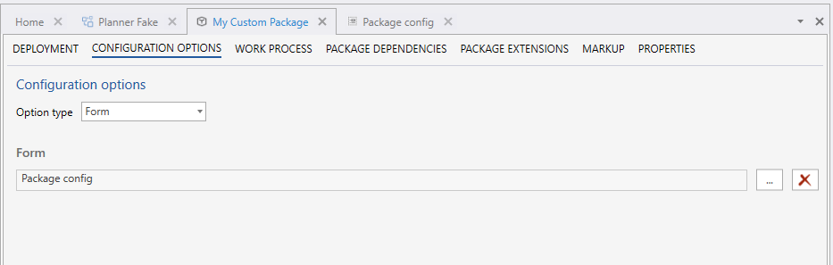
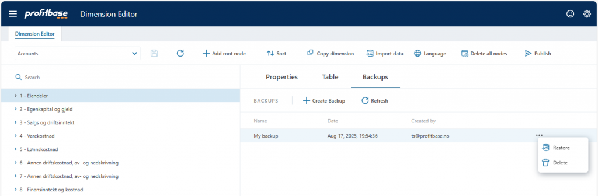
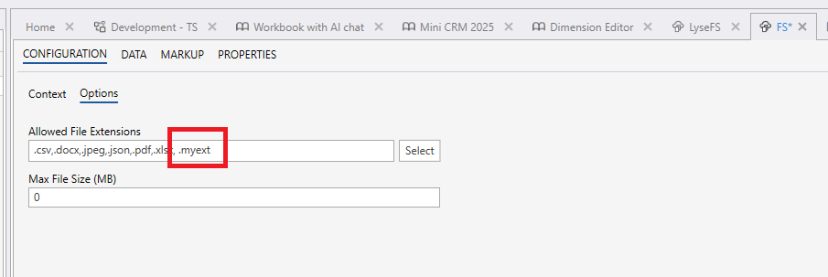
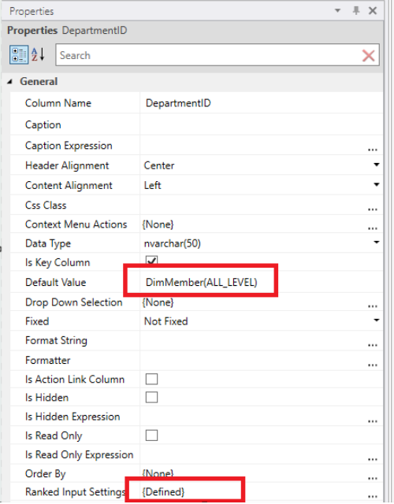
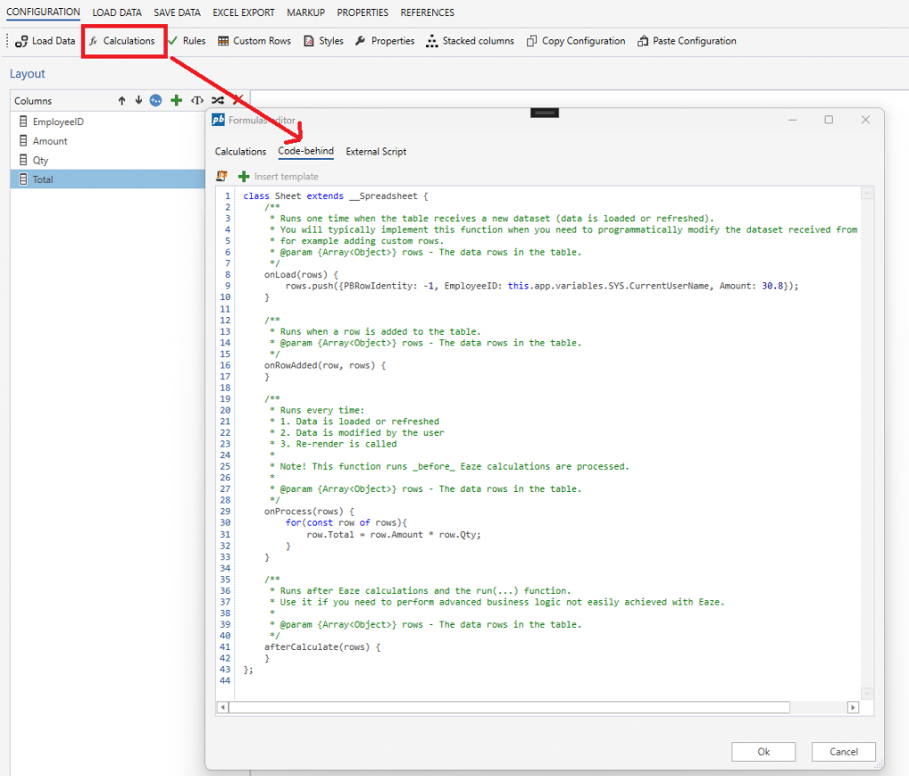

# Changelog 2025.5

This release introduces several enhancements aimed at improving flexibility, usability, and integration across key components.

Forms can now be used to configure Work Process versions, offering greater control over interface design and validation. Dimension backups are created automatically on publish, with support for manual backups via the editor. File uploads now accept non-standard extensions, including those used by internal enterprise systems. Ranked Input tables support the DimMember(ALL_LEVEL) function for default values, and JavaScript can now be used directly in spreadsheets for advanced logic and row generation. The release also includes bug fixes related to default language settings and start page behaviour during deployment.

 

## Support for using Forms for configuring packages instead of Package Properties

You can now use Forms instead of Package Properties to configure settings for Work Process versions. This gives Package authors full flexibility in designing the user interface, implementing business logic, collecting data, and validating inputs. The result is a more user-friendly and consistent experience when configuring Work Process versions.

To use a Form to as the configuration interface for Work Process versions, add a Form to the Package and select it in the Configuration Options page of the Package editor.

 

## Backup / restore of dimensions

The system now automatically creates a backup of dimension data every time it is published to. You can also create manual backups using the Dimension Editor UI.

By default, each dimension supports up to 10 backup slots—5 reserved for automatic backups upon publishing, and 5 for manual backups.

To restore a backup, simply hover over it and press “Restore”.

 

## Support for uploading files with any file extension to File Storage

The File Storage component now supports uploading files with non-standard file extensions. Users can select **All files**, or add the desired extension to the **Allowed File Extensions** list in the designer.

This feature was added to support files typically generated by internal enterprise applications, which often use proprietary formats or custom extensions.

 

## Set ‘All Level’ as default value for new rows in Ranked Input tables

Ranked Input tables now support the new DimMember(ALL_LEVEL) function, allowing the default value for new rows to be set to the “All level” fallback. This fallback matches any value (*) when processed by Flow.

 

## Spreadsheet code-behind

You can now use JavaScript directly in Worksheets, Tables, and SQL (tabular) reports to run calculations, implement business logic, and create custom rows.

This feature enables advanced scenarios beyond what Eaze (traditional calculations) supports, and eliminates the need for a separate JavaScript Solution object.

 

## Bug fixes

- In on-premises deployments, the default language was previously set to English unless users explicitly selected a different language. The system now uses the default value specified in appsettings.json instead.
- Previously, the start page (if defined) was automatically switched to the target Solution when a Solution was cloned or backed up. It is now only switched when a Package or Work Process version is deployed.

 

### See Also

- [Change Log 2025.6](changelog25_6.md)
- [Change Log 2025.4](changelog25_4.md)
- [Change Log 2025.3](changelog25_3.md)
- [Change Log 2025.2](changelog25_2.md)
- [Change Log 2025.1](changelog25_1.md)
- [Change Log 2024.x Series](changelog24_1.md)