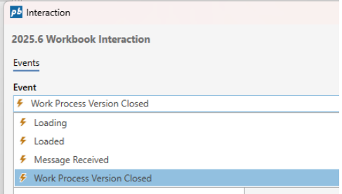
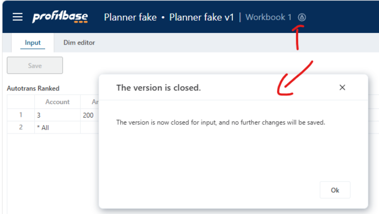
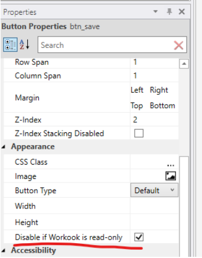
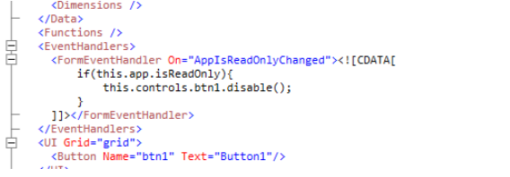
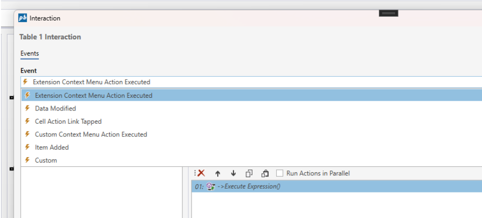
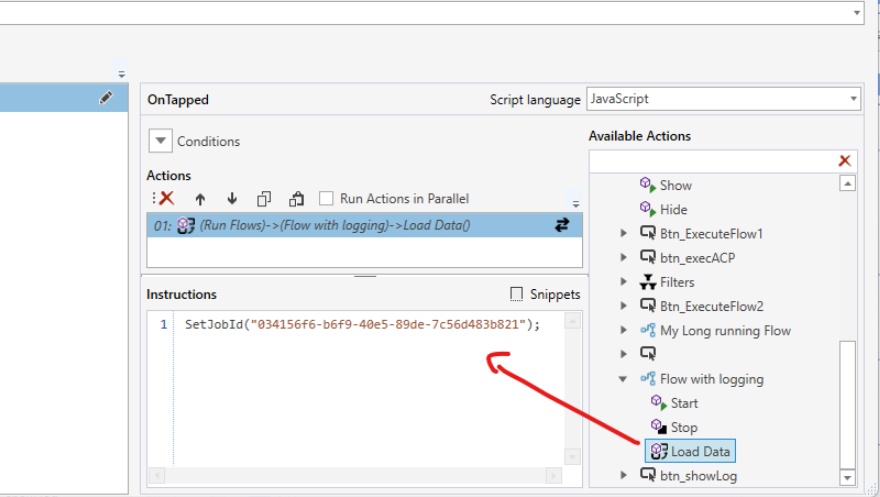

# Changelog 2025.6

The 2025.6 release of InVision delivers major collaboration improvements, enhanced Work Process version handling, new extension points for context menus, and upgrades to platform performance and infrastructure. This update provides end-users with richer interaction capabilities and gives developers more control and flexibility when building enterprise-grade solutions.

 

**Work Process enhancements** bring smarter handling of closed versions: automatic read-only mode, user notifications, and button auto-disabling, all supported by new APIs and events for fine-grained control.

Developers can now **extend context menus** in Worksheets, Tables, and SQL Reports with custom actions that persist through upgrades. The **Flow execution** log gains support for viewing previous runs via JobID.

The update also includes **UI and data handling fixes**, performance improvements, updated infrastructure components, and deprecation of InFront report rendering.

 

## User Chat for real-time collaboration

The new [User Chat](../docs/workbooks/components/userchat/user-chat.md) component enables users to exchange messages and collaborate directly within the application — in the context of a specific page, dashboard, report, or even a particular row or data point.

Solution developers can define the chat context and include as many chat components in a Workbook as needed (e.g., one per page or a single chat in a popup).

If a user does not see a new message for 5 minutes, you can trigger a Flow to send a notification (email or Teams).

 

## Work Process enhancements: smarter closing & read-only mode

InVision 2025.6 adds a range of enhancements for handling **closing Work Process Versions** in Workbooks. The new features provides more options to Solution developers for fine-grained control, but also removes the need for custom business logic to handle the most common scenarios – such as preventing data from being saved when versions are closed, and disabling buttons.

### Work Process Version Closed event

When a Work Process version is closed (from the backend), a message is sent to all open Workbooks in the version notifying that the Work Process version is now closed. When this happens, a Work **Process Version Closed** event is raised. Solution developers can handle this event to implement custom business logic.

 

### System prevents component from saving changes when a version is closed

When a Work Process version that a Workbook belongs to is closed, the Workbook automatically enters read-only mode. When this mode is enabled, modified data in Worksheets, Tables and Forms can no longer be saved.

### User notification

Users see an automatic popup notification if they have a Workbook open when the version is closed.

 

### Auto-disabling buttons when a version is closed

Buttons can now be configured to **always disable automatically** when the Workbook is in read-only mode. Recommended default behavior.

 

## New developer APIs

The following APIs and events provide fine-grained control over version state behavior:

- Added a new event to Forms (**AppIsReadOnlyChanged**) that is raised when the app transitions to read-only.
- Added new [JavaScript APIs](../docs/workbooks/programmingmodel/apis/base-apis.md#isreadonly) for Solution developers to [access the read-only state](../docs/workbooks/programmingmodel/apis/base-apis.md#isreadonly) of the Workbook
- Added new [JavaScript APIs](../docs/workbooks/programmingmodel/variables.md?tabs=javascript#system-variables) for Solution developers to [read the id of the Work Process Version that the Workbook belongs to](../docs/workbooks/programmingmodel/variables.md?tabs=javascript#system-variables).
- Renamed the current **SYS.WorkProcessId** and **SYS.WorkProcessVersionId** to **VM.SelectedWorkProcessId** and **VM.SelectedWorkProcessVersionId** (VM = “Version Manager)

 

## Extension context menu items for Worksheets, Tables & SQL Reports

Partners and customers can now extend the context menus in Worksheets, Tables and SQL reports that are part of standard solutions with custom actions. Extension context menu items are preserved during package upgrades, so this feature enables partners and customers to extend our standard products like Planner (budgeting and forecasting) and Consolidation with their own custom business logic.

Worksheets, Tables and SQL Report components now also supports a new **Extension Context Menu Action Executed** event where the actual handling of the event is done.

 

## Flow execution log - display log for a previous execution

The Flow execution log now supports displaying the log for a previously executed Flow by providing the JobID through the new **SetJobId(…) API**.

This enables creating custom UIs for operations, where the same log viewer can be used for both executing and browsing previous Flow executions.

 

## Worksheet & Table improvements

- Default values are now applied for hidden columns
- Fixed issue with “Select all” not selecting all rows/columns
- Cell selection remains visible when Factor / Distribution dialogs open
- Users can adjust selected cells after dialog is opened
- Summary rows now update correctly after filtering
- `@CurrentUserName` now supported in dropdown filter expressions
- Fixed timezone issues affecting dates
- Fixed TreeView filter issues with multi-level access control
- Table Explorer can now pre-filter visible tables via `SetTagFilter(...)` in Load Data

 

## Infrastructure & performance

- **Performance:** The app bundle size is now smaller, making it load faster to the browser.
- **RabbitMQ:** InVision now uses the latest version of the RabbitMQ SDK and APIs
- **FlowID in SYS_Objects:** Solution developers can now find the FlowID via the SYS_Objects view for Flows in a Solution
- **InFront deprecation:** Support for rendering Profibase InFront reports in InVision has been removed.

 

### See Also

- [Change Log 2025.5](changelog25_5.md)
- [Change Log 2025.4](changelog25_4.md)
- [Change Log 2025.3](changelog25_3.md)
- [Change Log 2025.2](changelog25_2.md)
- [Change Log 2025.1](changelog25_1.md)
- [Change Log 2024.x Series](changelog24_1.md)
