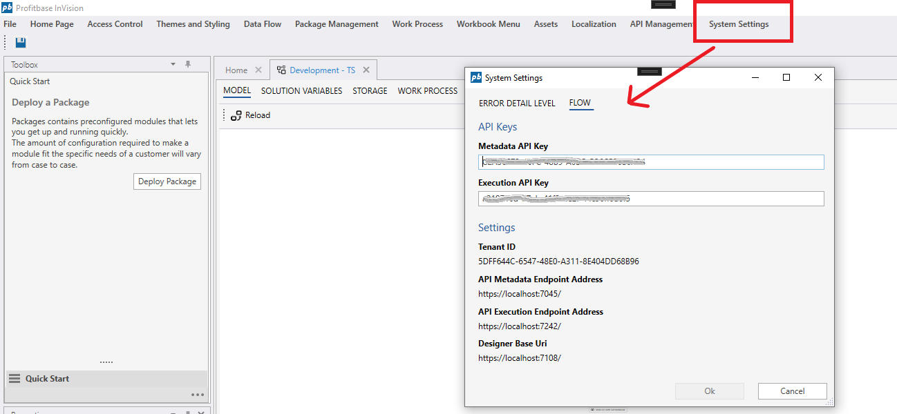

# API keys  

Any service, including InVision, that wants to call Flow HTTP APIs must use [API keys](../../../flow/tenants/api-keys.md) for authentication and authorization.  
API keys are automatically set up when InVision is deployed with Flow, so you don't have to edit API keys unless the API keys are revoked from the Flow Portal by an admininstrator.  
When API keys are revoked or updated, you need to update the [Flow API keys](../../../flow/tenants/api-keys.md) used by InVision, or else any API call to Flow will fail with an authentication error.  

To edit the Flow API keys, go to `System Settings` -> `Edit` -> `Flow` from the `Application menu` in the Designer and copy the [API keys from the Flow Portal](../../../flow/tenants/api-keys.md).  
  
