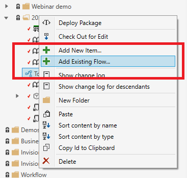

# Add a Flow to a Solution  

To add a Flow to a Solution, simply right click a folder in the Solution Explorer and select `Add new item`. When the Flow has been added, double-click the object in the Solution Explorer to launch the editor.  

## Add an existing Flow to a Solution  

If you have created a Flow from the Flow Portal or the Flow Designer instead of from the Solution Explorer, and wants to include it in the Solution, right-click a folder in the Solution Explorer and select `Add existing Flow`.  

> [!NOTE]
> You can only add existing Flows from the Flow Workspace that the Solution is [linked](link-to-flow-workspace.md) to.

