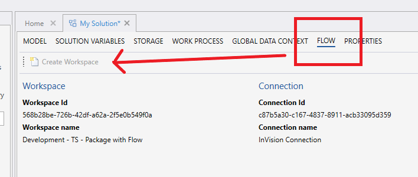

# Link to Flow Workspace  

An InVision Solution must be linked to a [Flow Workspace](../../../../flow/workspaces.md) in order to create or execute any Flows. This happens automatically when a Solution is created. If, however, you upgrade an old Solution that was deployed before Flow was released, you need to create the link manually. To do this, open the Solution in InVision, go to the `Flow` tab and click `Create Workspace`.  

> [!NOTE]
> Ensure that API keys have been set up correctly, or else the request will fail with an authentication error.  

