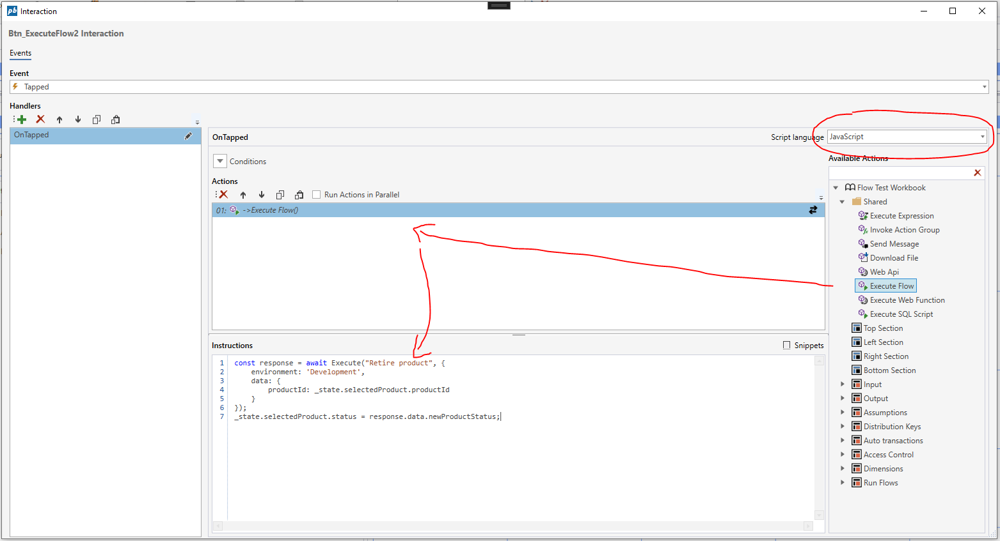
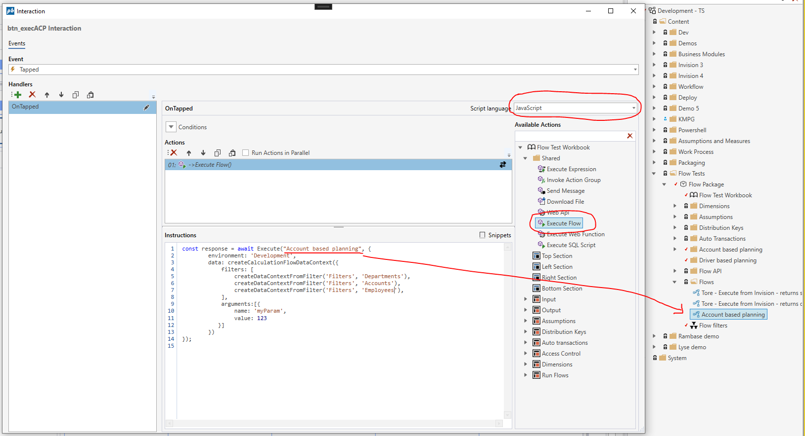

# How to: Run Flow from Workbook

To run a Flow from a Workbook, use the `Execute Flow` Workbook action. The Flow that you want to run must exist in the same Solution as the Workbook.

> [!IMPORTANT]
> 1) Both of the examples on this page requires using **JavaScript** as script language instead of **Eaze** in the action handler definitions.  
> 2) The Flow that you want to run must exist in the same Solution as the Workbook.

## Example: Execute Flow with parameters  

This example shows how to execute a Flow named `Retire product` that requires the id of the product to retire, and returns the new status of the product.
The Flow should have a [HTTP Trigger](../../../../flow/triggers/http-trigger.md) with a `Data Definition` object that contains a product id property like shown below.

**HTTP Trigger Data Definition**  

 
```csharp
public record ProductInfo(string ProductId);
```



****
```javascript
const response = await Execute("Retire product", {
    environment: 'Development',
    data: {
        productId: _state.selectedProduct.productId
    }
});
_state.selectedProduct.status = response.data.newProductStatus;
```


## Example: Execute Flow with Data Context

This example shows how to pass a data context when executing a Flow that uses Calculation Flow actions, such as the [Read Calculation Flow Input](../../../../flow/actions/profitbase-invision/calculation-flow/read-calculation-flow-db-input.md) action.  

The `createCalculationFlowDataContext(..)` creates a data structure that Calculation Flow actions in a Flow uses to determine the data slice to process.
If you want the data context to include the selection the user has made with filters in the Workbook, you must include the selection of each filter using the `createDataContextFromFilter(...)` like shown below. The data source of the filter (for example a dimension) must be the Reference Table used in the [Table relationship](../../../../flow/actions/profitbase-invision/calculation-flow/table-relationship.md) property in the Calculation Flow action (for example the [Read Calculation Flow Input](../../../../flow/actions/profitbase-invision/calculation-flow/read-calculation-flow-db-input.md) action).

You can also pass in custom arguments. These can either be used in the [Parameter relationships](../../../../flow/actions/profitbase-invision/calculation-flow/parameter-relationship.md) property of the Calculation Flow action, or simply as a normal variable in the Flow business logic.

Both the `filters` and `arguments` properties are optional.




```javascript
const response = await Execute("Account based planning", {
    environment: 'Development',
    data: createCalculationFlowDataContext({
        filters: [
            createDataContextFromFilter('Filters', 'Departments'),
            createDataContextFromFilter('Filters', 'Accounts'),  
            createDataContextFromFilter('Filters', 'Employees'),
        ],
        arguments:[{
            name: 'myParam',
            value: 123
        }]
    })
});
```


