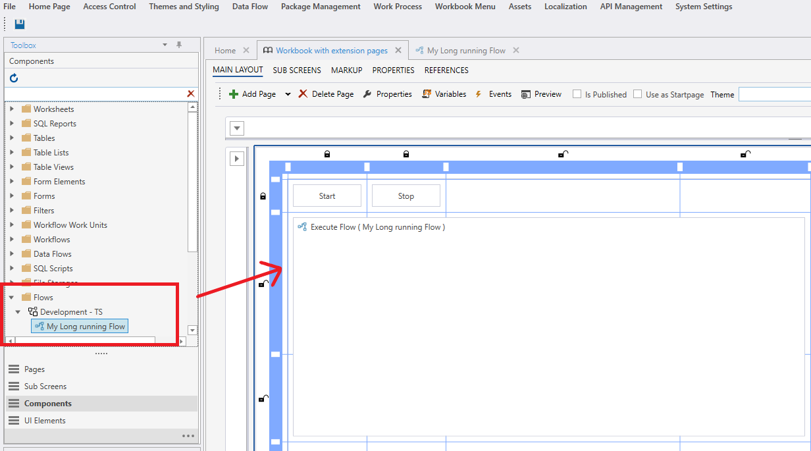
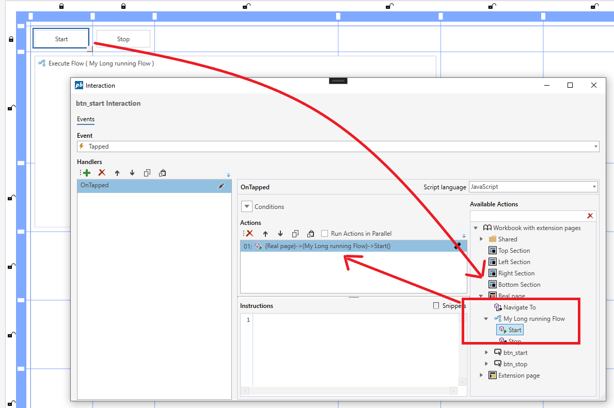
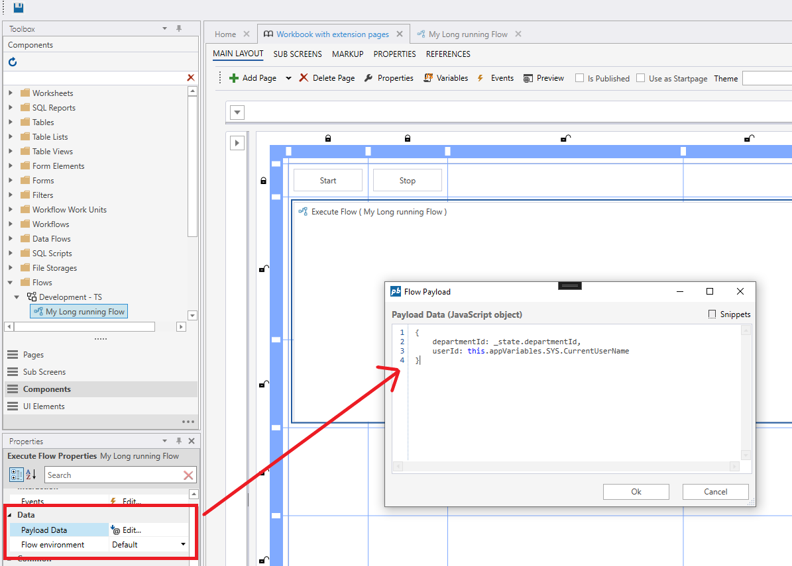

# How to: Run long-running Flow  

To run a long-running Flow from InVision, drag and drop a Flow onto a Workbook Page from the toolbox.

Next, you need to start it by calling the `Start` action.

 

If you need to define arguments to the Flow, open the `Payload Data` editor from the Properties panel, then define a JavaScript object which match the format of the startup argument expected by the Flow.  
If you are not sure about the format of the argument object, open the Flow and inspect the Trigger action.  

