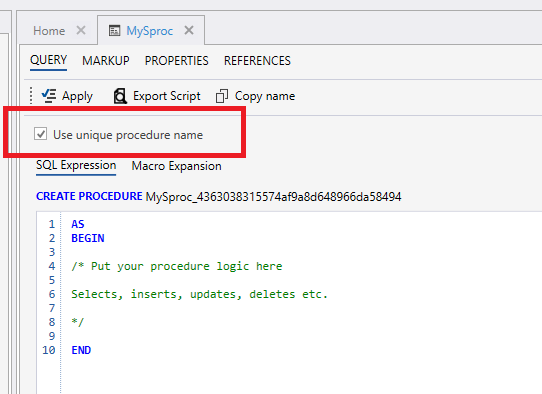

# Stored Procedures

You can define Stored Procedures which will execute in the InVision Database.  

When you create a Stored Procedure, it will get a unique name. The reason for this is to ensure that there will be no name collisions with Stored Procedures in other Solutions, which typically happens if you clone a Solution or deploy a Work Process Version.

If you're developing a custom low-code Solution, and you know that the Solution will never be cloned within the same database, you can uncheck the `User unique procedure name` checkbox if you want to use a more friendly name.

