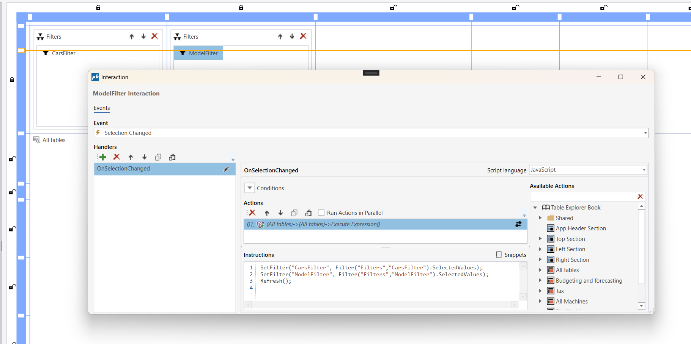
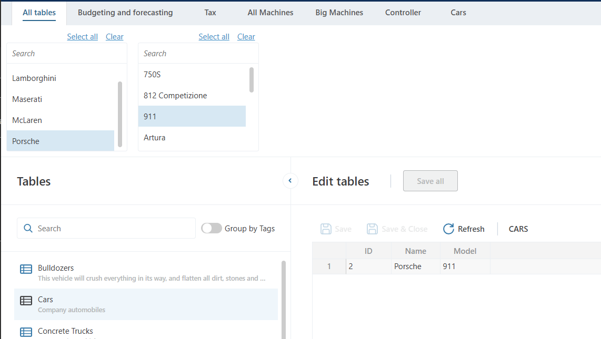

# Filtering table data

You can enable filtering for individual tables by defining your table queries with a parameterized `WHERE` clause. This allows filter values set in the workbook to dynamically update the query results.
To apply filters, use the **Execute Expression** action available for the **Table Explorer** component in the Workbook Designer. In the event handler that reacts to filter changes, use the [`SetParamValue()`](../../../docs/workbooks/programmingmodel/instructions/setparamvalue.md) function to assign a value to the query parameter.

1) Use **Execute Expression** available for the **Table Explorer**
2) Set the SQL filter parameter value using [`SetParamValue()`](../../../docs/workbooks/programmingmodel/instructions/setparamvalue.md) function
3) Call the `Refresh()` method

<br/>

### Add a filter to the workbook page


<br/>

### Set an event for the filter change action


<br/>

### Configure the filter change event

Use the **Execute Expression** action for the **Table Explorer** and configure instructions to:

1) Set the SQL parameter value (e.g., based on the selected filter item).
2) Call `Refresh()` to reload the table data with the updated parameter value.


<br/>


**Example**

The following example shows how to set the SQL parameter `@car` based on the selected value in a filter named **CarsFilter**, followed by calling the refresh method:

```
SetParamValue("@car", Filter("Filters", "CarsFilter").SelectedValue?.Id ?? "");
Refresh();
```

**Example**

This example shows how the sql parameter `@car` is used in the query `WHERE` clause:

```
SELECT tx.[Name],tx.[Id]
  FROM [dbo].[Setting_Cars_2fd73_05062025050634667] tx
 WHERE tx.[Name] = @car
```

<br/>

# Extended filtering table data, with multiple filters and values

You can filter the individual tables with multiple values and multiple filters by defining your table queries with parameterized  `WHERE` clause and `JOIN` filters, and defining your filters at the top of the query. This allows filter values set in the workbook to dynamically update the query results.
To apply filters with multiple values, use the **Execute Expression** action available for the **Table Explorer** component in the Workbook Designer. In the event handler that reacts to filter changes, use the `SetFilter()` function to assign a values to the query parameter.

1) Use **Execute Expression** available for the **Table Explorer**
2) Set the SQL filter parameter value(s) using `SetFilter()` function
```
SetFilter(filerName: string, Filter("Filters", filterName: string).SelectedValues);
```
3) Call the `Refresh()` method


<br/>

### Add filter(s) to the workbook page and set event(s) for filter change action(s) (for each filter if applicable)



<br/>

### Configure the filter change event

Use the **Execute Expression** action for the **Table Explorer** and configure instructions to:

1) Use the  `SetFilter()` function.
2) Call `Refresh()` to reload the table data with the updated filters and values.

<br/>

**Example**

The following example shows how to set the SQL filters for `cars` based on the selected values in a filter named **CarsFilter**, and the `models` based on the selected values in a filter named **ModelFilter** followed by calling the `Refresh()` method:

```
SetFilter("CarsFilter", Filter("Filters", "CarsFilter").SelectedValues);
SetFilter("ModelFilter", Filter("Filters", "ModelFilter").SelectedValues);
Refresh();
```

The Table Explorer will then filter the selected table(s) with the filters, given that the tables load queries have the filters declared and joined.




<br/>

**Example**

This example shows how the filters are applied in the sql:

```
@Declare_FilterAlias(CarsFilter, CF)
@Declare_FilterAlias(ModelFilter, MF)
SELECT DISTINCT tx.[Name],tx.[Id],tx.[Model]
  FROM [dbo].[Setting_Cars_2fd73_05062025050634667] tx
  JOIN @Object_Name(CF) cf ON tx.[Name] = cf.[Name]
  JOIN @Object_Name(MF) mf ON tx.[Model] = mf.[Model]
 WHERE @Values_Equal(CF)
   AND @Values_Equal(MF)
```