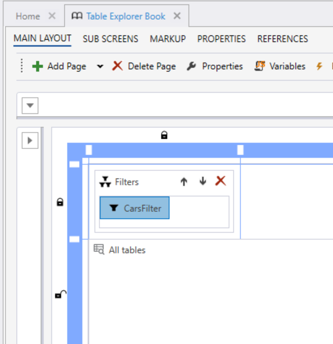
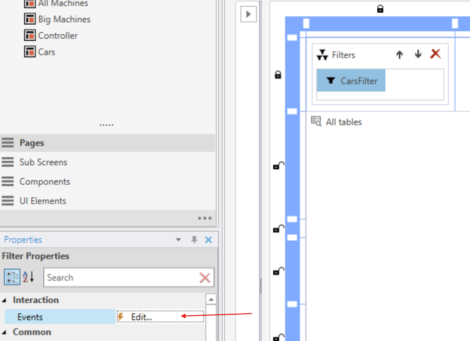
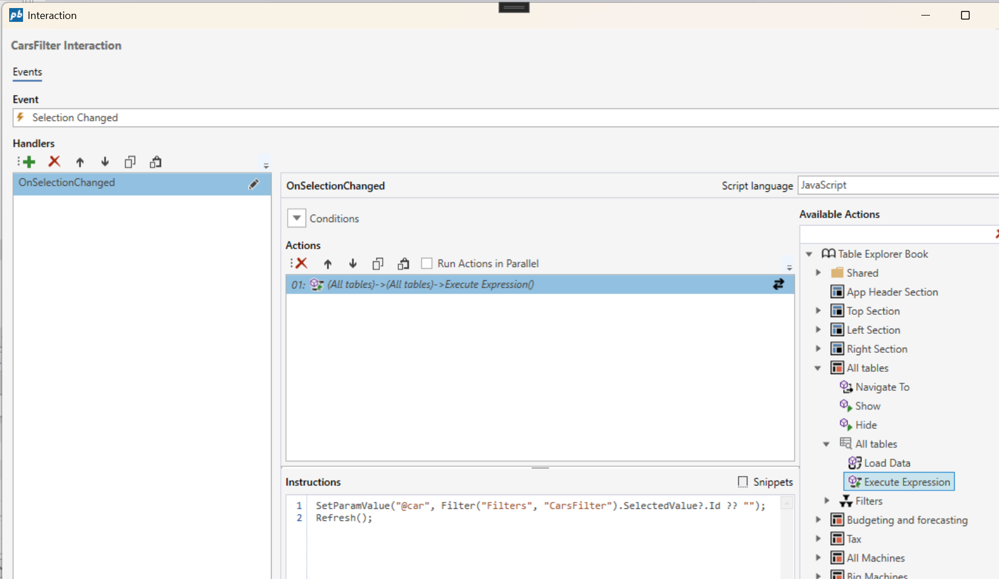

# Filtering table data

You can enable filtering for individual tables by defining your table queries with a parameterized `WHERE` clause. This allows filter values set in the workbook to dynamically update the query results.
To apply filters, use the **Execute Expression** action available for the **Table Explorer** component in the Workbook Designer. In the event handler that reacts to filter changes, use the [`SetParamValue()`](../../../docs/workbooks/programmingmodel/instructions/setparamvalue.md) function to assign a value to the query parameter.

<br/>

**Add a filter to the workbook page**



<br/>

**Set an event for the filter change action**



<br/>

**Configure the filter change event**

Use the **Execute Expression** action for the **Table Explorer** and configure instructions to:

1) Set the SQL parameter value (e.g., based on the selected filter item).
2) Call `Refresh()` to reload the table data with the updated parameter value.



<br/>


**Example**

> The following example shows how to set the SQL parameter `@car` based on the selected value in a filter named CarsFilter, followed by calling the refresh method:

```
SetParamValue("@car", Filter("Filters", "CarsFilter").SelectedValue?.Id ?? "");
Refresh();
```

**Example**

> This example shows how the sql parameter `@car` is used in the query `WHERE` clause:

```
SELECT tx.[Name],tx.[Id]
  FROM [dbo].[Setting_Cars_2fd73_05062025050634667] tx
 WHERE tx.[Name] = @car
```