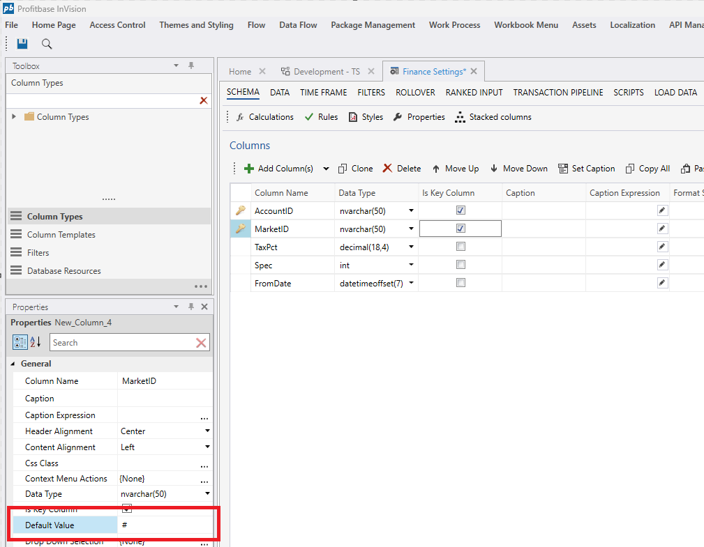

# Basic Column Properties

Below you will find a list of the basic **Column Properties**.
 

| Name                              | Description                                                 |
|-----------------------------------|-------------------------------------------------------------|
| Name                              | The name of the column in the data set. Use the name for addressing the column in formulas. The name must be unique within the column set. Setting Columns can provide a localized caption based on the Name property if the value is registed in pbSimLangText and there is no Caption or Caption Expression providing an override Caption value. |
| Display Order Expression    | An expression that returns an int to define the column's display order, overriding the default schema arrangement. |
| Default value                     | The default value assigned to a cell when a new row is added. The following values are supported:  - Any valid scalar value  - SQL functions (like `getdate()`)  - `DimMember(ALL_LEVEL)`  |
| Order By                          | Specifies if the Worksheet data set should be ordered by the values of the column when loaded from the server.  *Priority* must be greater than 0 to order the data set by the column. Priority also specifies the index of the column in the order by clause.   *Sort Descending* specifies if the values of the column should be sorted in descending order instead of ascending.|
| Trim whitespace on save           | Specifies whether to remove leading and trailing whicespace characters from text column values when data is saved to the database. Dropdown or Ranked Input columns will only be trimmed if this property is set to True. Standard text input columns will be trimmed unless the value is explicitly set to False. |
| Context menu actions              | Specifies the custom context menu actions for the column |
| Is Action Link Column             | Specifies whether the column should be an Action Link Column. The values of Action Link Columns are displayed as hyperlinks, and cannot be edited by the user. When clicked, an event is raised in the Workbook context containing information about the clicked row, action and column. |
| Format string                     | Specifies the format string used to display the rendered value of the column. Applicable to numberic and date columns only. |
| Width type                        | Specifies how the column should be sized. |
| Width                             | Specifies the width if `Width type` is set to `Numeric`. |
| Content Alignment                 | Specifies the alignment of the cell values of the column. |
| Is Fixed                          | Specifies if the column is fixed / pinned to the left side of the grid. |
| Conditional formatting            | Specifies styling and formatting rules for the column based on cell values. Due to performance reasons, we recommend specifying cell formatting using [Style Formulas](../calculations/cellnrowstylfunc.md), **SetRowStyle(…)** and **SetCellStyle(…)**, instead of the Conditional Formatting feature. |
| Summmary Function                 | Specifies which summary function to apply the the column when the Summary Row feature of the data grid is enabled. Available functions are Default, Sum, Min, Max, Count, Average and None. For numeric columns, the default is Sum and for all other columns, the default is None. |

## Default value property for new non-null columns

The Default value property is now automatically applied when the schema of a table changes. This is useful when you add a new PK (or non-nullable) column to an existing table. The Default value can be a value or a function, for example NEWID().

 

 

## Videos
* [Worksheet](../../../videos/worksheet.md)
* [Conditional Formatting](https://profitbasedocs.blob.core.windows.net/videos/Worksheet%20-%20Conditional%20Formating.mp4)