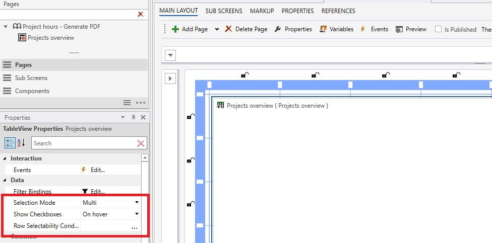

# Table View

Table View is used for displaying data in a read-only data grid. Compared to spreadsheet [tables](tables.md) ([Worksheet](worksheets.md), Table, and [SQL Report](sqlreports.md)) which is used for editing data, Table View is used for displaying data in a user-friendly and nicely formatted way. The component has built-in features for selection, sorting, filtering, formatting, and custom renderers.

<br/>


## Data

Use a SQL query to define the data set that is displayed in a Table View. You can load data from any database table or view it in the Solution database. To enable access control, use filters that reference dimensions using the same syntax that you are using to create SQL Reports.

You can also use macros to create highly dynamic queries using C#.

<br/>

## Data Grid layout and behavior

The Data Grid tab in the Table View designer is where you create the layout and behavior by adding columns from the data set and setting properties for selection, paging, and filtering.

Before you can create the layout, run the (Data Source) SQL query so that you can easily add columns to the data grid from the data set.
<br/>

**Columns**

> To configure a column, select it from the Columns list and edit its properties in the Properties window.

<br/>


## How to create dynamic and localized column captions

If you need a dynamic column caption, or you need to support localization, use the **Caption Expression** to create a C# expression that returns a string.
<br/>

**Example**

> This caption expression translates the text associated with the "AccountID" text code to the language of the currently logged-in user:

```
Localize("AccountID")
```

<br/>

## How to render the custom cell content

Use the Renderer column property to define a JavaScript function that returns the HTML element to render in the cell.

<br/>

**Example**

> This example shows how to use a custom renderer to render a SVG into a cell:

```
function(eventArgs, services){
    const importancePct = (eventArgs.value / 10) * 100;
    const svg = document.createElementNS("http://www.w3.org/2000/svg", "svg");
    svg.setAttribute("width", "100%");
    svg.setAttribute("height", "30px");

    const newRect = document.createElementNS("http://www.w3.org/2000/svg", "rect");
    newRect.setAttribute("width", importancePct + '%');
    newRect.setAttribute("height", "100%");
    newRect.setAttribute("fill", importancePct > 50 ? 'green' : 'yellow');
    svg.appendChild(newRect);

    return svg;
}
```

<br/>

## How to format cells

You can format numeric and date/datetime cells using the **Format String** or **Formatter** property.
<br/>

## How to define context menu actions

You can define custom actions pr column that the user can execute. Custom actions are defined with the **Context Menu Actions** property.

When a user executes an action, the action can be acted upon in the Workbook by handling the "Custom Context Menu Action executed" event of the Table View component. In the event handler, you can access the following properties of the **@Event** object.
<br/>


<br/>

```
{
  Data: {}, // the row object of the cell that was clicked
  Selection:{
    Rows: [{
      Columns: [], // array of column names of the row (keys)
      RowData: {ColumnName: cellValue, ...} // each key and value of the row
    }], // All the selected rows
    Cells: [{ RowData: "cell value", Column: "name of the column"}, ... ] // All the selected cells
  },
  Sender:{
    ActionName: "the name of the context menu action that was executed",
    ColumnName: "the name of the column"
  }
}
```

<br/>

## How to filter on one or more columns

To enable filtering on one or more columns, set the **Enable filter** property to the true for each column that you want to filter on. This will add a filtering option for the column to the filter bar at the top of the Table View component in the Workbook.

The filter options for a column are based on its data type. For example, a numeric column can be filtered using numeric operators such as less than or greater than, while a text column can be filtered by equals, contains, starts with, and so on.
If you want to instead enable the user to pick from a list of values in the column, use the **Filter Type** property and switch from **Default** to **Select**.


<br/>


<br/>

## How to use row selectability

<br/>

Developers can write JavaScript that evaluates whether or not specific rows are selectable by the user in TableView components. That provides developers fine-grained control over whether or not a row can be selected by a user based on business logic and application state.

<br/>

.png)

<br/>

.png)

<br/>


**Example**

This function will return true if the value of **args.row.Ratings** is greater than or equal to **8**, which means that the row will be selectable if the ratings are equal to or higher than 8.:

```
function (args: {rows: any[], row: any, variables: {[index: string]: any}}): boolean {
  return (args.row.Ratings >= 8);
}
```
<br/>

## Rerender

<br/>

The Table View can be re-rendered manually at any time. A typical use case for when you want to trigger a re-render is when some application state outside the TableView has changed, and you want this state to be reflected in the TableView.

This functionality is intended for controls that do not automatically refresh the TableView.


> [!NOTE]
> This re-rendering process does not involve reloading data from the backend, but rather only involves the TableView re-rendering itself on the client-side.

<br/>


<br/>

This action can be called in the interaction window of the control.

<br/>


<br/>

## How to pin columns to left or right

You can pin columns to left or right using the **Fixed State** property.


<br/>

## How to declare filter

You can filter table view using [hierarchical filter](filters/howto/hierarchicalfilter.md), to do that you need to declare that filter in the load query. You will find more [here](sqlreports/dataqueries.md) in [Data Queries](sqlreports/dataqueries.md) subject, and in this [example](tableview/howto/filter.md).


<br/>

### How to enable excel export

You can enable excel export, to do that you need to check "enable excel export" box and insert code template in the EXCEL EXPORT tab. 
<br/>


<br/>

When you click the **"C#  Insert Code Template"**, it will be inserted.

```
//This method is call for every header cell
public override ExcelExportHeaderCellOutput RenderHeaderCell(ExcelExportRenderHeaderCellInput input)
{
    //input.RowIndex (int)
    //input.ColumnIndex (int)
    //input.Caption (string)

    var output = CreateExcelExportHeaderCellOutput(input);
    //output.Caption (string)
    //output.ColumnSpan (string)
    //output.Font.Bold (bool)
    //output.Font.Italic (bool)
    //output.Font.Size (bool)
    //output.HorizontalAlignment (string - 'left' | 'right' | 'center')

    output.Font.Bold = true;

    return output;
}

//This method is called for every data cell
public override ExcelExportDataCellOutput RenderDataCell(ExcelExportRenderDataCellInput input)
{
    //input.RowIndex (int)
    //input.ColumnIndex (int)
    //input.Value (string)
    //input.Row (DataRow)
    //input.Column (DataColumn)

    var output = CreateExcelExportDataCellOutput(input);
    //output.RowIndex = input.RowIndex;
    //output.ColumnIndex = input.ColumnIndex;
    //output.Value = input.Value;
    //output.FormatString (string)
    //output.Font.Bold (bool)
    //output.Font.Italic (bool)
    //output.Font.Size (bool)
    //output.HorizontalAlignment (string - 'Left' | 'Right' | 'Center')

    output.HorizontalAlignment = "Right";

    return output;
}
```

<br/>

## Selection options can be configured at Workbook component level

When using TableViews to list data, you can specify the selection behavior and rules per instance instead of on the object definition level. This means you can now reuse the same TableView multiple times, but with different selection configuration. For example, you may have a Workbook with a limited (or read-only) functionality, but you want to reuse the same TableView that’s available to power users with admin permissions in another Workbook.





### Videos

* [Table View](../videos/tableview.md)
* [Table View - Basics](https://profitbasedocs.blob.core.windows.net/videos/Table%20View%20-%20Basics.mp4)
* [Table View - Macro Expansion](https://profitbasedocs.blob.core.windows.net/videos/Table%20View%20-%20Macro%20Expansion.mp4)
* [Table View -Custom Cell Renderer](https://profitbasedocs.blob.core.windows.net/videos/Table%20View%20-%20Custom%20Cell%20Renderer.mp4)
* [Table View - Declaring Filter](https://profitbasedocs.blob.core.windows.net/videos/Table%20View%20-%20Declaring%20Filter.mp4)
* [Table View - Enable Excel Export](https://profitbasedocs.blob.core.windows.net/videos/Table%20View%20-%20enable%20excel%20export.mp4)
* [Table View - Row Selectability Condition](https://profitbasedocs.blob.core.windows.net/videos/TBV%20-%20Row%20Selectability%20Condition.mp4)
* [Table View - Rerender](https://profitbasedocs.blob.core.windows.net/videos/TBV%20-%20rerender.mp4)