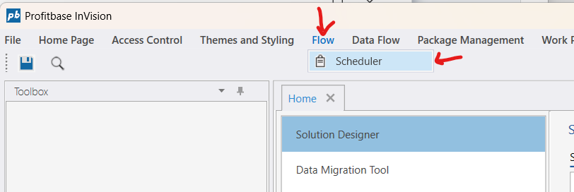
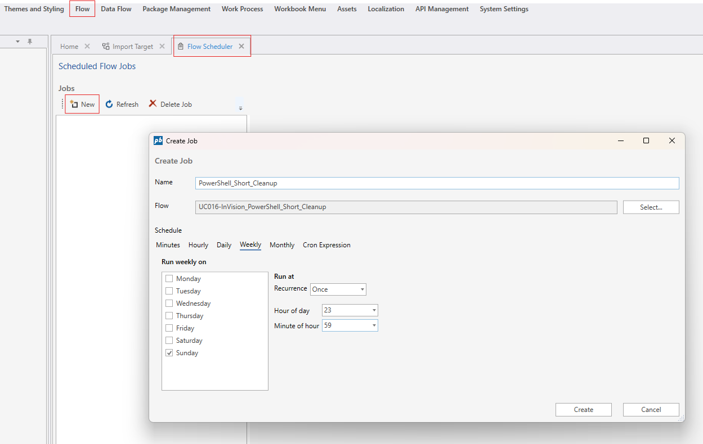
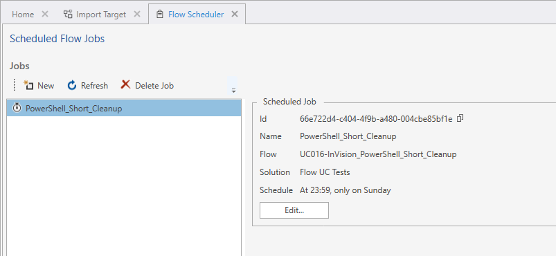
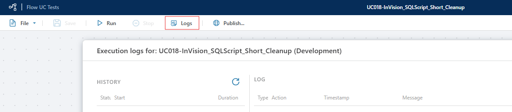
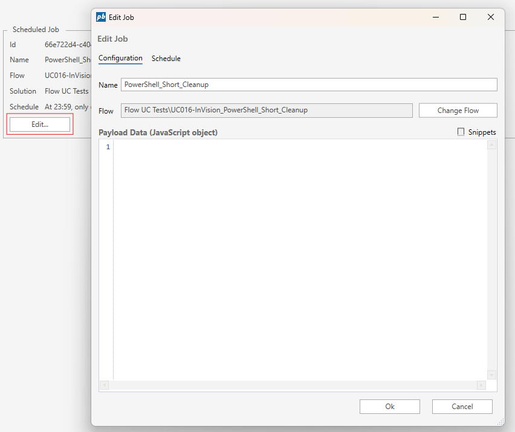

# Flow Schedule

The  [Flow](../../../../flow/flow.md) Schedule component enables end users to create and edit the scheduled runs of Flows from a [Workbook](../../workbooks.md) instead of having to use the Designer.

 

## How to add a Flow Schedule component to a Workbook
1. Open the Workbook Designer,
2. Drag and drop the Flow Schedule component onto the surface.

 

 

## How to create a New Schedule for a Flow
 

To create a new Flow Schedule, you need to execute the New action of the Schedule component and provide the id of the  [Flow](../../flows/overview.md). You can also provide one or more parameters that you want theflow to be executed with.

Navigate to the Flow tab and select Scheduler.   

 

Select the Flow you want to schedule from your solution.  

 

Create a new job by providing a name, selecting the Flow, and configuring the schedule.  

 

Review the list of scheduled jobs and confirm your new job is listed.  

 

Check the execution logs to monitor the status and history of your scheduled Flow.

 

## How to Edit a Schedule

Click Edit on the scheduled job you want to modify.  

 

Switch to the Schedule tab to update when the job should run.  

 

Optionally, define a custom Cron expression for advanced scheduling.  

 

