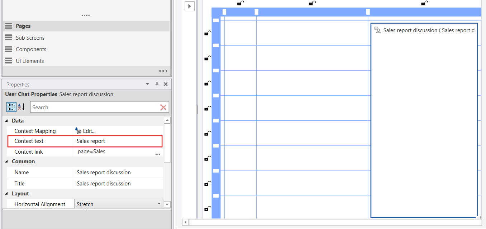
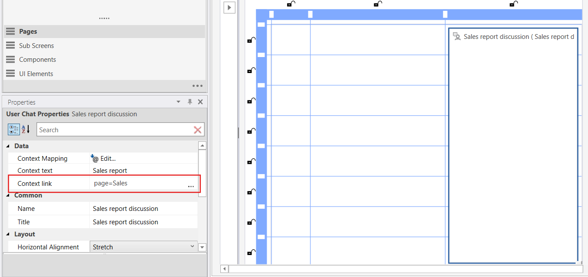

# User chat

The **User Chat** component provides real-time, context-aware communication directly within Workbooks. It enables end users to exchange messages related to the specific analytical context they are viewing — such as a page, dashboard, report, or even a selected record or data point.


<br/>

## Key Capabilities

- **Context-bound messaging**  
  Each chat instance is associated with a defined context scope (e.g., workbook page, filter state, selected row or object). Messages are stored together with the assigned context to ensure discussions remain relevant to the data being reviewed.
<br/>
- **Multiple chat instances per Workbook**  
  Solution developers can insert multiple independent chat components into a Workbook. This allows for fine-grained collaboration use cases such as:  
  - One chat per page or dashboard  
  - A global chat accessible from a popup  
  - Chats tied to specific entities or detail views (e.g., per customer record or project)
<br/>
- **Real-time communication**  
  New messages are synchronized in real time for all users currently viewing the same context.
<br/>
- **Notification integration**  
  To support asynchronous collaboration, a Flow can be triggered if a user does not see a new message within **5 minutes**. The Flow can then send an external notification (Email or Microsoft Teams) to ensure users are alerted to unread messages.

<br/>

#### Usage Scenarios

- Analyst collaboration on dashboards  
- Cross-team review of reports  
- Commenting on data points or anomalies  
- Approval / feedback workflows tied to records

<br/>

## Display in Workbook

To display a Chat in a Workbook, drag and drop it from the toolbox. You can change size and placement in the Properties panel if you want to.

Run the **Load Data**-action to setup the chat on the page. Go to **Events** - **Navigated To** - **Load Data** of the Chat.


<br/>

## Context Mapping

Context Mapping allows you to associate user chat context items with specific values or dynamic expressions. This feature ensures that messages in the User Chat component can reference relevant data, such as filters or parameters, making interactions more meaningful and context-aware. You can map context items to fixed values or link them to dynamic filters that adapt to the current page content.

If no context items are mapped, all messages for the component will be shown without filtering.


**Example**   
The above example shows an example where the context items **_Filter_by_company_** and **_Filter_by_department_** is given the fixed values: Filter_by_company = "Profitbase" and Filter_by_department = "Development". These context items may also be mapped to filters instead of fixed values to adapt dynamically to the page content, e.g.:

```
Filter("Filters", "Company").SelectedValue.Id
Filter("Filters", "Department").SelectedValue.Id
```


<br/>

## Context Text

A chat may be connected to a specific context which can be described in the **_Context Link_** property of the workbook component. The text described in this property will appear on each message displayed for the user in the **_App Header Notifications_**-section. Read more [here](../../workbooks/components/uielements/app-header-notifications.md).



**Example**   
The above example shows the property field **_Context Text_** for the User Chat Workbook component with the text **_Sales report_**.

<br/>

## Context Link

Each message that includes a **_Context Text_** will display this text as a link when the **_Context Link_** property of the User Chat Workbook component is set; otherwise, it will appear as plain text.

This link property may be just a simple url link, or logic details to be handled by the **_Notification Context Link Clicked_** handler on the **_App Header Notifications_**-section. Read more [here](../../workbooks/components/uielements/app-header-notifications.md).



**Example**   
The above example shows the property field **_Context Link_** for the User Chat Workbook component with the text **_page=Sales_**.


