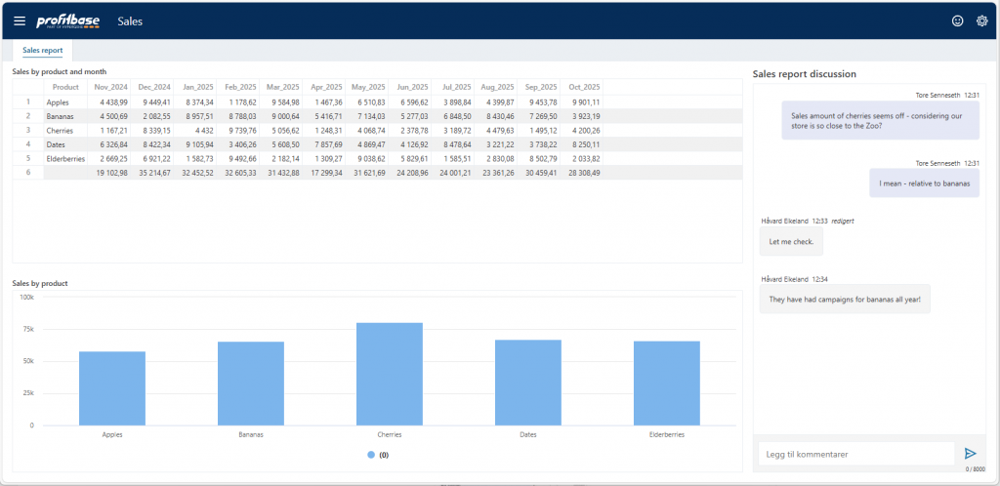
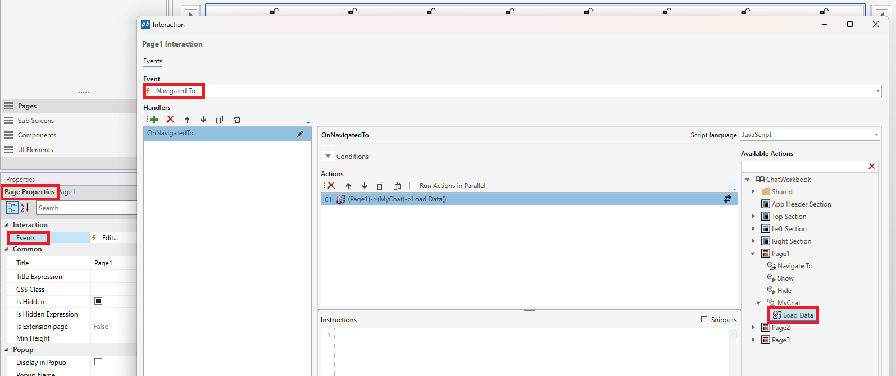
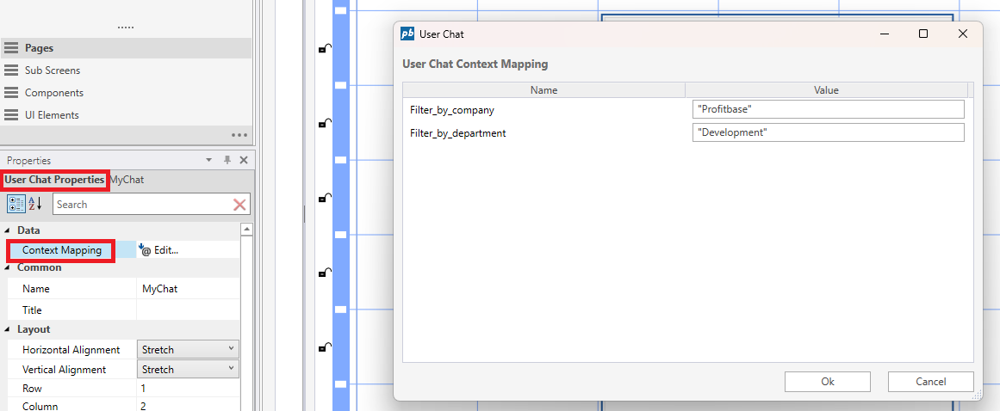

# User chat

The **User Chat** component provides real-time, context-aware communication directly within Workbooks. It enables end users to exchange messages related to the specific analytical context they are viewing — such as a page, dashboard, report, or even a selected record or data point.

 

## Key Capabilities

- **Context-bound messaging**  
  Each chat instance is associated with a defined context scope (e.g., workbook page, filter state, selected row or object). Messages are stored together with the assigned context to ensure discussions remain relevant to the data being reviewed.

- **Multiple chat instances per Workbook**  
  Solution developers can insert multiple independent chat components into a Workbook. This allows for fine-grained collaboration use cases such as:  
  - One chat per page or dashboard  
  - A global chat accessible from a popup  
  - Chats tied to specific entities or detail views (e.g., per customer record or project)

- **Real-time communication**  
  New messages are synchronized in real time for all users currently viewing the same context.

- **Notification integration**  
  To support asynchronous collaboration, a Flow can be triggered if a user does not see a new message within **5 minutes**. The Flow can then send an external notification (Email or Microsoft Teams) to ensure users are alerted to unread messages.

#### Usage Scenarios

- Analyst collaboration on dashboards  
- Cross-team review of reports  
- Commenting on data points or anomalies  
- Approval / feedback workflows tied to records

## Display in Workbook

To display a Chat in a Workbook, drag and drop it from the toolbox. You can change size and placement in the Properties panel if you want to.

Run the **Load Data**-action to setup the chat on the page. Go to **Events** - **Navigate to** - **Load Data** of the Chat.

 

## Context Mapping

Maps user chat reference contexts to values.

 

