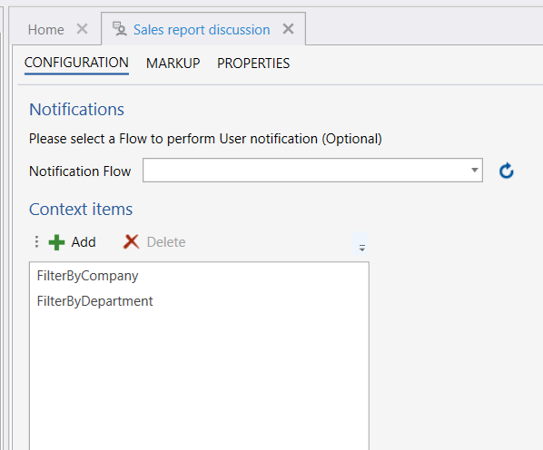

# Context Item

The **Context**, associates messages with metadata, for example which department or contract the message belongs to. A common use case is to associate messages with [Filters](../../../filters.md).

## Properties

| Name                | Description                   |
|---------------------|-------------------------------|
| Key                 | Name of the context item that will associate with a context, e.g.: "FilterByDepartment" |

 

**Example**   
You create context item in the Invision Designer, on the User Chat solution item, and the above example shows an example where the context items **_FilterByCompany_** and **_FilterByDepartment_** are created.

