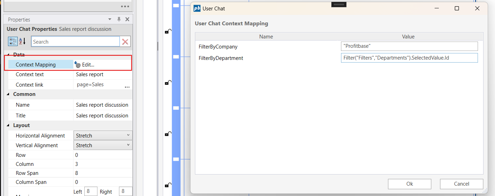

# Context Mapping

Context Mapping allows you to associate user chat [context items](../context-item.md) with specific values or dynamic expressions, e.g. like filtering on departments. This feature ensures that messages in the User Chat component is relevant according to filters or parameters, making interactions more meaningful and context-aware. You can map [context items](../context-item.md) to fixed values or link them to dynamic filters that adapt to the current page content.

If no context items are mapped, all messages for the component will be shown without filtering.




**Example**   
The above example shows an example where the context items **_FilterByCompany_** and **_FilterByDepartment_** is given the fixed values: FilterByCompany = "Profitbase" and FilterByDepartment = "Development". These context items may also be mapped to filters instead of fixed values to adapt dynamically to the page content, e.g.:

```
Filter("Filters", "Company").SelectedValue.Id
Filter("Filters", "Department").SelectedValue.Id
```
