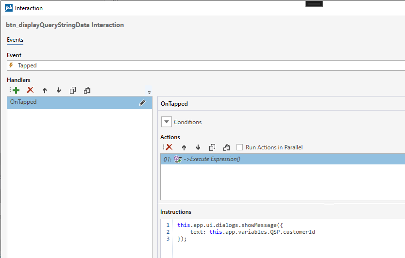

# Initializing From URL

**Initializing from URL (query string)**

A [Workbook](../../workbooks.md) can be initialized from the url using parameters in the `query string`.

The values of the query string parameters can be accessed from the `QSP` object variable by name (see example below).

## Example - Access query string parameters through variables

If the url of the Workbook is ``http://site/invision/workbooks/id?customer=customerA&amount=4500``, two variables will be created:

# [JavaScript](#tab/javascript)

| Name                                  | Description                              |
|---------------------------------------|------------------------------------------|
| this.appVariables.QSP.customer        | Contains the value `customerA` from the url.          |
| this.appVariables.QSP.amount          | Contains the value `4500` from the url.               |

# [Eaze](#tab/eaze)

| Name                | Description                             |
|---------------------|-----------------------------------------|
| QSP.customer        | Contains the value `customerA` from the url. |
| QSP.amount          | Contains the value `4500` from the url.      |

---

You can then use the variables in expressions, for example  

```javascript
this.app.ui.dialogs.showMessage({
    text: this.app.variables.QSP.customerId
}); 
```

