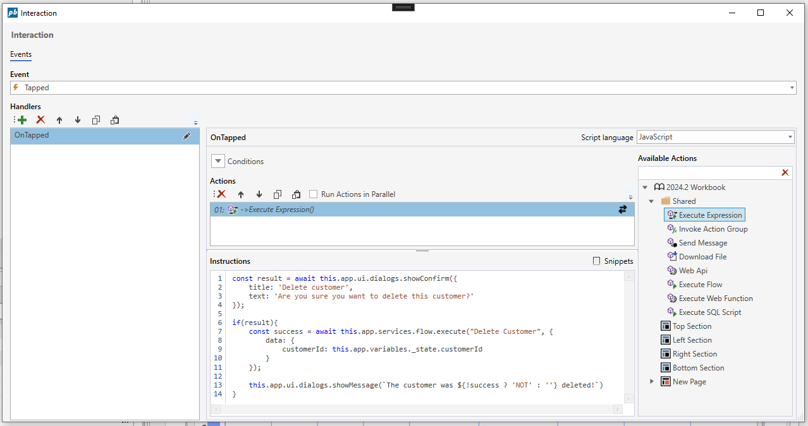
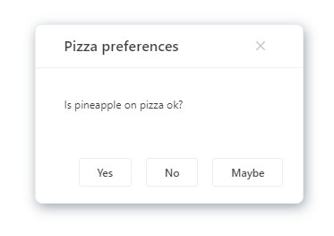

# Dialog Service API

The following APIs can be used in any [Execute Expression](../interactionmodel/workbookactions.md#execute-expression) Actions or [Form Schema functions](../../../forms/formschemas/functions.md).

#### showConfirm({string, string, string, string})
#### showConfirm(string)

Displays a confirm dialog to the user, with the options to accept or reject. If the user accepts, `true` is returned, otherwise `false`. Note that the API is asynchronous and must be awaited like shown in the example below.  

##### API Definition

```javascript
this.app.ui.dialogs.showConfirm({title: string, message: string, positiveButtonText?: string, negativeButtonText?: string }) : Promise<boolean>
this.app.ui.dialogs.showConfirm(text: string): Promise<boolean>
```

##### Example

This example shows how to ask a user to confirm that they want to delete a customer and then displays whether the customer was successfully deleted.

```javascript
const result = await this.app.ui.dialogs.showConfirm({
    title: 'Delete customer', 
    text: 'Are you sure you want to delete this customer?'
});

if(result){
    const success = await this.app.services.flow.execute("Delete Customer", {
        data: {
            customerId: this.app.variables._state.customerId
        }
    });
    
    this.app.ui.dialogs.showMessage(`The customer was ${!success ? 'NOT' : ''} deleted!`)    
}
```



<br/>
<br/>

#### showMessage({string, string, number})
#### showMessage(string)

Displays a message box to the user.

##### API Definition

```javascript
this.app.ui.dialogs.showMessage({title: string, message: string, width?: number}) : void
this.app.ui.dialogs.showMessage(text: string): void
```

##### Example

```javascript
this.app.ui.dialogs.showMessage({title: 'Delete customer', text: 'The customer was deleted.'});
```

<br/>
<br/>

#### showChoice({string, string, number, number, array})

Displays a popup to the user with multiple buttons and returns the option selected by the user. Note that the API is asynchronous and must be awaited.

##### API Definition

```javascript
this.app.ui.dialogs.showChoice({title: string, text: string, width: number, height: number, options: { text: string; value: any }[]}) : Promise<any>
```

##### Example

The example below shows how to display a popup that lets the user answer one of the most important and debated questions in human history.

```javascript
const response = await this.app.ui.dialogs.showChoice({
    title: 'Pizza preferences', 
    text: 'Is pineapple on pizza ok?', 
    options: [{
        text: 'Yes',
        value: 1
    },{
        text: 'No',
        value: 2
    },{
        text: 'Maybe',
        value: 3
    }]
});

if(response === 3){
    this.app.ui.dialogs.showMessage(`Yup, it all depends on the other ingredients.`);
}else{
    this.app.ui.dialogs.showMessage(`You are ${response === 2 ? 'NOT' : ''} a pineapple lover.`);
}

```


