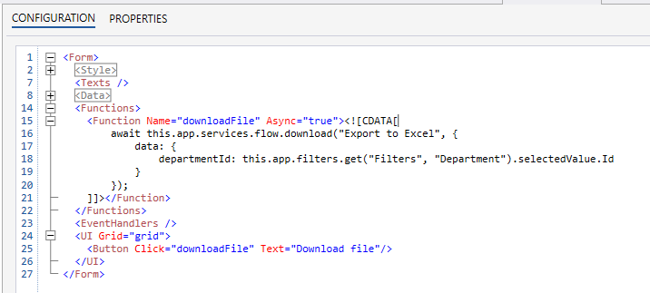

# Flow API

The following APIs can be used in any [Execute Expression](../interactionmodel/workbookactions.md#execute-expression) Actions or [Form Schema functions](../../../forms/formschemas/functions.md).

#### execute(string, data)

Executes a short-running Flow in the current Solution and returns data if the Flow is configured to do so.

##### API Definition

```javascript
this.app.services.flow.execute(flowName: string, {
    environment?: string,
    data: {}
}) : Promise<any>
```

##### Example

This example shows how to run a Flow that returns a value (price) and displays the result in a message box. You can run this code in an [Execute Expression](../interactionmodel/workbookactions.md#execute-expression) Actions or [Form Schema functions](../../../forms/formschemas/functions.md).  

```javascript

const price = await this.app.services.flow.execute('Calculate Price', {
    data: {
        productId: this.app.variables._state.selectedProductId,
        qty: 30
    }
});

this.app.ui.dialogs.showMessage(`The calculated price is ${price}`);

```


#### download(string, data)

Executes a short-running Flow that returns a file, and downloads the file. Use this API if you have a Flow that returns a file that you want to download in the browser.

##### API Definition

```javascript

this.app.services.flow.download(flowName: string, {
    environment?: string,
    data: {}
}) : Promise<void>

```

##### Example

The following example shows how run a Flow named `Export to Excel` creates an Excel file for the selected department, and then download the file to user.

```javascript
await this.app.services.flow.download("Export to Excel", {
    data: {
        departmentId: this.app.filters.get("Filters", "Department").selectedValue.Id
    }
});
```

