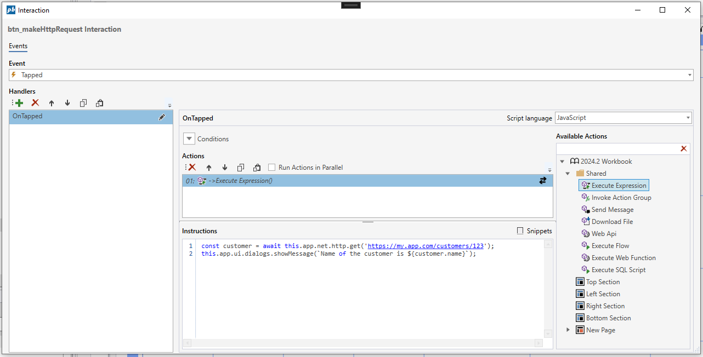

# HTTP service API

The following APIs can be used in any [Execute Expression](../interactionmodel/workbookactions.md#execute-expression) Actions or [Form Schema functions](../../../forms/formschemas/functions.md).

#### get(string, requestConfig)

Sends a HTTP GET request and optionally returns data.

##### API Definition

```javascript
this.app.net.http.get(url, requestConfig: HttpRequestConfig) : Promise<any>
```

###### Example

The example below shows how to call an HTTP endpoint that returns a customer in a Workbook [Execute Expression](../interactionmodel/workbookactions.md#execute-expression) Action.

```javascript
const customer = await this.app.net.http.get('https://my.app.com/customers/123');
this.app.ui.dialogs.showMessage(`Name of the customer is ${customer.name}`);
```



#### post(string, requestConfig)

Sends a HTTP POST request and optionally returns data.

##### API Definition

```javascript
this.app.net.http.post(url, requestConfig: HttpRequestConfig) : Promise<any>
```

#### put(string, requestConfig)

Sends a HTTP PUT request and optionally returns data.

##### API Definition

```javascript
this.app.net.http.put(url, requestConfig: HttpRequestConfig) : Promise<any>
```

#### delete(string, requestConfig)

Sends a HTTP DELETE request and optionally returns data.

##### API Definition

```javascript
this.app.net.http.delete(url, requestConfig: HttpRequestConfig) : Promise<any>
```

#### post(string, requestConfig)

Sends a HTTP GET request to a url that is expected to return a file, and then downloads the file to the browser.

##### API Definition

```javascript
this.app.net.http.download(url, requestConfig: HttpRequestConfig) : Promise<void>
```

#### HttpRequestConfig

```javascript
type HttpRequestConfig = {
    data?: any
    headers?: { [index: string]: string }
}
```
