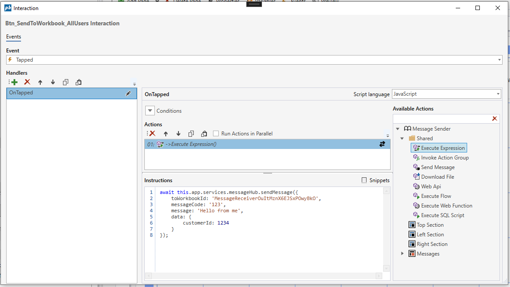

# Message Hub Service API

This service enables sending messages to other Workbooks.  

Messages are sent between Workbooks using a fixed format message object. The message object has 5 properties, which specify the receiver address and the message contents. If you do not specify an address, the message is broadcasted to all Workbooks running on the same website.

The following APIs can be used in any Execute Expression Actions or [Form Schema functions](../../../forms/formschemas/functions.md).

#### sendMessage({string, string, string, string, any})

```javascript

this.app.services.messageHub.sendMessage({
    toWorkbookId?: string, 
    toUserName?: string, 
    messageCode?: string, 
    message?: string, 
    data?: any
}) : Promise<boolean>
```

##### Message object

| Property name       | Type       | Description                                      |
|---------------------|------------|------------------------------------------------- |
| toWorkbookId        | string     | Optional. Specifies the id of the Workbook to send the message to. If you don't specify and id, the message will be broadcasted to all open Workbooks.  |
| toUserName          | string     | Optional. Specifies the userName (user@corp.com) to broadcast the message to. If you don't specify this property, the message will be broadcasted to all users.                |
| messageCode         | string     | Optional. Specifies a message code for the message. You can use this message code in the Message Received Workbook action to determine what to do.   |
| message             | string     | Optional. Specifies a message text to send.    |
| data                | any        | Optional. Specifies a payload to send. This can be any value, for example an object, number, string or date |

##### Example

This example shows how to send a message to another Workbook from the Execute Expression action of a Workbook.  

```javascript
await this.app.services.messageHub.sendMessage({
	toWorkbookId: 'MessageReceiverOuItMznX6EJSxPOwyBkO',
	messageCode: '123',
	message: 'Hello from me',
	data: {
		customerId: 1234
	}
});
```

