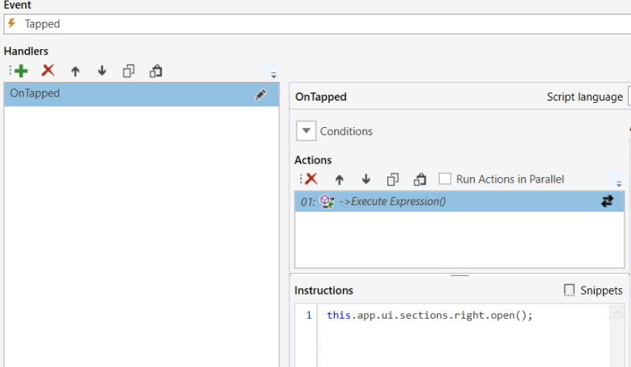

# Workbook Actions

## Execute Expression

Executes one or more statements.
Please refer to the [API topic](../apis.md) for further reading.  


<br/>

## Send Message

Sends messages to other Workbooks.

> [!IMPORTANT]
> This API is being deprecated. Use the [Message Hub API](../apis/message-hub-apis.md) in an `Execute Expression` action instead.

## Invoke Action Group

Invokes another Action Group. Configure the invocation using the [ConfigureInvocation(…)](../instructions/configinvocation.md) function.

<br/>

## Web Api

> [!IMPORTANT]
> This API is being deprecated. Use the [HTTP API](../apis/http-apis.md) in an `Execute Expression` action instead.

 Invokes an HTTP request by calling one of the following methods in the expression:
```
HttpGet(url)
HttpPost(url, httpContent)
HttpPut(url, httpContent)
HttpPatch(url, httpContent)
HttpDelete(url)
```  

Add **headers** by calling the AddHeader(name, value) method.

<br/>

## Download File

> [!IMPORTANT]
> This API is being deprecated. Use the [HTTP API](../apis/http-apis.md) or [Flow API](../apis/flow-apis.md) in an `Execute Expression` action instead.

Downloads a file to the browser by calling one of the following methods in the expression:
```
SetSrc(url)
SetSrcIf(boolean expression, trueUrl, falseUrl)
```

## Workbook actions and APIs to programmatically open and close sections

You can open and close Workbook sections (top, left and right) either programmatically or using Workbook component actions. This offers authors of highly dynamic Workbooks more flexibility in how to build user interfaces, by automatically showing or hiding sections of the UI based on choices made by the user – or the general state of the application.



<br/>

## Default value property for new non-null columns

The Default value property is automatically applied when the schema of a table changes. This is useful when you add a new PK (or non-nullable) column to an existing table. The Default value can be a value or a function, for example NEWID().


<br/>