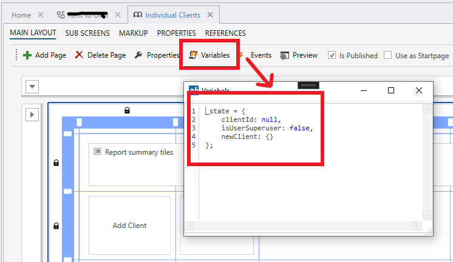

# Variables


## Global variables

To define global variables, use the `Variables` popup in the Workbook menu and declare one or more variables using JavaScript. You can add as many variables as you want, but we recommend creating just a single variable named `_state` and assign an object to it. Then, use `_state` as the container to store all other state information in the Workbook when executing Workbook component actions.



To access a variable `_state`, use  

```javascript
const myState = this.appVariables._state 
```

or  

```javascript
const myState = this.app.variables._state
```

## System Variables

The following variables are provided by the system, and available in all Workbook component actions.  

# [JavaScript](#tab/javascript)
| Name                                  | Description                             |
|---------------------------------------|-----------------------------------------|
| this.appVariables.SYS.CurrentUserName | Returns the user name of the currently logged-in user, for example `leia@rebellion.com` |
| this.appVariables.SYS.SYS_DataSetID   | When the Workbook is under Workflow Control, returns the Data Set ID associated with the Workflow. |
| this.appVariables.SYS.SolutionId      | Returns the Solution Id that the Workbook belongs to. |
| this.appVariables.SYS.WorkbookId      | Returns the Id of the Workbook.          |
| this.appVariables.QSP.name            | Returns the value of the query string parameter with the name 'name'. |

# [Eaze](#tab/eaze)

| Name                | Description                             |
|---------------------|-----------------------------------------|
| SYS.CurrentUserName | Returns the user name of the currently logged-in user, for example `leia@rebellion.com`. |
| SYS.SYS_DataSetID   | When the Workbook is under Workflow Control, returns the Data Set ID associated with the Workflow. |
| SYS.SolutionId      | Returns the Solution Id that the Workbook belongs to. |
| SYS.WorkbookId      | Returns the Id of the Workbook.          |
| QSP.name            | Returns the value of the query string parameter with the name 'name'. |

---

#### Example

This example shows how to display the name of the current user in a Label.  
To display a dynamically evaluated text in a Label, you need to apply using the SetText – function to the Text property of the Label.

**JavaScript**
```javascript
// To display the name of the current user, add the following expression to the Text property of a Label.
SetText("The current user is " + this.appVariables.SYS.CurrentUserName);
```

**Eaze**
```javascript
// To display the name of the current user, add the following expression to the Text property of a Label.
SetText("The current user is " + SYS.CurrentUserName);
```