## Customization Patterns

Profitbase

08.09.2025

Version 2.3

## Abstract, intended audience and pre-requisites

This document aims to describe common customization patterns and best practices for making custom extensions to Profitbase Planner and is aimed at implementation partners.

An in-depth knowledge of the Profitbase InVision designer is required.

The following patterns are described:

**Pattern 1** - Create a new Planner input module extension that will integrate with Planner’s Plan Overview, produce financial transactions of its own, and follow Planner’s versioning.

**Pattern 2** - Create a new module that will follow Planner’s versioning only (subset of 1) and be present in the hamburger menu.

**Pattern 3** – Customize the transaction pipeline.

**Pattern 4** – Customize assumptions (lookup) measures for the Driver Based module.

**Pattern 5** – Use a custom target store for data import.

**Pattern 6** – Use a custom source for data export.

**Pattern 7** – Add custom button and/or custom row context menu in standard Planner modules.

**Pattern 8** – Import transactional plan data from an external source.

**Pattern 9** – Register custom module with the Operation Manager.

**Pattern 10** – Link processing of driver based models using a dynamic map of from/to departments.

## EPM Planner Custom Extension Template

TThis is a starter template that can should be used to rapidly set up a custom extension either for pattern 1 or 2 above.

The custom extension template must be deployed to a solution in which the EPM Planner package exists already.

The custom extension package is not self-contained as its workbook uses hierarchical filters that refer to dimensions in EPM Planner.

Once deployed, the following markup changes must therefore be done to the hierarchical filters that refer to source dimensions that reside in EPM Planner:

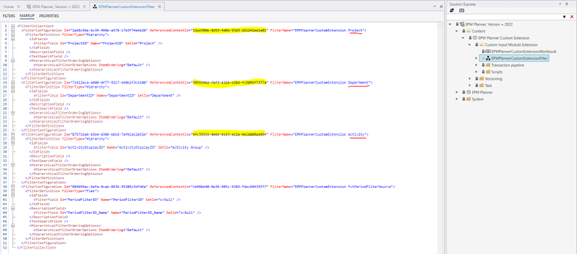

Replace the ids in yellow with the content ids for the dimensions within EPM Planner with names as underlined in red in the image above. You will find the id by locating the dimensions and right-click and select Copy id to clipboard as shown for the Activity dimension below:

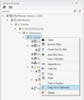

Save the markup.

Assign yourself access to the workbook in the custom extension package. This is best done by re-publishing the workbook access in the solution hosting EPM Planner and the custom extension package.

Open the workbook by previewing it from the designer as it will not appear in the menu until the package is part of a process’ content.

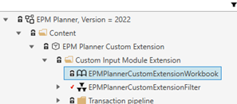

There is a basic list of todos listed in the workbook:

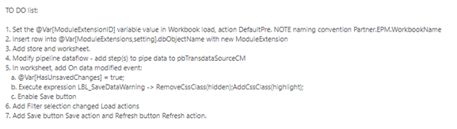

The following two chapters explain patterns 1 and 2 more in-depth. Note that much of the Planner integration specific topics are covered by the custom extension template.

## Pattern 1 

Create a new Planner input module extension

> [!NOTE]
> Before creating a new custom Planner input module extension, consider carefully if one or more driver-based models make up a “good enough” solution as they are supported and upgraded as part of standard Planner and a custom extension may thus be avoided in the first place.

> [!NOTE]
> Any customizations made as additions to the EPM Planner package, should be contained in separate packages and developed in the solution that acts as the EPM Planner blueprint. This will allow for access to Planner objects using the @Object notation and any workbooks in the package that should appear in the hamburger menu can be included in the process content when creating a new Planner process:

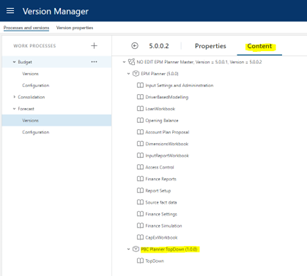

> [!NOTE]
> Never use Planner objects such as filters, worksheets, setting tables, reports, etc directly in custom module workbooks. Create custom objects that refer to the data in question.

### Register new Planner input module extension

A Planner input module extension comes in the form of a workbook and associated store(s) and worksheet(s).

Input module extensions are registered in @Object[ModuleExtensions,setting].dbObjectName.

**Relevant attributes:**

 | Column | Description |
 | --- | --- |
 | ModuleExtensionID | The id of the module extension. Naming convention used by Profitbase for standard modules: **Profitbase.EPM.WorkbookName**. Propose to use **Partner.EPM.WorkbookName** |
 | WorkbookID | Version specific workbook id (i.e. @Object[WorkbookName].Id). Must be updated post version deployment to reflect the actual workbook id for the version in question. |
 | WorkbookName | The workbook object name as given in the Profitbase InVision designer. NOTE workbook names must be unique as there is no type-qualification available for workbooks when using @Object notation. |
 | InUse | Published | Not published (true/false) |
 | ModuleExtensionID_Name | Default description. |
 | ModuleExtensionID_Name_NO | Description - Norwegian translation |
 | ModuleExtensionID_Name_EN | Description - English translation |
 | WorkbookPixelHeight | Used when launching module in new window from Plan Overview (integer). |
 | WorkbookPixelWidth | Used when launching module in new window from Plan Overview (integer). |
 | WorkbookPixelLeftAdjustment | Used when launching module in new window from Plan Overview (integer). |
 | WorkbookPixelTopAdjustment | Used when launching module in new window from Plan Overview (integer). |
 
 Attributes in bold above are maintainable by the user in the Input settings and administration workbook:
 
 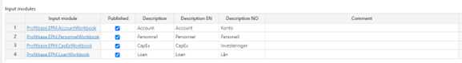

### Plan overview interaction

This part is taken care of in the custom extension template.

The Plan overview workbook will launch the module and use query string variables to represent the context:

**DepartmentID** – Department filter context

**ProjectID** – Project filter context

**ActivityID** – activity filter context

**FilterChoice** – Period filter context

**ReportLineID** – Report line context (when launched by clicking a report line)

**MessageBackTo** – the WorkbookID for the Plan Overview workbook. If not null, this should be used for sending messages back to the Plan Overview workbook which listens for these messages. When sending messages, make sure to limit to CurrentUser or else a broadcast to all users having the Plan Overview workbook open will take place.

When data is changed: DirtyFlagRefresh

After transaction pipeline is completed: RefreshSummary

Back – indicates whether launched in same window (1) or as new window (0). Used to activate/deactivate Back button. A click on an active Back button should execute an OpenBrowserWindow with the Plan overview workbook as the target including the query string parameters except for ReportLineID, MessageBackTo and Back (query string parameter values may have changed if user has changed the context while in module).

> [!NOTE]
> The URL may or may not contain certain variables, depending on the context. The custom workbook should handle situations where certain query string variables are not provided.

The relevant filter sources:

**Department filter:** @Object[Department,dim].dbObjectName

**Project filter(*):** @Object[Project,dim].dbObjectName

**Activity filter(*):** @Object[Activity,dim].dbObjectName

**Period filter:** @Object[FctPeriodFilterSource,view].dbObjectName

***(*):** the filters are optional, naming and visibility controlled in: @Object[InputFilters,setting].dbObjectName.*

Other issues to consider:

**IsAppReadonly()** – to control availability of non-grid actions such as buttons (enable/disable) when a version is closed and thus editable.

User-editable attributes in @Object[ModuleExtensions,setting].dbObjectName such as name (set using SetAppTitle()) and Published. Standard Planner input modules will avoid loading filters, enabling buttons and loading data when a module is not published. A message is displayed:

The text code for the message is: NoAccess

Integration with New Task form (separate doc)

If Workflow is to be used, a separate workflow with identical states to the Planner one should be created in the custom module as any interaction with the Planner workflow will not survive an upgrade. In such cases the standard relaying of state from Plan Overview to its modules when changing the state from Plan Overview will not be supported for custom modules.

## Create custom financial transactions

Custom financial transactions are created in @Object[pbTransdataSourceCM,store].dbObjectName.

| Column | Description |
| --- | --- |
| LegalEntityID | Legal entity dimension id |
| DepartmentID | Department dimension id |
| DepartmentID_DCD | Department context dimension id |
| AccountID | Account dimension id |
| ProductID | Product dimension id |
| MarketID | Market dimension id |
| SupplierID | Supplier dimension id |
| EmployeeID | Employee dimension id |
| ProjectID | Project dimension id |
| ActivityID | Activity dimension id |
| Dim1 | Free dimension 1 dimension id |
| Dim2 | Free dimension 2 dimension id |
| Dim3 | Free dimension 3 dimension id |
| Dim4 | Free dimension 4 dimension id |
| CPLegalEntityID | Counterparty legal entity id – used for intercompany trade |
| CPDepartmentID | Counterparty department id – used for intercompany trade |
| CPAccountIDOvr | Counterparty account id – used for intercompany trade |
| CategoryID | Free dimension category dimension id |
| TextInpID | Free dimension text id dimension id |
| Transdate | Transaction date time |
| Amount | Amount in CurrencyForeignID |
| CurrencyForeignID | Currency id identifying the amount |
| TransTypeID | 1 (regular transaction) |
| Qty | Optional quantity |
| AccTypeID | PL (Profit Loss) |
| ModuleExtensionID | ID uniquely identifying the module’s data |
| SYS_OriginID | Used by Profitbase InVision when using the transaction pipeline |
| SYS_OriginColumnID | Used by Profitbase InVision when using the transaction pipeline |
| SYS_TransGeneratorID | Used by Profitbase InVision when using the transaction pipeline |
| SYS_OriginRowIdentity | Used by Profitbase InVision when using the transaction pipeline |
| SYS_DataSetID | Obsolete |
| WithholdTaxPctOvr | Optional financial setting value override |
| VATPctOvr | Optional financial setting value override |
| VacationPayPctOvr | Optional financial setting value override |
| SpecialTaxCOvr | Optional financial setting value override |
| SpecialTaxBOvr | Optional financial setting value override |
| SpecialTaxAOvr | Optional financial setting value override |
| ShrinkagePctOvr | Optional financial setting value override |
| ReturnPctOvr | Optional financial setting value override |
| PriceOvr | Optional financial setting value override |
| PensionEmployerPctOvr | Optional financial setting value override |
| PensionEmployeesPctOvr | Optional financial setting value override |
| ObsolescencePctOvr | Optional financial setting value override |
| GrossMarginPctOvr | Optional financial setting value override |
| FreightOutPctOvr | Optional financial setting value override |
| FreightInPctOvr | Optional financial setting value override |
| EmployerTaxPctOvr | Optional financial setting value override |
| DiscountPeriodicPctOvr | Optional financial setting value override |
| DiscountPctOvr | Optional financial setting value override |
| DaysOfCreditOvr | Optional financial setting value override |
| CostPriceOvr | Optional financial setting value override |
| CogsPctOvr | Optional financial setting value override |
| CashPctOvr | Optional financial setting value override |
| BadDebtPctOvr | Optional financial setting value override |

The built-in Profitbase InVision Transaction pipeline function (using Distributer, Producer and Mapper functions) can be used, or the data can be scripted. If scripting is used, the existing slice of data must be deleted explicitly before re-inserting the slice of data.

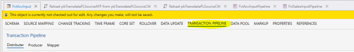

The data context defines the slice of data and must as a minimum include the ModuleExtensionID identifying data from the custom module. Normally, department is also part of the data context, making it possible to slice the data per module and department. For data context purposes, the DepartmentID_DCD column is used.

The following part is taken care of in the custom extension template:

In a transaction pipeline dataflow, the following two scripts must be executed post the creation of the transactions – they involve piping the data through to the PL (Profit & Loss) and AFP (preliminary social cost generation) stages:

**@Object[Reload pbTransdataPLSourceCM,script].Id

@Object[Reload pbTransdataPLSourceAFP from pbTransdataPLSourceCM,script].Id**

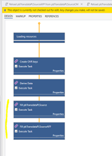

## Actions to be performed post version deployment

This section is also relevant for Pattern 2 - Create a new module that will follow Planner’s versioning only.

The custom package should have its own post version deployment dataflow:

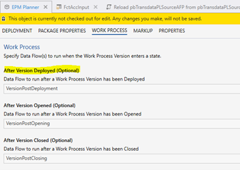

This dataflow should be able to take actions based on the following package variables that are set depending on the user’s selections made when creating a new version:

Profitbase_EPM_Planner_PostDeploymentAction

RollFwd (*)

Init (#)

Nothing (pure copy, nothing to be done)

(*) Profitbase_EPM_Planner_RollOverDelta

Number of months to roll forward

(#) Profitbase_EPM_Planner_StoreReferenceDate

New store reference date

The custom package is responsible for its own initializing and roll forward operations.

If the customization is a module extension (i.e. exists in @Object[ModuleExtensions, setting].dbObjectName), the WorkbookID column must be updated to reflect the actual WorkbookID (i.e. @Object[WorkbookName].Id).

If Workbook(s) are to be “go to” workbook options when creating new tasks, they must be registered in SYN_Common_Workbook in the correct process/version context:

| Column | Description |
| --- | --- |
| WorkbookID | The workbookid found as @Object[workbookname].Id |
| WorkbookName | The default title of the workbook |
| WorkbookName_EN | The English title of the workbook |
| WorkbookName_NO | The Norwegian title of the workbook |
| MasterWorkbookName | The workbook object name as found in the Profitbase InVision designer. This is used for Process tasks which are defined outside of a versioned context. |
| ProcessID | The current process id as found in [dbo].[SYS_WorkProcessVersions] for WorkProcessVersionID = '@CurrentWorkProcessVersionID' |
| VersionID | '@CurrentWorkProcessVersionID' |
| WorkbookURL | Same as WorkbookID |
| Editable | True |
| Versioned | True |
| ApplicationID | EPMPlanner |

> [!NOTE]
> that this part is taken care of in the custom extension template but will require some adaptation. The following dataflow is attached to the custom extension package as a After Version Deployed dataflow:

It reads the relevant Planner package properties and splits into two control flows depending on the PostDeploymentAction package property:

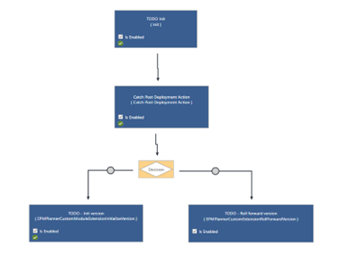

## Pattern 2 - Create a new module that will follow Planner’s versioning only

This should be a subset of pattern 1, refer to Actions to be performed post version deployment

## Pattern 3a – Customize the transaction pipeline and/or FinanceAll dataflow (Dataflow based)

Starting from Planner 6.0.0, the transactions pipelines support both flow and dataflow (depending on configuration). The following assumes the use of dataflow-based transaction pipelines.

The transaction pipeline for the Account, Personnel and Driver based modules can be customized by adding a sql script that executes prior to (PRE) and/or after (POST) the standard transaction pipeline of the module.

Note that from Planner 6.1.x, transaction pipelines are purely flow based, refer to Pattern 3b – Customize the transaction pipelines (flow based) for details.

It is possible to register a custom script per pipeline PRE and/or POST. Scripts registered as object names as defined in the Profitbase InVisiondesigner which are evaluated to version specific object ids at run-time.

Table for registering custom scripts: @Object[CustomPipelineScripts,setting].dbObjectName. There is no user interface, so content will have to be scripted or input using the Profitbase InVision designer:

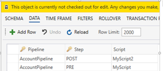

Scripts must use context variables:

**@ModuleExtensionID** – id defining the module or model

**@DepartmentID** – selected filter value (id) in the department filter (123XYZZZYX321 outside of context)

**@DepartmentColumnName *** - Column name in wide dimension that represents the selected filter value, default is DepartmentID (leaf).

**@ActivityID *** – selected filter value (id) in the department filter (123XYZZZYX321 outside of context or if dimension is not used)

**@ActivityColumnName *** - Column name in wide dimension that represents the selected filter value, default is ActivityID (leaf).

**@ProjectID *** – selected filter value (id) in the department filter (123XYZZZYX321 outside of context or if dimension is not used)

**@ProjectColumnName *** - Column name in wide dimension that represents the selected filter value, default is ProjectID (leaf).

*****From Planner 5.2.4, with the introduction of multi-department input, the context slice is dynamic and script must therefore handle situations where context is defined at higher filter levels, for example @DepartmentColumnName = ‘L2’ And @DepartmentID = ‘Norway’ when pipeline is triggered from a workbook. It is suggested that the script makes use of dimension slicers that is used to control the context, for example:

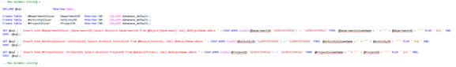

The slicer table should be joined into any select that delimits the context.

If the registered script does not exist in current version context, no error message is given as the custom step is ignored.

Scripts should never be created in EPM Planner package. Should be created in a separate custom package co-existing with EPM Planner. A template script with variables can be copied from EPM Planner:

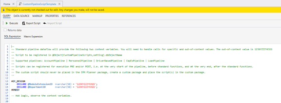

From Planner 5.4.0 the FinanceAll dataflows can also be customized with PRE and POST scripts (no parameters).

The FinanceAll dataflows (FinanceAllBaseline and FinanceAllScenario) source transactions from input modules and executes financial engines producing a plan ledger.

In some cases, it may be desirable to introduce custom logic before the financial engines starts and after the financial engines finish.

Use cases may be to add data to price list from say a driver-based model before if simulation on price is required and allocation (non-cash) of cost from admin to production departments after simulation is finished.

This can be done by adding custom scripts and registering these in the CustomPipelineScripts table in the same way as for transaction pipelines:

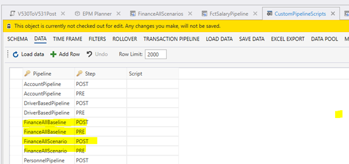

The PRE script executes before the start of the first financial engine:

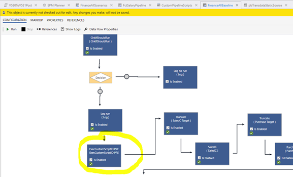

The POST script executes after the finish of the last financial engine and prior to the static feedback loop to the Plan overview workbook and the aggregation of report data:

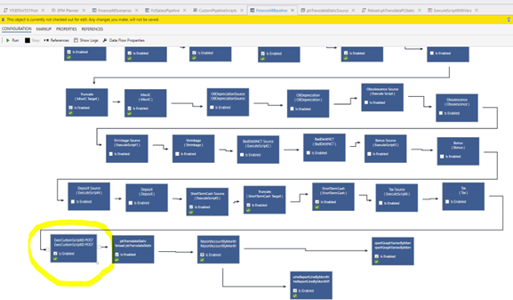

## Pattern 3b – Customize the transaction pipelines (flow based)

From Planner 6.0.0, the transaction pipelines (Account, Personnel and Driver based) support flow and from Planner 6.1.x, the transaction pipelines are purely flow based.

For a solution configured to use flow, the custom scripts must be connected to the relevant flow(s).

The following outlines how to register a pre or post custom pipeline script in a standard flow pipeline.

Using the InVision designer, open the relevant versioned solution and filter the solution explorer on the “Flow” object type:

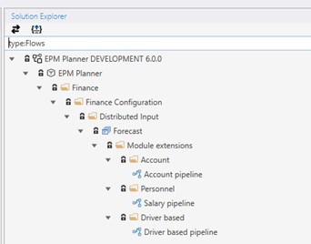

Open the flow that is to be customized by clicking on it. Note that this will open the Flow designer.

In the transaction pipeline flow, two sub-flows are made available for customizing the standard behavior:

Custom pre: sub-flow that executes before the standard pipeline executes

Custom post: sub-flow that executes after the standard pipeline has been executed

The sub-flows can be found as separate tabs:

The “Custom pre” and “Custom post” sub-flows are not upgradeable meaning that an upgrade will retain any custom script added.

To register a custom sql script, determine which sub-flow to use (pre / post) and the click on the relevant tab to open the sub-flow:

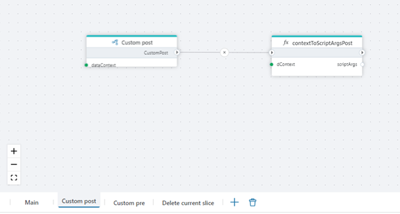

Add a SQL script action (right-click and select “Add Action”) and attach it to the end of the last sub-flow node:

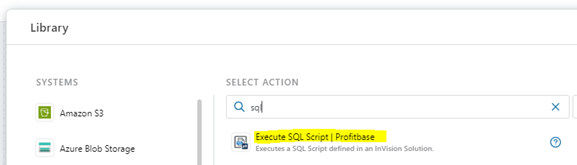

Click the sql script node and select the script and define arguments as shown:

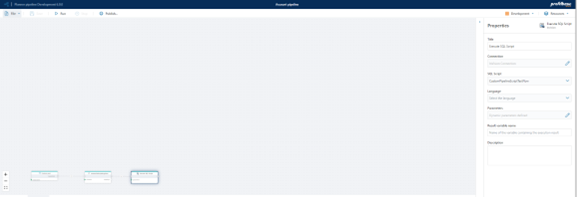

The custom sql script is selected from the drop-down “Sql script”.

The sql script parameters are set in the “Parameters” selection like this:

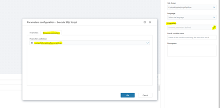

> [!NOTE]
> that the parameters supported are the same as described here: Pattern 3a – Customize the transaction pipeline and/or FinanceAll dataflow (Dataflow based)

When using pre/post transaction pipeline scripts that will add transactions, the built-in module transaction tables should be used:

Account:

pbTransdataPLSourceFlow

Personnel:

pbTransdataPLSourceHRFlow

Driver based:

pbTransdataPLSourceDriverBasedFlow

This allows for the most efficient processing and rendering of data. The flow-based pipelines will always slice input data per departmentid (driver based: moduleextensionid and departmentid) by deleting existing slices and inserting new slices. By using the built-in transaction tables for additional transactions means that the script will only have to insert the transactions as the built-in delete existing slice will remove both standard and custom transactions for the current slice (assuming that the correct dimensional context is applied for the custom transactions).

A note on social costs (vacation pay, employer tax, pension): some transactions will generate social costs. For the social costs to be displayed in the Plan overview (i.e. pre financial engines), they will have to be defined or calculated by the custom script. There are two possible representations for the costs:

As separate transactions with the relevant costs calculated as amounts

As additional information on the source transaction itself with appropriate rates. This is the preferred method as it limits the number of rows in the transaction table. Built-in rendering to plan overview, account details and account drill down reports make use of this additional information. The following fields are relevant:

Vacation pay:

**AccVacPay** – account for vacation pay

**RLVacPay** – report line id for vacation pay

**VacationPayPctOvr** – the vacation pay rate (e.g. 0.12 indicating 12%)

Employer tax:

**AccEmplTax** – account for employer tax

**RLEmplTax** – report line id for employer tax

**EmployerTaxPctOvr** – the employer tax rate (e.g. 0.141 indication 14.1%)

Employer tax on vacation pay:

**AccEPTaxOnVacPay** – account for employer tax on vacation pay

**RLEPTaxOnVacPay** – report line id for employer tax on vacation pay

Existing values in columns VacationPayPctOvr and EmployerTaxPctOvr used to calculate combined rate

Pension employer:

**AccPensionEmployer** – account for pension employer

**RLPensionEmployer** – report line id for pension employer

**PensionEmployerPctOvr** – the pension employer rate (e.g. 0.05 indication 5%)

## Pattern 4 

Customize assumptions (lookup) measures for the Driver Based module.

The standard assumption table for the driver-based module is found in the Driver based modelling workbook:

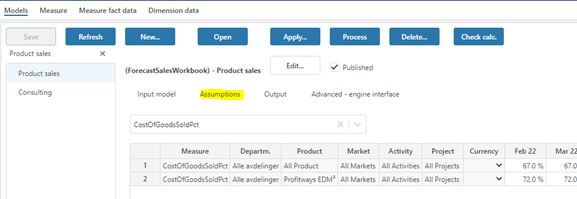

Sometimes it may be required to customize the source for assumptions. This can be done by creating a custom view adhering strictly to the internal format of the standard assumption table and registering this view as an override in the Base settings table found in the Input Settings and Administration workbook settingID DriverBasedCustomAssumptionView:

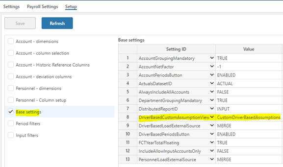

Such a view should never be created in EPM Planner package. Should be created in a separate custom package co-existing with EPM Planner.

The view will have to be common for all driver-based models, i.e. either you customize or you don't. However, it's a good idea to combine with standard setting as described below so that only the assumptions you need to customize are custom.

View need to conform strictly to the format for FctSalesInputAssumptions, including PBRowIdentity. Example view established in custom extension package:

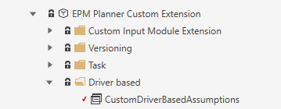

Rules that apply:

The custom view can combine the standard assumption table (@Object[FctSalesInputAssumptions,setting].dbObjectName and custom sql but any one measure can EITHER have its assumption values from the standard table or custom sql.

* can be used for indicating all as with ranked input. This can be used to avoid the custom values to explode if for example certain dimensions are not used and the assumption values apply across all dimension value combinations for that dimension.

For any custom assumption values where all values and specific values are used, PBRowidentity and Pri (rank/specificity) field logic must be used, i.e. more specific values have higher Pri (rank/specificity) and the different rows for that specific assumption must have unique PBRowIdentity values.

Please also observe that the PBRowIdentity values for the custom measures must persist across queries against the view as the driver-based pipeline will query on a set of PBRowIdentities. This means that you cannot use constructs such as ROW_NUMBER() Over ( Partition..) to generate PBRowIdentity as this will result in different results for each query.

## Pattern 5 

Use a custom target store for data import

## Pattern 6 

Use a custom source for data export

## Pattern 7 

Add custom button/row context menu in standard Planner modules

From Planner 5.4.0, it is possible to enable and configure a custom button and/or a custom row context menu in modules Account, Personnel, Driver Based and the Plan overview workbook. The purpose is to enable a UI integration to custom workbooks and pass the context from the standard workbook to the custom workbook without “breaking” the standard.

As an example, a custom workbook offering a drill-to-detail of ledger data may be configured as a custom row context menu receiving contextual information from the appropriate row such as department, account, project and so on that may be used to filter a custom report.

This is set up using the Profitbase InVision designer in the setting table ModuleExtensions:

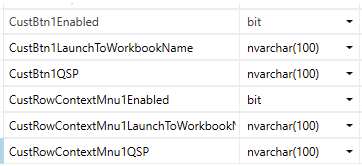

While not a module, it is also supported to add a custom button and a custom row context menu to the Plan Overview workbook. Details stored in separate columns in the ModuleExtensions table.  
[!NOTE]
> Row for ModuleExtensionID = Profitbase.EPM.AccountWorkbook taken into account

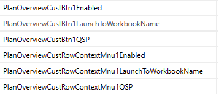

Custbtn1Enabled - (true | false, default false). If false, the button is hidden

CustBtn1LaunchToWorkbookName - the workbook name as given in the invision designer. Planner will evaluate the workbook id based on the version context in which it is called. The workbook must exist in the same version context as the calling workbook (e.g. a custom package parallel to the Planner package.

CustBtn1QSP - an optional part of the query string that may hold context in addition to the standard context provided by Planner. This must be specified in the form parameter1=value1&parameter2=value2 (note the ampersand for separating multiple custom parameters).

CustRowContextMnu1Enabled (true | false, default false). If false, the row context menu is inactive.

CustRowContextMnu1LaunchToWorkbookName - the workbook name as given in the invision designer. Planner will evaluate the workbook id based on the version context in which it is called. The workbook must exist in the same version context as the calling workbook (e.g. a custom package parallel to the Planner package.

CustRowContextMnu1QSP - an optional part of the query string that may hold context in addition to the standard context provided by Planner. This must be specified in the form parameter1=value1&parameter2=value2 (note the ampersand for separating multiple custom parameters).

Context

Custom button - Department, Project and Activity filter values, the workbook id of the workbook from which the custom button is clicked and an optional query string context. Module specific context include the Account filter context is provided for the Account module. For Personnel, the Employee filter context is provided. For Driver based, the Product and Market filter context is provided.

Button is placed:

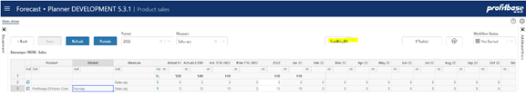

Custom row context menu - The row context is provided, i.e. all values of relevant input dimensional context columns such as DepartmentID, ProjectID, ActivityID, CPLegalEntityID and so on. Module specific context include, AccountID for the Account module, EmployeeID for the Personnel module, ProductID, MarketID and SupplierID for the driver based module.

Custom row context menu is available on right-click on Project and Activity dimension columns of main input fheet. Module specific additions include Account column for the Account module, Employee column for the Personnel module and Product and Market columns for the driver-based module.

Titles and translations

The following localization text codes is referenced:

Account module:

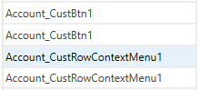

Personnel module:

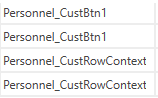

Driver based module (generic texts):

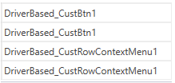

For the custom button, driver-based model-specific texts may be added by adding a localization of the form <ModuleExtensionID>_CustBtn1 for example MyModel_CustBtn1 for a model with ModuleExtensionID = MyModel.

Use type $AppUIResource for added localization texts.

Note that model-specific texts are not supported for the custom row context menu.

Plan overview:

Size and positioning of custom workbook when called from standard modules

The OpenBrowserWindow command is used to open the custom workbooks. It is possible to control the height, width, left and top adjustments in pixels by setting the following values in the setting table ModuleExtensions:

For Account, Personnel and Driver based modules:

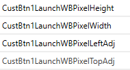

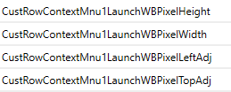

For Plan overview:

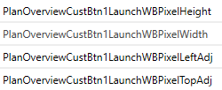

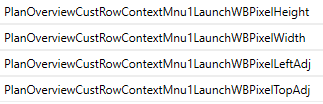

The values are pixels and the data type is therefore integer.

Communication back to caller

The workbookID of the caller is part of the query string to the custom workbook as the “MessageBackTo” variable. This value can be stored in a workbook variable in the custom workbook like this:

@Var[MessageBackTo] = @Var[QSP:: MessageBackTo];

A SendMessage event may be issued by the custom workbook to signal to the calling module/workbook to refresh.

The Plan overview workbook (InputReportWorkbook) has a “RefreshSummary” message received event that refreshes the summary page.

The Account, Personnel and Driver based modules (AccountWorkbook, PersonnelWorkbook and DriverBasedWorkbook) has an “RefreshInputPage” message received event that refreshed the main input page.

Example of a SendMessage instruction back to the calling module:

ConfigureMessage(@Var[MessageBackTo], SYS.CurrentUserName, "RefreshInputPage", '');

## Pattern 8 

Import transactional plan data from an external source.

In some cases plan data from external sources need to be included in the plan without involving any input, i.e. to be imported as transactional data to the plan.

In EPM Planner, the transaction store @Object[pbTransdataSourceCM,store].dbObjectName can be used for this.

Data should be identified by a ModuleExtensionID.

Use the following pattern:

Set up a standard Data Import job to EPM Datamart destination store pbTransdataSourceCMExternal (identified by synonym SYN_Datamart_pbTransdataSourceCMExternal).

This will import the data to EPM Datamart.

To import the data to an EPM Planner version, create an Operation that contains the following sql script steps:

ImportFrompbTransdataSourceCMExternal

Parameter: @ModuleExtensionID, @DepartmentID = 123XYZZZYX321

Reload pbTransdataPLSourceCM

Parameters: @ModuleExtensionID, @DepartmentID = 123XYZZZYX321, @SYS_OriginID = 123XYZZZYX321

Scripts have parameters that must be set. Note that when adding parameter values to the Operation step, no quotes should be used as shown in the examples above.

Note that @ModuleExtensionID should always be set to identify the set of data imported.

Parameter value 123XYZZZYX321 means all.

For a description of the various data fields and the requirements related to the fields, please refer to Create custom financial transactions

> [!NOTE]
> from 6.0.x and onwards data is returned to the plan overview and associated reports through stored procedures that are compiled to reflect the current configuration. When introducing custom transactions, these stored procedures will have to be recompiled manually in the version in which they are first introduced (later deployments will adapt so long as data exists in the CM table).

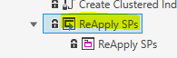

A note on social costs (vacation pay, employer tax, pension) from 6.0.x and onwards: Some transactions may produce social costs. For custom modules, these transactions are assumed to be part of the imported data, i.e. the source for imports should include separate transactions for the relevant social costs involved.

# Pattern 9 

Register custom module with Operation Manager

The Operation Manager is a common resource that allows you to set up, execute and schedule operations for any module that is known to the operation manager. To make Operation manager aware of a custom module, you need to register it. This can be done by executing a sql command like the one shown below:

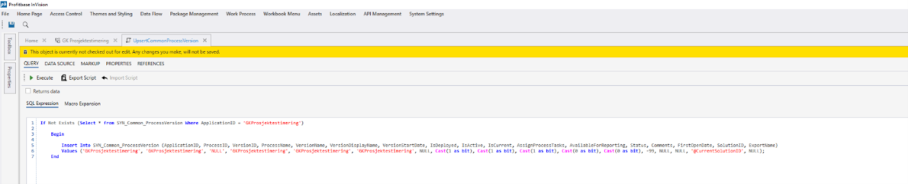

In the example, the name of the custom module is GKProsjektestimering’

If Not Exists (Select * from SYN_Common_ProcessVersion Where ApplicationID = 'GKProsjektestimering')

Begin

Insert Into SYN_Common_ProcessVersion (ApplicationID, ProcessID, VersionID, 	ProcessName, VersionName, VersionDisplayName, VersionStartDate, IsDeployed, IsActive, IsCurrent, AssignProcessTasks, AvailableForReporting, Status, Comments, FirstOpenDate, SolutionID, ExportName)

Values ('GKProsjektestimering', 'GKProsjektestimering', 'NULL', 'GKProsjektestimering', 'GKProsjektestimering', 'GKProsjektestimering', NULL, Cast(1 as bit), Cast(1 as bit), Cast(1 as bit), Cast(0 as bit), Cast(0 as bit), -99, NULL, NULL, '@CurrentSolutionID', NULL);

End

## Pattern 10 

Link processing of driver based models using a dynamic map of from/to departments

Linking processing of driver based models is supported from Planner version 6.1.0 and is only supported for the flow based pipeline.

In certain cases, maintaining the department map based on selections that end user make in their input may be beneficial. In such cases, you should add a pre custom script to the driver based flow pipeline that maintains the ModuleExtensionLinkDepartmentMap table.

If for example, the end user’s selection of target department is saved in the activity dimension of the input workbook for a certain model, do the following:

Set up the link in the Driver Based modelling workbook, un-checking the self departmental selection but leaving the map empty as this should be maintained dynamically based on the end user’s actions:

Using the InVision designer or sql, get the LinkID as this will be used in the custom script:

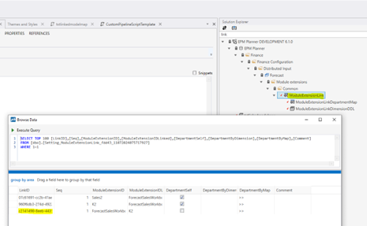

Create a custom pipeline script by making a copy of the template script and making sure to place it in a custom package and add logic to synchronize the ModuleExtensionLinkDepartmentMap table with the distinct Activity dimension values from the input store (FctSalesInput) for the relevant processing context only as outlined in the comments in the script template.

Add the script and a node that removes the ModuleExtensionLinkDepartmentMap object from the cache to the Custom pre hook of the flow:

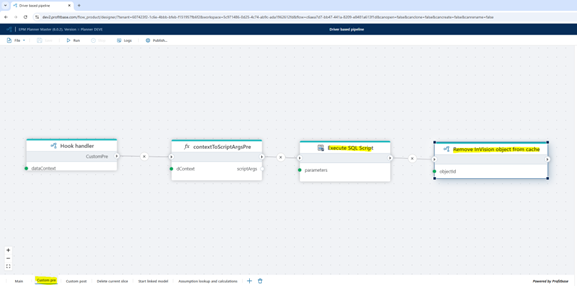

## Data Architecture and Extensions

When creating extensions you need to know where to find data and where to put data and using sources and targets that will be present and most stable over version upgrades. The picture below show the main dataflow in Profitbase Planner.

This presentation contains figures that show how the integration describe above will connect to the rest of Planner.

Profitbase Planner Architecture.pptx

## Recommendation summary:

Use pbTransdataSourceCM when creating and inserting finance source transactions.

Use pbTransdataPL when presenting Profit & Loss information – typically in workbook report.

Use ReportAccountByMonth whenever you need to do postprocessing such as allocations and redistribution for reporting purposes. Use extract, process and present fi possible. Avoid doing deletes. Remember that “Finance All” will replace the total content.

Using table and views – try to use tables/views with SYN or CPV.

For dimensions there will be a shared dimension in datamart and a local dimension in versioned solution. Access these using @Object[Dimension, Dimension].DbObjectName to get the local and SYN_Dimension to get the shared dimension.

Avoid using other tables and views. If you have to: It is recommended to use a view as an interface to protect the implementation against changes and help document this dependency.

It is important to minimize external reference points to minimize risk that an upgrade will break compatibility.

Be aware of the content in this document which will be updated and extended with new patterns.
