# Planner Data Requirements

This document defines the minimum dimension, report and transaction data that is required to run the Planner solution as well as optional data required depending on the Planner functionality used.

It also describes how external data can be imported to Profitbase Planner.

The intended audience of this document is implementation partners configuring the solution initially and establishing integrations with external sources. The reader is expected to be familiar with Planner capabilities and functionality.

Planner is deployed with initial (demo-only) data that will make Planner functional upon deployment and that may act as examples for data that is required. This applies to all data described in this document.

Planner is self-contained with respect to dimensions and some fact data in the sense that these can be input and maintained in Planner. In practice, however, some of the dimensions and ledger transaction data will typically be imported from external sources or from files.

Planner dimensions may be maintained in the “Dimensions” workbook in the “Edit dimensions” page by selecting the appropriate dimension:

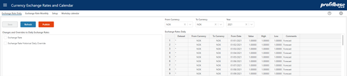

Editing is done directly in the hierarchy (drag-drop, use of toolbar and … (3 dots) context menu actions) allowing for a dynamic number of levels depending on the actual need. Changes are saved using the save button.

Note that certain dimensions, such as Legal Entity, Department and Account has requirements with respect to properties that must have values for Planner to work.

Note also that dimension management is by default centralized to the primary dimensions. Primary dimensions can be published to specific versions.

Each version has it’s own copy of the dimensions. By the use of the solution picker, context can be switched to a specific version and local editing can take place there.

Each version is as such self-contained with respect to dimensional data. However, it is good practice to manage dimension centrally (primary dimensions) as much as practically possible.

Import-from-clipboard functionality is available using the Import icon.

The currency exchange rates may be maintained in the “Currency Exchange Rates and Calendar” workbook:

Fact data may be maintained in the “Source fact data” workbook within a specific version:

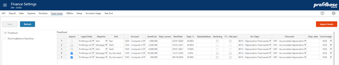

Similarly, fixed assets may be maintained in the “Finance Settings” workbook within a specific version:

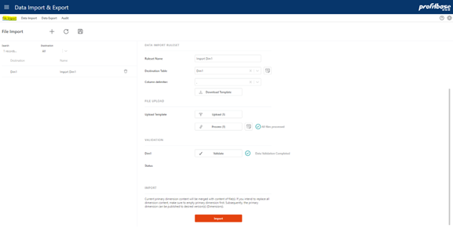

Best practice during an implementation- and setup-phase, is to establish dimensional and transactional data either within Planner or by the use of the File import option while at the same time identifying, developing and testing appropriate integrations in time for production start.

File import (from local csv file) to the standard Planner dimension and fact formats is available in “Data Import & Export” in “File Import” page:

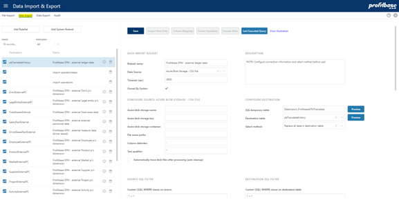

A more generic and sophisticated import option is available in the “Data Import” page allowing for transformation and import of data from external sources located in SQL server or Azure blob store.

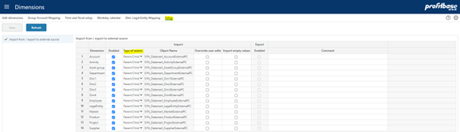

# Minimum data requirements

The following are the minimum data requirements and limits the use of input modules to the Account, CapEx and Loan modules only. For use of other modules, please refer to Optional data requirements – depending on functionality used

Required (minimum) dimensions are:

- Legal Entity dimension – this is the formal company structure.

This structure also needs to include entities that is used for elimination when intercompany transactions occurr and one want to record intercompany transactions.

The Legal Entity dimension is typically imported from an external source or file.

- Department dimension – this is the structure within each Legal Entity used for providing plan input and get actual accounting transactions.

The department structure must contain the Legal Entity level and thus the LegalEntityID column.

All transactions must contain Legal Entity and Department.

The Department dimension is typically imported from an external source or file.

- Account dimension – this is the structure that is used to determine the type of transactions relative to a finance fiscal regime.

Planner requires a common (corporate) account dimension for all companies in the solution.

The Account dimension is typically imported from an external source or file.

Note that the recommended format for importing dimensions is the parent/child format. Planner does, however, also support a fixed wide format for legacy reasons but the support for this format is likely to end in a future version and partners are therefore discouraged from using this format.

The format used is configured in the “Setup” page of the “Dimensions” workbook:

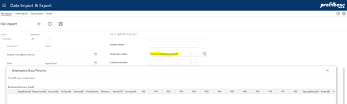

- Report Setup – setup of one or more reports containing report lines that map to ranges of accounts. The report setup is maintained in Planner.

The Planner input models are initiated from the Plan overview workbook that make use of a report typically named INPUT (configurable).

This report does exist when Planner is deployed, but must be adapted to each customer’s needs and the report lines that the INPUT report comprises of must be mapped to ranges of the customer’s account dimension.

In addition to the INPUT report, other reports exist and is used for reporting purposes (Finance Reports workbook). They should also be adapted and mapped to ranges of the customer’s account dimension.

- Currency dimension – define the currencies used.

The Currency dimension is typically maintained in the solution.

- Time dimension – contains calendar with days, months and years

The time dimension is generated within the solution.

Required Transaction (fact) data:

- Ledger fact - Actual (and other historic datasets if relevant) finance accounting transaction from general ledger.

Note that ledger fact data is not a pre-requisite per se, as input to the Planner account module can be made without any historical data present simply by adding input rows manually for the relevant departments and accounts.

Ledger fact data is, however, required in order for opening balances to be generated.

Ledger fact data may be introduced post production start. In most cases, however, ledger data is included at or before production start.

Ledger fact data is typically imported on a regular basis from an external source.

As an alternative to the transactional format, a trial balance with opening balance per fiscal year (column FiscalYearNo) format can be used. This format is available in the “Data Export & Import” workbook in the “File Import” page:

This format supports opening balance (column OB) and a choice between YTD and periodic change methods (columns P01 – P12) controlled by column RowsIsYTD.

Any data imported through this format is converted to the ledger transactional format by Planner.

- Currency Exchange rates.

Exchange rates for historic data should be the same as the ERP system.

## Legal Entity Dimension

The parent/child format (recommended):

|  | Column name | Description | Mandatory / Optional | Comment |
| --- | --- | --- | --- | --- |
| 1 | ID | ID for the Legal entity | M | Primary Key
Company Code |
| 2 | Name | Name for the Legal entity | M |  |
| 3 | ParentID | ID for the parent node | O | Must be a valid ID or NULL. Any ID with ParentID = NULL is placed at the root level |
| 4 | FunctionalCurrencyID | Home currency for this Legal Entity | M |  |
| 5 | OperationTypeID | Type of legal entity (Main \| Elimination) | M |  |
| 6 | DefaultDepartmentID | Default department used for situations where a department is not normally given, such as opening balances | O |  |

Alternatively (not recommended), a legacy fixed wide format can be used as outline here: Legal Entity dimension

Regardless of format used:

It is important that Legal Entity IDs of the dimensions corresponds to the IDs used for actual general ledger data.

Please note that any non-visual characters such as as carriage return, line feed and so on should not be used for dimension member ids nor descriptions.

In order to best secure data quality, please refer to the section on Data quality audit.

## Department Dimension

The parent/child format (recommended):

|  | Column name | Description | Mandatory / Optional | Comment |
| --- | --- | --- | --- | --- |
| 1 | ID | ID for the Department | M | Primary Key |
| 2 | Name | Name for the Department | M |  |
| 3 | ParentID | ID for the parent node | O | Must be a valid ID or NULL. Any ID with ParentID = NULL is placed at the root level |
| 4 | LegalEntityID | ID for the Legal Entity that the department belongs to | M | All departments must be tagged with their legal entity id. |

Alternatively (not recommended), a legacy fixed wide format is described here: Department dimension.

Regardless of format used:

Please note that the LegalEntityIDs should be different from the DepartmentIDs. If such cases of equality exist, the best practice would be to prefix the source DepartmentIDs with LegalEntityID before making use of them in Planner. For example, if both a LegalEntityID and a DepartmentID equals ‘pro’, best practice would be to rename the DepartmentID to ‘pro.pro’ thus making it unique.

It is important that DepartmentIDs of the dimension corresponds to the IDs used for actual general ledger data.

Please note that any non-visual characters such as as carriage return, line feed and so on should not be used for dimension member ids nor descriptions.

In order to best secure data quality, please refer to the section on Data quality audit.

There may be cases where the Department dimension consists of members where a legal entity’s functional currency cannot be established, for example a country level or similar.

In order to associate a currency with such members, those may be added to the “CurrencyReportID” setting in the Finance Settings workbook:

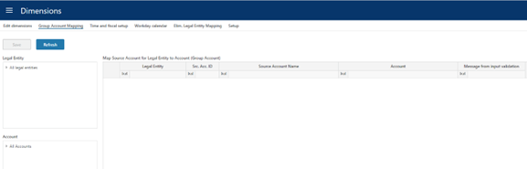

Example (ref. image above): assume that the department dimension contains a member “NO” that is not associated with a legal entity. To associate this member to the reporting currency NOK, this association can be done as shown in row #2 in the above image. When selecting this member in the organizational filter of relevant workbooks amounts will be converted to NOK.

## Account Dimension

The parent/child format (recommended):

|  | Column name | Description | Mandatory / Optional | Comment |
| --- | --- | --- | --- | --- |
| 1 | ID | ID for the Account | M | Primary Key |
| 2 | Name | Name for the Account | M |  |
| 3 | ParentID | ID for the parent node | O | Must be a valid ID or NULL. Any ID with ParentID = NULL is placed at the root level |
| 4 | SignFactor | Tells the sign for the transaction. E.g. expenses recorded as positive number gives SignFactor 1 while sales recorded as negative numbers gives SignFactor -1 | M |  |
| 5 | AccTypeID | Grouping account for Profit&Loss and Balance | M | Profit&Loss type = PL
Balance type = BAL |
| 6 | AllowInput | True/false
Marks the accounts that will be allowed plan input | M |  |

Alternatively (not recommended), a legacy fixed wide format can be used as described here: Account dimension

Regardless of format used:

It is important that AccountIDs of the dimension corresponds to the IDs used for actual general ledger data.

Please note that any non-visual characters such as as carriage return, line feed and so on should not be used for dimension member ids nor descriptions.

In order to best secure data quality, please refer to the section on Data quality audit.

Planner requires a common (corporate/group) account dimension for all companies. However, functionality exists allowing mapping of company-specific accounts to to corporate/group accounts in the Dimensions workbook:

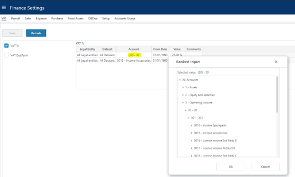

### Account dimension hierarchy

The account dimension hierarchy is used for defining Finance settings and not for reporting (see Report setup for details on reporting dimensions).

When defining settings that relate to account, dimensional levels may be selected using the socalled high level or ranked input selector:

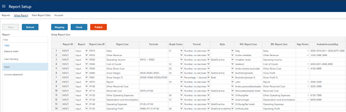

This ability to select higher dimensional levels enables fewer settings to be made that cater for all underlying accounts. When designing this hierarchy, the main consideration should therefore be the granularity most suitable for defining finance settings.

The account hierarchy consists by default of 3 levels, L1, L2 and L3 of which L1 is the highest level and L3 is the lowest level, immediately above the account level.

## Report setup

The Reports defined in the report setup are used for reporting in Planner.

The report setup is maintained in Planner in the Report Setup workbook.

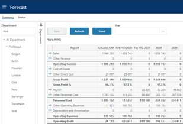

Any number of reports can be created containing any number of report lines that will either:

- Map to a range of account (ref. column “IncludeAccountsExp”)
  - Ranges of accounts are specified comma-separated, for example 3000-3005, 3011-3014 that evaluates to:
    - 3000, 3001, 3002, 3003, 3004, 3005, 3011, 3012, 3013 and 3014

Or

- Calculate across other report lines (ref. column “Formula”)
  - Formulae are specified as arithmentic operations addition (+), subtraction (-), multiplication (*), division (/) between ReportLineIDs, for example IP010 + IP020 that evaluates to:
    - The result of report line id IP010 added to the result of report line id IP020

Use of normal paranthesis () follow the general rule of paranthesis in arithmetic.

### The INPUT report

Used for the Plan Overview workbook and acts as a summary and launch site for these.

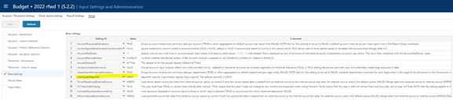

An INPUT report should always be present and set up to map the customer’s account dimension. The ReportID is default set to INPUT but can be configured if needed:

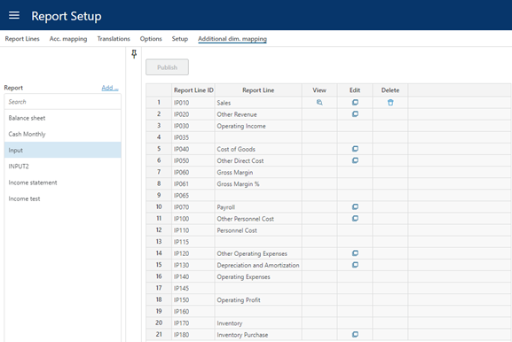

Note that for the INPUT report, no one account should map to more than one report line unless additional dimensionality determines how that specific account’s transactions are divided between report lines:

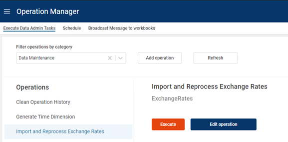

## Sign factor

Sign factor is relevant in two scenarios

- Account sign factor: a sign factor of -1 tied to an account will:
  - Switch the sign of any historical data
  - Switch the sign of any input data

This would typically apply to income accounts booked with a credit sign that one would like to see and input as a positive amount in an input form.

- Report line sign factor: a report line nets a range of accounts or is a calculation of other report lines.
The report line sign factor indicates whether this net amount should be presented "as is" (sign factor +1) or with the opposite sign (sign factor -1) in this particular report.
Note that any report lines that act as calculations of other report lines will perform that calculation based on the values displayed, i.e. after the sign factor has been applied.
## Ledger fact - Actual and other historical transaction datasets

The ledger fact can either be imported directly as transactions or via file import using the periodic finance trial balance and OB format and let Planner convert the data to the ledger format.

### Finance trial balance and OB (periodic format)

|  | Column name | Description | Mandatory / Optional | Comment |
| --- | --- | --- | --- | --- |
| 1 | LegalEntityID | ID corresponding to an item in the Legal Entity dimension | M | Company Code |
| 2 | DepartmentID | ID corresponding to an item in the Department dimension | M |  |
| 3 | AccountID | ID corresponding to an item in the Account dimension | M |  |
| 4 | AccTypeID | Classify transaction on account to be ‘PL’ for profit/loss, ‘BAL’ for balance transactions. Anything else will not be included in the financial results but may be used for reporting purposes. | M |  |
| 5 | DatasetID | Identifier of the transaction dataset, valid values: (Actual | Budget | Forecast) | M |  |
| 6 | FiscalYearNo | The fiscal year (yyyy) | M |  |
| 7 | Measure | The nature of data in OB and P01-P12 | M | AmountFunctional (default) AmountForeign AmountReporting Qty |
| 8 | RowIsYTD | Are the values found in periods P01-P12 YTD values or periodic values (true | false) | M |  |
| 9 | CurrencyID | The currency associated with the values in OB and P01-P12. |  | Note: if measure is AmountFunctional, CurrencyID should reflect the home currency of the legal entity identified on the transaction. |
| 10 | OB | The opening balance for the fiscal year identified on the transaction | O |  |
| 11 | P01-P12 | The YTD or period values for P01-P12 respectively depending on the RowIsYTD setting | O |  |

In addition to the mandatory information described above, the following dimensional information is optional but may be desirable to include depending on the Planner functionality used and the ability to connect ledger information to these dimensions:

|  | Column name | Description | Mandatory / Optional | Comment |
| --- | --- | --- | --- | --- |
| 1 | ProductID | ID corresponding to an item in the Product dimension | O |  |
| 2 | MarketID | ID corresponding to an item in the Market dimension | O |  |
| 3 | SupplierID | ID corresponding to an item in the Supplier dimension | O |  |
| 4 | EmployeeID | ID corresponding to an item in the employee dimension | O |  |
| 5 | Dim1 | ID corresponding to an item in the free dimension #1 (Dim1) | O |  |
| 6 | Dim2 | ID corresponding to an item in the free dimension #2 (Dim2) | O |  |
| 7 | Dim3 | ID corresponding to an item in the free dimension #3 (Dim3) | O |  |
| 8 | Dim4 | ID corresponding to an item in the free dimension #4 (Dim4) | O |  |
| 9 | ProjectID | ID corresponding to an item in the Project dimension | O |  |
| 10 | ActivityID | ID corresponding to an item in the Activity dimension | O |  |
| 11 | CPLegalEntityID | ID corresponding to an item in the LegalEntity dimension | O | Counterpart, to be used only for intercompany transactions |
| 12 | Description | Textual description of the row | O |  |

### Ledget fact (transaction format)

The table below defines the data required for finance general ledger actual data or other datasets such as financial goals or last official financial forecast.

There is no input solution for ledger fact data in Planner, an integration will have to be set up to load data from an external source uing the “Data Import & Export” workbook and “Data Import” page or use the Finance trial balance and OB (periodic format) available in”File Import” page .

Please note that the ledger fact table contains a number of dimension columns, identified below. For any dimensional column, if used, the id used in the fact transaction must have corresponding id (member) in the dimension.

Please note that any non-visual characters such as as carriage return, line feed and so on should not be used for dimension member ids.

For example: a transaction marked with AccountID = 3000 will only make so long as the Account dimension contains a member with ID = 3000.

In order to best secure data quality, please refer to the section on Data quality audit.

The following are the mandatory fact columns.

|  | Column name | Description | Mandatory / Optional | Comment |
| --- | --- | --- | --- | --- |
| 1 | AccountID | ID corresponding to an item in the Account dimension | M | Group account that must correspond do members in Account dimension |
|  | AccountSrcID | Original account used by legal entity | O/M | Optional field that is mandatory if the solution need to map to group accounts. |
| 2 | SYS_DatasetID | Identifier of the transaction dataset, valid values:
(Actual \| Budget \| Forecast) | M |  |
| 3 | LegalEntityID | ID corresponding to an item in the Legal Entity dimension | M | Company Code that must correcpond to members in LegalEntity dimension |
| 4 | DepartmentID | ID corresponding to an item in the Department dimension | M | DepartmentID must correcpond to members in Department dimension |
|  | CpLegalEntityID | ID corresponding to an item in the Legal Entity dimension | O/M | Company Code that must correcpond to members in LegalEntity dimension.
Optional for Planner not using counterpart for budget and forecast but required for Consolidation. |
| 5 | TransTypeID | Identifies if the transaction is an opening balance (=0) transaction, a regular transaction (=1) | M | This “tagging” of transactions is done so that the sum of all give the most complete picture. |
| 6 | CurrencyForeignID | Oriiginal transaction currency code for transactions; e.g. ‘NOK’, ‘SEK’, ‘EUR’, ‘USD’, ‘DKK’. | O/M | Optional field for Planner and recommended to omit from import.
Mandatory field for Consolidation use. |
| 7 | AmountForeign | Transactions amount using at least 2 decimals. | O/M | Optional field for Planner and recommended to omit from import. |
| 6 | CurrencyFunctionalID | Functional currency code for transactions; e.g. ‘NOK’, ‘SEK’, ‘EUR’, ‘USD’, ‘DKK’. | M |  |
| 7 | AmountFunctional | Functional amount using at least 2 decimals. | M |  |
| 8 | Transdate | Transaction or booking date. | M |  |
| 9 | AccTypeID | Classify transaction on account to be ‘PL’ for profit/loss, ‘BAL’ for balance transactions. Anything else will not be included in the financial results but may be used for reporting purposes. | M |  |
| 10 | FiscalPeriod | Specify the fiscal period for the transaction. The datatype is integer and the format is composed of fiscal year (YYYY) and fiscal period (MM). Eks. Fiscal year 2024 and period 1: FiscalPeriod = 202401. | M | Introduced in Planner 5.5.0 |

In addition to the mandatory information described above, the following dimensional information is optional but may be desirable to include depending on the Planner functionality used and the ability to connect ledger information to these dimensions:

|  | Column name | Description | Mandatory / Optional | Comment |
| --- | --- | --- | --- | --- |
| 1 | ProductID | ID corresponding to an item in the Product dimension | O |  |
| 2 | MarketID | ID corresponding to an item in the Market dimension | O |  |
| 3 | SupplierID | ID corresponding to an item in the Supplier dimension | O |  |
| 4 | EmployeeID | ID corresponding to an item in the employee dimension | O |  |
| 5 | Dim1 | ID corresponding to an item in the free dimension #1 (Dim1) | O |  |
| 6 | Dim2 | ID corresponding to an item in the free dimension #2 (Dim2) | O |  |
| 7 | Dim3 | ID corresponding to an item in the free dimension #3 (Dim3) | O |  |
| 8 | Dim4 | ID corresponding to an item in the free dimension #4 (Dim4) | O |  |
| 9 | ProjectID | ID corresponding to an item in the Project dimension | O | Available from Planner v4.2 |
| 10 | ActivityID | ID corresponding to an item in the Activity dimension | O | Available from Planner v4.2 |

## Currency Exchange Rates

The historical rates are by default fetched from an external source maintained by Profitbase using the operation “Import and Reprocess Exchange Rates”

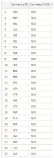

The following currencies are currently handled (additional currencies may be added by contacting Profitbase):

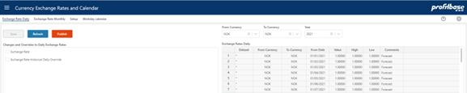

Future exchange rates are managed in the “Currency Exchange Rates and Calendar” workbook and does not require an external source:

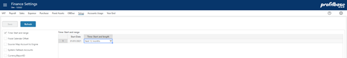

Note that when adding new rates to currency codes (“Currency” field in image above) that do not exist already, these currency codes are automatically added to the currency dimension.

If historical rates are to be fetched from a customer specific external source, the following information is required and the steps involved to switch sources from the default source is described in Currency Exchange rates:

|  | Column name | Description | Mandatory / Optional | Comment |
| --- | --- | --- | --- | --- |
| 1 | CurrentyID | ID for the currency. 3-letter currency code. | M |  |
| 2 | ToCurrencyID | Base currency for the exchange rates | M |  |
| 2 | ExchangeRateDate | ‘Actual’ or ‘Budget’ | M |  |
| 3 | DayAverageValue |  | M | Company Code |
| 4 | MonthlyAverageValue |  | M |  |
| 5 | MonthlyClosingValue |  | M |  |

## Time dimension

The time dimension is generated within Planner from the “Finance Settings” workbook within a specific version:

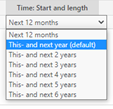

The “Start Date” is established automatically based on the start date of the version.

The “Time: Start and length” is selected from a drop down list of pre-defined options and reflects the planning horizons supported:

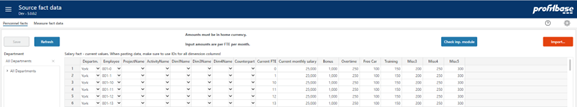

Select the option that corresponds to the situation at hand.

The time dimension is automatically re-generated when a new version is rolled forward or initiated.

# Optional data requirements – depending on functionality used

This section is relevant if the following modules are to be used:

- Personnel
- Driver based
- CapEx
- Fixed Assets

Optional dimensions are:

- Product – optional in the driver based models
- Market – optional in the driver based models
- Project – optional in all modules
- Activity – optional in all modules
- Supplier – optional in the driver based models
- Asset Group – optional in the CapEx module
- Dim1..Dim4 – optional in all modules
- Employee – mandatory in the Personnel module

Optional fact data are:

- Personnel fact – current personnel facts such as FTE and monthly salary used by the personnel module
- Driver based fact – historic data for measures such as Sales Quantity, etc. used by the driver based models
- Fixed assets – asset data such as acquisition cost, depreciation rates, etc.
## Dimension data

The following applies to the Product, Market, Supplier, Employee, Dim1..Dim4, Asset Group and Project and Activity optional dimensions:

The parent/child format (recommended):

| # | Column name | Description | Mandatory / Optional | Comment |
| --- | --- | --- | --- | --- |
| 1 | ID | ID for the dimension member | M | Primary Key |
| 2 | Name | Name for the dimension member | M |  |
| 3 | ParentID | ID for the parent node | O | Must be a valid ID or NULL. Any ID with ParentID = NULL is placed at the root level |

Alternatively (not recommended), using the legacy fixed wide format, the dimensions are by default set up with one group level – columns XYZGroup/XYZGroup_Name for XYZ dimension – this renders as a group level the dimension hierarchy.

| # | Column name | Description | Mandatory / Optional | Comment |
| --- | --- | --- | --- | --- |
| 1 | XYZID | The XYZ dimension ID | M | Primary key |
| 2 | XYZID_Name | The XYZ dimension ID name | M |  |
| 3 | XYZGroup | ID for The group level | M |  |
| 4 | XYZGroup _Name | Name for the Group lkevel | M |  |

## Personnel fact

The fact source data contain current FTE (Full Time Equivalent), HC (Headcount) and monthly salary data per department/employee combinations:

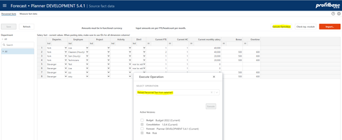

Note that the personnel modules have a number of optional dimensions and columns (measures and attributes) that may be included or not. The fact format displayed will display the optional dimensions and columns included with their chosen headings (“Bonus”, “Overtime”, etc in the image above).

|  | Column name | Description | Mandatory / Optional | Comment |
| --- | --- | --- | --- | --- |
| 1 | DepartmentID | The department ID | M |  |
| 2 | EmployeeID | The employee ID | M | Could be the id of an individual employee or that of a group of individuals or function, e.g. “Cleaners” |
| 3 | ProjectID | The project ID | O | Available from Planner v4.2.
If no value is provided, the default value # is set |
| 4 | ActivityID | The activityID | O | Available from Planner v4.2.
If no value is provided, the default value # is set |
| 5 | Dim1ID | The dim 1 ID | O | Available from Planner v4.2.
If no value is provided, the default value # is set |
| 6 | Dim2ID | The dim 2 ID | O | Available from Planner v4.2.
If no value is provided, the default value # is set |
| 7 | Dim3ID | The dim 3 ID | O | Available from Planner v4.2.
If no value is provided, the default value # is set |
| 8 | Dim4ID | The dim 4 ID | O | Available from Planner v4.2.
If no value is provided, the default value # is set |
| 9 | FTE | The current FTE (Full Time Equivalent) position of the employee or group/function at the given department. | M |  |
| 10 | HC | The current HC (headcount) position of the employee or group/function at the given department. | M |  |
| 11 | MonthlySalary | The current monthly salary for a full time FTE for the employee at the given department. | M |  |
| 12 | Bonus | The current monthly benefit for a full time FTE for the employee at the given department. | O | The use of the column is implementation dependant |

|  | Column name | Description | Mandatory / Optional | Comment |
| --- | --- | --- | --- | --- |
| 13 | Overtime | The current monthly benefit for a full time FTE for the employee at the given department. | O | The use of the column is implementation dependant |
| 14 | Misc1 | The current monthly benefit for a full time FTE for the employee at the given department. | O | The use of the column is implementation dependant |
| 15 | Misc2 | The current monthly benefit for a full time FTE for the employee at the given department. | O | The use of the column is implementation dependant |
| 16 | Misc3 | The current monthly benefit for a full time FTE for the employee at the given department. | O | The use of the column is implementation dependant |
| 17 | Misc4 | The current monthly benefit for a full time FTE for the employee at the given department. | O | The use of the column is implementation dependant |
| 18 | Misc5 | The current monthly benefit for a full time FTE for the employee at the given department. | O | The use of the column is implementation dependant |
| 19 | EmployerTaxPctOvr | Override value for employer tax rate | O | Note that an override value will set aside any setting regime that otherwise might apply to this row. |
| 20 | PensionEmployerPctOvr | Override value for pension rate (employer’s part) | O | Note that an override value will set aside any setting regime that otherwise might apply to this row. |
| 21 | PensionEmployeesPctOvr | Override value for pension rate (employee’s part) | O | Note that an override value will set aside any setting regime that otherwise might apply to this row. |
| 22 | VacationPayPctOvr | Override value for vacation pay rate | O | Note that an override value will set aside any setting regime that otherwise might apply to this row. |
| 23 | Attr1 | The Attribute 1 ID | O | Available from Planner 5.4.1. If no value is provided, the default value * (any) is set The use of the column is implementation dependant |
| 24 | Attr2 | The Attribute 2 ID | O | Available from Planner 5.4.1. If no value is provided, the default value * (any) is set The use of the column is implementation dependant |

Add new rows as needed or import from external fact (datamart) using the Operation button and selecting the Reload Personnel Fact from datamart option:

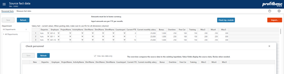

When pasting data, make sure to paste dimension and attribute ids. A dropdown will evaluate the id against the corresponding dimension and render the dimension description. If no description is rendered, just the id, this indicates that the id does not exist in the dimension.

To check which combinations will be processed into the input module, click the “Check inp. module” button. Revise data as appropriate and keep the source fact data current.

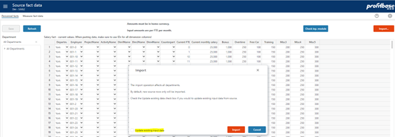

The module can be updated manually by clicking the “Import…” button:

Note that the default is to import new combinations only (i.e. add new rows only to the input store).

If existing rows should be updated, the check box “Update existing input data” must be checked. The following setting table defines which columns are in fact updated:

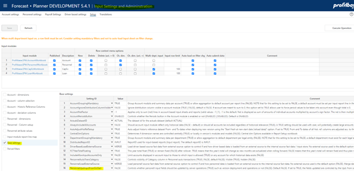

Dimension combinations found in the source and not in the input module will automatically be processed into the module on forecast rollover and operations such as Update and Process Input data.

Existing rows can be updated automatically (columns checked in the setting above) on forecast rollover and operations such as Update and Process input data if the following base setting is set to TRUE:

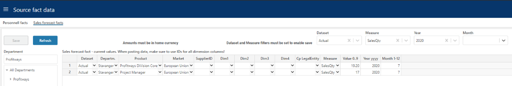

For details on how to import data from an external source, please refer to Integration.

## Driver based fact

A simple input tool for maintaining historical data is available in the “Source Fact Data” workbook

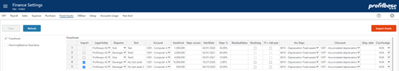

Select a value in the “Dataset” and “Measure” filter at the top and click the “Refresh” button to enable the save button.

Add new rows as needed or paste selection from the “Sales forecast fact” excel template.

When pasting data, make sure to paste dimension ids. A dropdown will evaluate the id against the corresponding dimension and render the dimension description. If no description is rendered, just the id, this indicates that the id does not exist in the dimension.

|  | Column name | Description | Mandatory / Optional | Comment |
| --- | --- | --- | --- | --- |
| 1 | DepartmentID | The department ID | M | Primary key |
| 2 | ProductID | The product id | M | Primary key |
| 3 | MarketID | The market id | M | Primary key |
| 4 | SupplierID | The supplier id | O | If no value is provided, the default value # is set |
| 5 | ProjectID | The project id | O | Available from Planner v4.2. If no value is provided, the default value # is set |
| 6 | ActivityID | The activity id | O | Available from Planner v4.2. If no value is provided, the default value # is set |
| 7 | EmployeeID | The EmployeeID | O | Available from Planner 6.1.1 If no value is provided, the default value # is set |
| 8 | Dim1 | The frem dimension #1 id | O | If no value is provided, the default value # is set |
| 9 | Dim2 | The frem dimension #2 id | O | If no value is provided, the default value # is set |
| 10 | Dim3 | The frem dimension #3 id | O | If no value is provided, the default value # is set |
| 11 | Dim4 | The frem dimension #4 id | O | If no value is provided, the default value # is set |
| 12 | CPLegalEntityID | Counterpart legal entity id | O | If no value is provided, the default value # is set |
| 13 | SystemModelAccountID | The measure id | M |  |
| 14 | Attr1 | The Attribute 1 ID | O | Available from Planner 6.1.1 If no value is provided, the default value * (any) is set |
| 15 | Attr2 | The Attribute 2 ID | O | Available from Planner 6.1.1 If no value is provided, the default value * (any) is set |
| 16 | Value | The value (amount, quantity, percentage, etc depending on the nature of the measure) | M | Numeric. Any amounts to be provided I the home currency of the legal entity that the departmentid belongs to. Value will default to 0 if no value is provided. |
| 17 | Year |  | M | 4-digit year, for example 2020. |
| 18 | Month |  | M | Month number, 1-12 |

Dimension combinations found in the source and not in the input module for either the last 12 months actuals or any of the (optional) historical reference columns, will automatically be processed into the module on forecast rollover.

The module can also be updated manually by clicking the “Apply…” button in the “Sales Forecast Setup” page of the “Sales Forecast Setup” workbook.

For details on how to import data from an external source, please refer to Integration.

## Fixed assets

Fixed asset data may be input in the “Finance Settings” workbook within a specific version:

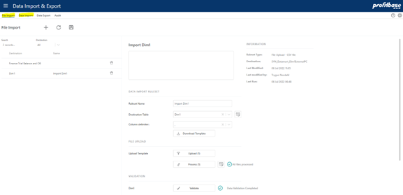

See the associated help page (?-icon) for a field description.

For details on how to import data from an external source, please refer to Integration.

# Integration

Profitbase Planner is by default set up to be self-served with data and as such dimensions and mots facts can be maintained in Planner. However in many cases it is preferred to use external source for e.g. accounts and ledger fact data.

Integration with Profitbase Planner is done using the “Data Import & Export” workbook, either “File Import” from local CSV files to standard Planner formats or “Data Import” for a more advanced transform and import function.

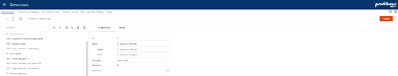

Note that database synonyms are provided for the external objects and should always be used as opposed to the actual table names that are dynamic and will vary over time.

Synonym names are prefixed with “SYN_Datamart_” in front of the logical object names shown above, for example SYN_Datamart_DepartmentExternalPC will always point to the correct external store for department dimensional data.

Dimension external source synonyms:

SYN_Datamart_DepartmentExternalPC 

SYN_Datamart_LegalEntityExternalPC 

SYN_Datamart_AccountExternalPC 

SYN_Datamart_EmployeeExternalPC 

SYN_Datamart_ProductExternalPC 

SYN_Datamart_MarketExternalPC 

SYN_Datamart_SupplierExternalPC 

SYN_Datamart_ProjectExternalPC 

SYN_Datamart_ActivityExternalPC 

SYN_Datamart_Dim1ExternalPC 

SYN_Datamart_Dim2ExternalPC 

SYN_Datamart_Dim3ExternalPC 

SYN_Datamart_Dim4ExternalPC 

SYN_Datamart_AssetGroupExternalPC 

Note that separate synonyms exists for the legacy fixed wide formats. They are named as shown above but without the PC suffix.

Fact external source synonyms:

SYN_Datamart_FinTrialBalanceExternal (finance trial balance and OB – periodic format)

SYN_Datamart_DriverBasedFactExternal (fact data to the driver based module) 

SYN_Datamart_SalaryFactExternal (fact data to the Personnel module) 

SYN_Datamart_pbTransdataHistory (ledger data for reporting and the account module)

SYN_Datamart_pbTransdataActual (ledger data for finance actual) 

SYN_Datamart_FixedAssetsExternal (fact data to the fixed assets module)

SYN_Datamart_pbTransdataSourceCMExternal (planning data from an external source to be included in the plan as trannsactions, i.e. not input in Planner) 

External dimension and fact data data will automatically be taken into account once external sources are filled with data.

Currency Exchange Rates

SYN_Datamart_CurrencyExchangeRateExternal

In order to take into account external currency exchange rate data, please refer to Currency Exchange rates .

### Dimensions

Primary dimensions are published to versions in the Dimensions workbook (Edit dimension page) using the Publish button:

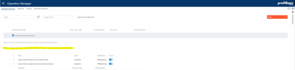

If integrations are set up for one or more dimensions, external dimensional data can be imported to the primary dimension from the Operation Manager workbook by executing the appropriate system operation (*):

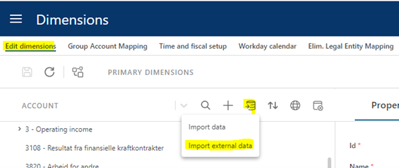

(*) Note that there exist system operation for each dimension that can be added using the Actions -> Add System Operation button. The system operation must, however, be completed in the sense that the actual import definition must be set up as outlined in the image above.

These system operations for importing external dimensional data can also be linked to the Dimensions workbook using the Actions -> Link to workbook.. button. This will make these operation available from the Import external data option in the Dimensions workbook:

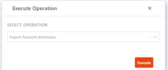

In the resulting pop-up, the appropriate operation can be selected:

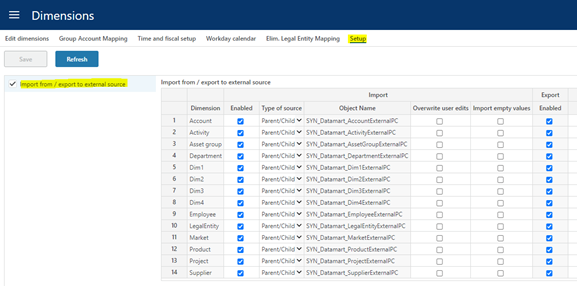

There is one operation per dimension. These operations will update the primary.

Note the following options that apply to importing dimension data:

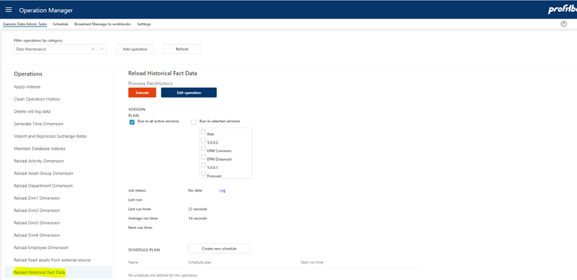

### Fact data

Fact data is automatically updated when a version is rolled forward or initiated.

Fact data can also be manually updated from the “Operation Manager”:

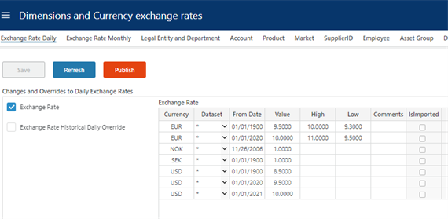

This operation will update the fact data for all facts in the selected versions and can be scheduled.

### Currency Exchange rates

Currency Exchange rates in Profitbase Planner by default is based on imported historical rates that is used when doing currency conversion on actual. These rates are imported from a Profitbase data table that provide official daily rates from the European Central Bank.

Future currency conversion rates are by default managed in Planner in the table shown below:

Note that this list of Currency is also used to update the Currency dimension (i.e. the list of available currencies).

Imported future rates is imported to the table above and tagged with a “IsImported” flag. This way you will not overwrite manually added entries, and you can manually override imported entries.

You can also provide your own currencies by making adjustment when setting up the solution. To set up the solution using another source for historical and future currencies you must du the following:

- In “Operation Administration” edit the “Import and Reprocess Exchange Rates” operation and enable step 1 and disable step 2 (“Copy Local Currency Exchange Rate Data”).

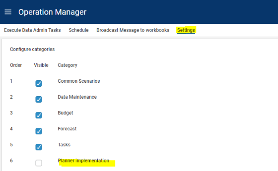

Import is to the “CurrencyExchangeRateExternal” table defined as follows:

- CurrencyID (nvarchar(50)) – 3-character currency code. This is the rate to convert to base currency. Default here is NOK.
- CurrencyToID (nvarchar(50)) – 3-character currency code. This is the rate for base currency – default NOK.
- DatasetID (nvarchar(50)) – this is the dataset, the only dataset supported currently is: Actual
- FromDate – the date the rate is valid from
- Value – decimal(18,4) is the exchange rate as the factor you use to convert from CurrencyID to CurrencyToID. Default this is the rate to convert to NOK.
- High, Low – decimal(18,4) is the high and low rate. These are optional and only relevant for simulation.
- Comments (nvarchar(200)) – optional text string
# Switching from demo to customer’s data

Planner comes with a full set of demo data at deployment.

During the implementation phase a switch from demo to customer data should take place. This applies to dimension data as well as fact and input data.

This switch involves:

- Empty the solution for demo data

Please note that this step involves data deletion and should therefore never be executed in a live production system.

- Input or import customer’s data using the Data Import workbook
- Create a new version using the Version Manager workbook
## Empty the solution for demo data

In the Operation Manager workbook, select the Settings page and enable the “Planner implementation” category:

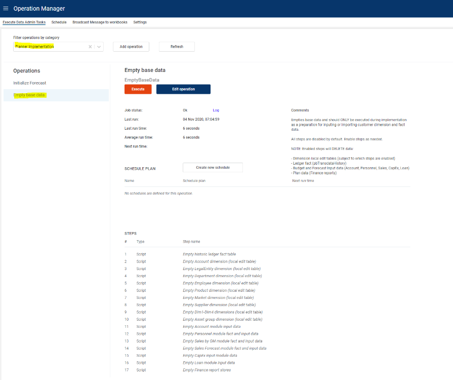

In the Operation Manager workbook, select the “Execute Data Admin Tasks” page. Select the “Planner implementation” category and the “Empty base data” operation:

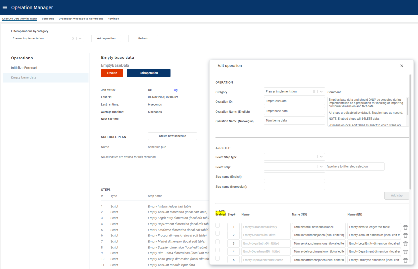

This operation contains multiple steps that are by default disabled.

Click the “Edit operation” button that opens the “Edit operation” dialogue and enable steps as needed:

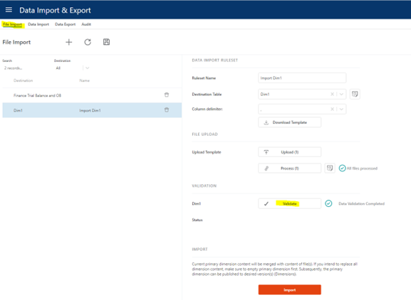

Scroll to the bottom of the “Edit opetaion” dialogue and click Save.

Execute the “Empty base data” operation by clicking the Execute button.

The “Planner implementation” category should not be visible after go live.

# Data quality audit

Data quality is important and Planner has some tools to help securing data quality. Data quality issues are generally categorized into severties:

- Error – data is erroneous as is and can not be used by Planner
- Warning – data is inconsistent and should be fixed (in a production environment anyway)
- Information – recommended to fix (best practice)

When using the file import to standard Planner formats, a validation is done as part of the process.

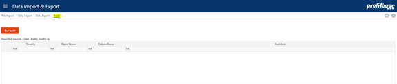

Regardless of import method, the QA report found in the Audit page can and should be executed to identify any data that do not fulfill Planner’s requirements:

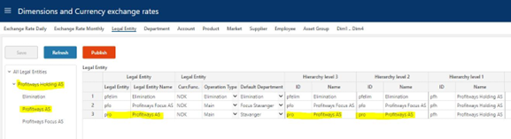

If no rows are output, no issues are found.

# Dimension legacy format (fixed wide)

This section is included for legacy purposes and deals with required dimensional data if using the fixed wide import format.

## Legal Entity dimension (fixed wide)

| | Column name | Description | Mandatory / Optional | Comment |
| --- | --- | --- | --- | --- |
| 1 | LegalEntityID | ID for the Legal entity | M | Primary Key
Company Code |
| 2 | LegalEntityID_Name | Name of legal entity | M |  |
| 4 | FunctionalCurrencyID | Home currency for this Legal Entity | M |  |
| 5 | OperationTypeID | Type of legal entity (Main \| Elimination) | M |  |
| 6 | DefaultDepartmentID | Default department used for situations where a department is not normally given, such as opening balances | O |  |
| 7 | LegalEntityL3ID | ID for hierarchical level 3 | M* | See comment on hierarchy below |
| 8 | LegalEntityL3ID_Name | Name for hierarchical level 3 | M* | See comment on hierarchy below |
| 9 | LegalEntityL2ID | ID for hierarchical level 2 | M* | See comment on hierarchy below |
| 10 | LegalEntityL2ID_Name | Name for hierarchical level 2 | M* | See comment on hierarchy below |
| 11 | LegalEntityL1ID | ID for hierarchical level 1 | M* | See comment on hierarchy below |
| 12 | LegalEntityL1ID_Name | Name for hierarchical level 1 | M* | See comment on hierarchy below |

* Must be filled in, but can be padded as explained in Legal entity dimension hierarchy.

### Legal entity dimension hierarchy

This section applies to the fixed wide (legacy) format only (if the recommended parent/child format is used, the number of levels is dynamic and the reason why parent/child should be used).

The legal entity dimension hiearchy by default consists of 4 levels, including the actual legal

entity, in the following order:

- Hierarchy level 1

- Hierarchy level 2

- Hierarchy level 3

- Legal entity

This is reflected in the positioning of the columns from left (lowest level, i.e. Legal entity) to right (highest level, i.e. Hierarchy level 1).

**Note** that all levels must be filled in, but padding - that is repeating - levels from one level to the next should be used if the actual hiearchy does not contain all levels, as showin in the example

below:

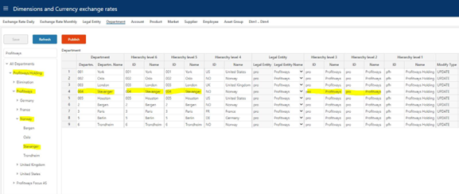

In the example, Legal entity Profitways is padded - repeated - to Hierarchy levels 3 and 2. This means that Planner renders the hierarchy skipping Hiearchy levels 3 and 2 so that when expanding level 1, the legal entity level is displayed as shown in the left margin where Profitways holding (Hierarchy level 1) expands directly to Profitways (Legal entity).

The number of hierarchical level can be changed, but has to be done using the Profitbase InVision designer and will require re-implementation after a Planner upgrade.

## Department dimension (fixed wide)

In practice, the Department dimension will typically contain additional hierarchical levels and thus additional columns.

|  | Column name | Description | Mandatory / Optional | Comment |
| --- | --- | --- | --- | --- |
| 1 | DepartmentID | Department identifier | M | Primary key |
| 2 | DepartmentID_Name | Name for department | M |  |
| 3 | DepartmentL6ID | ID for hierarchical level 6 | M* | See comment on hierarchy below |
| 4 | DepartmentL6ID_Name | Name for hierarchical level 6 | M* | See comment on hierarchy below |
| 5 | DepartmentL5ID | ID for hierarchical level 5 | M* | See comment on hierarchy below |
| 6 | DepartmentL5ID_Name | Name for hierarchical level 5 | M* | See comment on hierarchy below |
| 7 | DepartmentL4ID | ID for hierarchical level 4 | M* | See comment on hierarchy below |
| 8 | DepartmentL4ID_Name | Name for hierarchical level 4 | M* | See comment on hierarchy below |
| 9 | LegalEntityID | ID of the legal entity | M | All departments must be tagged with their legal entity id. |
| 10 | LegalEntityID_Name | Name of the legal entity | M | See comment on hierarchy below |
| 11 | DepartmentL3ID | ID for hierarchical level 3 | M* | See comment on hierarchy below |
| 12 | DepartmentL3ID_Name | Name for hierarchical level 3 | M* | See comment on hierarchy below |
| 13 | DepartmentL2ID | ID for hierarchical level 2 | M* | See comment on hierarchy below |
| 14 | DepartmentL2ID_Name | Name for hierarchical level 2 | M* | See comment on hierarchy below |
| 15 | DepartmentL1ID | ID for hierarchical level 1 | M* | See comment on hierarchy below |
| 16 | DepartmentL1ID_Name | Name for hierarchical level 1 | M* | See comment on hierarchy below |

* Must be filled in, but can be padded as explained in Department dimension hierarchy.

### Department dimension hierarchy

This section applies to the fixed wide (legacy) format only (if recommended parent/child format is used, the number of levels is dynamic and the reason why parent/child should be used).

The department dimension hiearchy by default consists of 8 levels, including the actual department and the legal entity, in the following order:

- Hierarchy level 1

- Hierarchy level 2

- Hierarchy level 3

- Legal entity

- Hierarchy level 4

- Hierarchy level 5

- Hierarchy level 6

- Department

This is reflected in the positioning of the columns from left (lowest level, i.e. Department) to right (highest level, i.e. Hierarchy level 1).

**Note** that all levels must be filled in, but padding - that is repeating - levels from one level to the next level up should be used if the actual hiearchy does not contain all levels, as showin in the example below so long as the department level contains actual departments and the legal entity level contains actual legal entities.

In the example, department Stavanger is padded - repeated - to Hierarchy levels 6 and 5. This means that Planner renders the hierarchy skipping Hiearchy levels 5 and 6 so that when expanding level 4, the department level is displayed as shown in the left margin where Norway (Hierarchy level 4) expands directly to Stavanger (Department).

The same applies to Legal entity that is padded - repeated - to Hierarchy level 3 and 2 so that when expanding Hierarchy level 1 (Profitways holding), the legal entity level is displayed (Profitways).

The number of hierarchical level can be changed, but has to be done using the Profitbase InVision designer and will have to be re-implemented post a Planner upgrade. Legal entity does not have to be a level in the hierarchy, but it has to be present in the table and filled in.

## Account dimension (fixed wide)

|  | Column name | Description | Mandatory / Optional | Comment |
| --- | --- | --- | --- | --- |
| 1 | AccountID | ID of the Account | M |  |
| 2 | AccountID_Name | Description for the Account | M |  |
| 3 | AccountID_Name_NO | Description for the Account in Norwegian | O |  |
| 4 | AccountID_Name_EN | Description for the Account in English | O |  |
| 6 | SignFactor | Tells the sign for the transaction. E.g. expenses recorded as positive number gives SignFactor 1 while sales recorded as negative numbers gives SignFactor -1 | M |  |
| 7 | AccTypeID | Grouping account for Profit&Loss and Balance | M | Profit&Loss type = PL
Balance type = BAL |
| 8 | AllowInput | True/false
Marks the accounts that will be allowed plan input | M |  |
| 9 | AccountGroupL1ID | ID for hierarchical level 1 (highest level) | M | See comment on hierarchy below |
| 10 | AccountGroupL1ID_Name | Description for hierarchical level 1 (highest level) | M | See comment on hierarchy below |
| 11 | AccountGroupL1ID_Name_EN | Description for hierarchical level 1 in English | O |  |
| 12 | AccountGroupL1ID | Description for hierarchical level 1 in Norwegian | O |  |
| 13 | AccountGroupL2ID | ID for hierarchical level 2 | M | See comment on hierarchy below |
| 14 | AccountGroupL2ID_Name | Description for hierarchical level 2 | M | See comment on hierarchy below |
| 15 | AccountGroupL2ID_Name_EN | Description for hierarchical level 2 in English | O |  |
| 16 | AccountGroupL2ID_Name_NO | Description for hierarchical level 2 in Norwegian | O |  |
| 17 | AccountGroupL3ID | ID for hierarchical level 3 (level above account) | M | See comment on hierarchy below |
| 18 | AccountGroupL3ID_Name | Description for hierarchical level 3 (level above account) | M | See comment on hierarchy below |
| 19 | AccountGroupL3ID_Name_EN | Description for hierarchical level 3 in English | O |  |
| 20 | AccountGroupL3ID_Name_NO | Description for hierarchical level 3 in Norwegian | O |  |

### Account dimension hierarchy

The account hierarchy consists by default of 3 levels, L1, L2 and L3 of which L1 is the highest level and L3 is the lowest level, immediately above the account level.