# Driver based module

**Document:** Configuration and Operation – Driver based module
**Company:** Profitbase AS
**Product:** Profitbase Planner
**Version:** 3.6
**Date:** 09.09.2025

# Abstract, intended audience and pre-requisites

The Profitbase Planner Configuration and Operation series consists of several documents dealing with the configuration and operation of individual Planner modules and functions.

Planner modules are operational input modules that contributors to the plan processes use to prepare the Profit & Loss (P&L) of their respective areas of responsibility. Different modules will typically cover parts of the P&L such as sales, personnel, cost, etc.

The modules are accessed from the Plan overview workbook of a given version and the input provided by the contributors are transformed into P&L transactions and fed back to the Plan overview workbook resulting in a P&L work-in-progress overview.

The intended audience of this document is implementation partners configuring the solution initially and solution administrators responsible for operating it thereafter.

This document assumes that a Profitbase Planner solution has been deployed and that access to this solution is given to the reader.

# Common functionality

Changes made to input sheets are not saved automatically. To save changes, click the “Save” button. The “Save” button will remain disabled until a change has been made.

To undo all unsaved changes, click the “Refresh” button.

To undo the last of a series of unsaved changes, click the Ctrl and Z keys simultaneously.

To insert new rows to an input sheet, right-click in the sheet and select one of the available options:

- Insert row
- Insert row below
- Insert copy of row

To delete a row from an input sheet, right-click the row in question and select:

- Delete row

Inserting and deleting rows can be controlled as part of the configuration, see Control row context menu options (right-click).

Please note, that although the row is no longer visible in the input sheet, the change must be committed using the “Save” button or undone using the “Refresh” button.

In input sheets, editable fields are distinguished from non-editable fields by fill color, editable fields have by default a white fill color.

In setting tables, a so-called ranked input concept is often used for the dimensional context. Ranked input allows for a high-level selection of dimensional nodes and gives the opportunity to alter the rank or specificity between rows.

A ranked input cell can be set through the ranked input selector by clicking the cell value (cell will display 3 dots if no value is set):

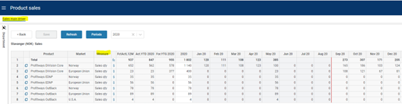

The ranked input selector will display the dimensional hierarchy and allows for the selection of a high-level dimensional node. The selection of a high-level node implies that the setting applies to all sub-ordinate nodes.

Select node and click “OK”.

Click “Cancel” to leave the selector without selecting.

In a table containing multiple rows, the rank or specificity of individual rows can be altered by moving the row up (decrease specificity) or down (increase specificity) by right-click the row in question and selecting:

- Move up
- Move down

The less specific the setting is, row should be high up in the table. The more specific the setting is, the further down in the table the row should reside.

# Principle of operation

## Driver based models

The driver-based module uses as the name suggests a driver-based principle.

Multiple models consisting of measures may be defined. Common to all models is the definition of one of the measures as the driving measure for that model.

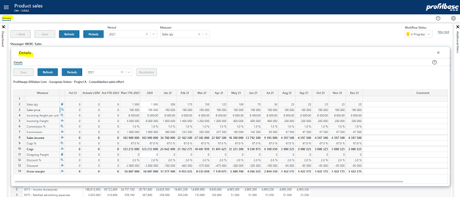

Examples of driving measures may be Sales quantity, Sales volume, FTE (Full Time Equivalents) and so on.

Click the icon to view the P&L transactions generated from the row in question.

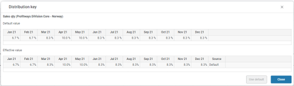

Additional measures make up the detail model and may take direct input, be lookups to assumptions and calculations of other measures.

Click the icon for the row in question to view the detailed model.

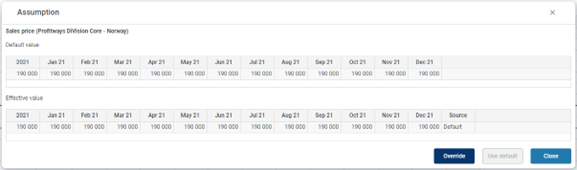

Measures will render as rows of the model, for example:

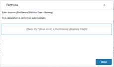

For details on how to set up a model, refer to Define models.

Measures to which a distribution function is associated is identified by the icon.

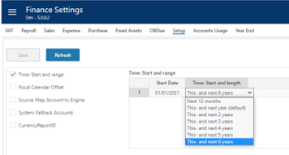

Note that it is possible to click the icon to view the distribution and any default distribution if it exists.

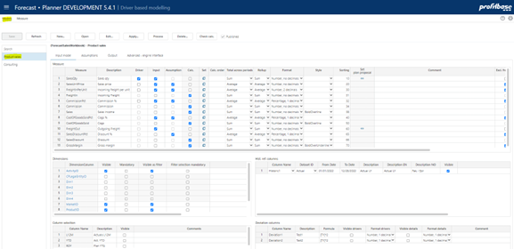

A year-total input is automatically spread to the plan months of that particular year. The total is spread according to the monthly distribution function tied to the product and market as follows:

  - If a specific monthly input has been made by the user, the distribution inherent in the monthly values is used as a distribution key.
  - If not, then if a central distribution key is tied to the account, this distribution will be used
  - If none of the above applies, the total is spread evenly over the plan months

Please refer to Distribution keys for details on distribution keys.

Measures that are lookup to assumptions are identified by the icon.

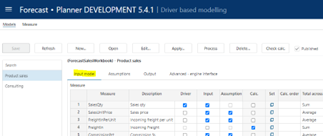

Note that it is possible to click the icon to view the assumption values and to override the assumption values and reset to the default if overridden if the model allows.

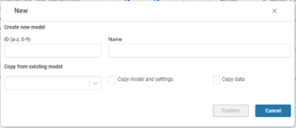

An overridden assumption is marked by a blue left border indication:

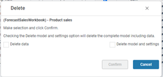

Please refer to Assumptions for details on assumptions.

Measures that are calculations are identified by the icon.

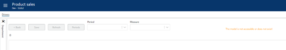

Note that it is possible to click the icon to reveal the formula and a formula description if set:

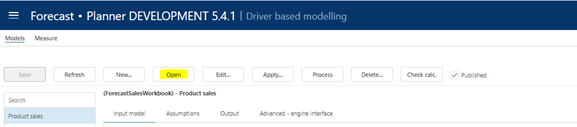

A formula that is not executed automatically but requires the click on the “Recalculate” button is marked with a red left border indication:

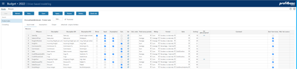

Please refer to Define calculations for details on calculations.

## Dimensionality

The basic dimensionality of the driver based module is department, product, and market. Extra dimensionality may be added:

- Employee
- Supplier
- Project
- Activity
- Counterpart
- Dimensions Dim1 to Dim4

For details on defining dimensionality, refer to Define dimensionality.

## Historical references

The models are preset with the last 12 months of actuals.

In addition to the above, up to 5 historic reference columns may be added as needed.

For details on defining historical reference columns, refer to Define historical reference columns.

## Planning horizon

The planning time horizon is controlled in the Finance Settings workbook:

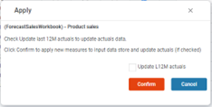

This time horizon applies to all input modules.

Long-term planning (beyond this year and next year) allows for a year-total input only. When saving the plan, the long-term year-totals are automatically distributed to months using the distribution that is relevant to the next year’s plan for the corresponding dimensionality.

Note that there is also a period filter setting that you may want to consider if you change the plan horizon. The period filter setting control which period filter will be available and which one will be the default, please refer to Period filters.

## Plan roll forward actions

### Source data

The input module will be updated with source data when rolling forward.

Any new combinations that exist in the driver source fact data will automatically be processed into the input module and their last 12 months actuals updated.

Please refer to Data management for details.

### Long term plan

If long-term planning is done, the year-total for next-year+1 will be distributed to monthly values using next-year’s distribution when rolling over to a new year.

# Model configuration

Driver based models are configured in the “Driver based modelling” workbook and the “Models” page.

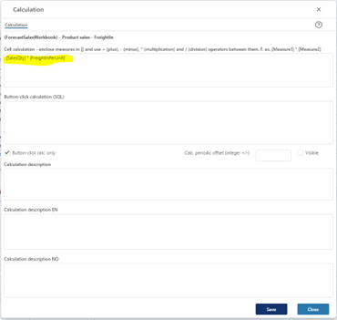

Multiple input models can be created and published to users. Select a model in the filter-list on the far left to activate buttons and display content.

## Input models

Select the “Input model” tab.

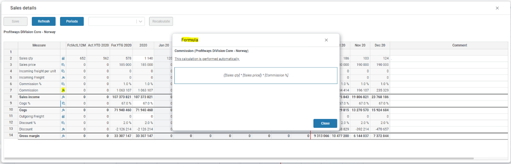

### Create a new input model

To create a new model, click the “New …” button.

In the following dialogue, enter a model id and a model default name.

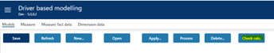

If relevant, select an existing model to copy from and select whether to copy only the model and settings or the input data as well.

Click “Confirm”.

The new model is created and displays in the filter list at the far left.

### Process an input model

Processing a model will re-generate any P&L transactions from the model. This should be done if changes have been made to the model, its assumptions or output processing definitions such as account mapping.

Processing is done by clicking the “Process” button.

Note that processing is a potentially time-consuming operation depending on the amount of input data associated with the model.

### Delete an existing input model

An input model can be deleted by clicking the “Delete …” button.

In the following dialogue, select from the following options:

- “Delete data” - deletes any input data associated with the model
- “Delete model and settings” – deletes the complete model, its settings, and any associated input data.

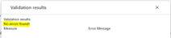

Note that deleting a model is a potentially time-consuming operation depending on the amount of input data associated with the model and the model will be processed to delete any associated P&L transactions.

### Publish an input model

To publish a model, check the “Published” checkbox and click the “Save” button.

Conversely, to set a model offline, uncheck the “Published” checkbox and click the “Save” button.

A model that is not published, will not be editable by users accessing the model from the “Plan Overview” workbook.

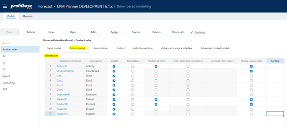

It is, however, possible to open an unpublished model from the “Open” button:

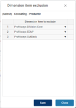

### Edit input model properties

Select the model to edit in the filter list at the far left.

The input models are defined in the following screen:

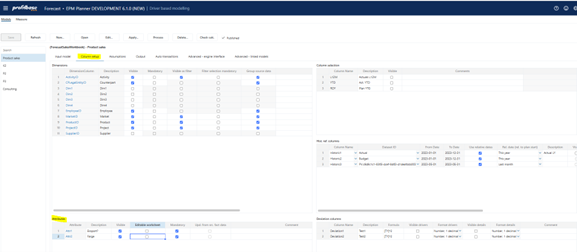

| Column | Description |
| --- | --- |
| Measure | The MeasureID. Mandatory. Select from list. For details on adding a new measure, refer to Define measures. |
| Description | The measure’s default description. Translations can be added in the Translations tab. |
| Driver | The measure is the driver (checked). Note that while a single driver per model is most common, more than one measure per model can actually be a driver. |
| Input | The measure is open for input (checked) or not (unchecked). Note that if the measure is also a lookup (checked), the measure will not be open for input until the user has chosen to override the default lookup assumption value. |
| Lookup | The measure attains its value from a lookup assumption. For details on maintain assumption settings, refer to Assumptions. Note that if the measure is also open for input (checked), the user will have the opportunity to override the default lookup assumption value. A lookup measure will be read-only if not open for input. |
| Calc | Read-only indicator that the measure is calculated (checked) or not (unchecked). A measure that is a calculation is read-only. Note that calculations are performed in the sequence indicated by the Sorting column. |
| Calc. order | For back-end (sql) calculations, the default order of calculation is the sorting, i.e. that it is assumed that no measure with a low sorting rely on a calculation with a higher sorting (further down in the model). If this is not the case, the Calc order my be used to override this sequence. |
| Set | Action link that open a calculation pop-up in which calculation formulae and optional verbal calculation explanations are maintained. For details on defining calculations, refer to Define calculations. |
| Total across periods | Defines how year-totals are calculated from the monthly values (Sum \| Average). Select from list. Note that the average is an arithmetic average. |
| Rollup | Defines how the measure is to be rolled up to aggregate organizational levels (Sum \| Average). Select from list. Note that the average is an arithmetic average. |
| Format | The number display format. Select from list. |
| Style | The style of the measure row. Select from list. |
| Sorting | Sort sequence. Controls the display order and also the default calculation sequence. |
| Set plan proposal | Contains a link to the driver based plan proposal workbook for measures that are eligible for a plan proposal set up using the Dtiver based plan proposal workbook. |
| Plan prop source | For measures eligible for plan proposals, identifies the source of the plan proposal. The source of the plan proposal is defined for the measure in the Measures tab. The default plan proposal source is the Driver based plan proposal source. Alternatively, the Personnel fact source can be used, typically in applications when a driver based model is used for payroll planning. |
| Upd. input data from plan prop | If “Plan prop. Source” equals “Personnel fact source”, the updating of existing input values is controlled by this field (checked = true). See Using Personnel fact source for details on using personnel fact as source. |
| Comment | Optional comment. |
| Excl. from trans. | Input models are diverse and often contain measures that are not relevant as transactions, for example pure visual calculations. To avoid irrelevant measures from being processed as transactions, check the “Excl. from trans.” Column for the measures in question. |
| Hist. fact source | Displays the source of the historic facts for the measure. Default is empty meaning it is manually input in the Source data workbook. Alternatively:
Driver based external fact (imported from external source)
General ledger external fact (based on a selection of ledger data)
Actualized driver based plan data (based on plan input for periods that are actualized as the plan rolls forward)
The Hist. fact source for a measure is defined in the Measures tab (see Define measures). |
| Ovr. Calc. hist. cols. | Historic reference columns are by default calculated based on periodic values. If for example the periodic values are percentages, this may not be desirable. An override calculation may be provided if this is the case. |

To delete a measure from a model, right-click the measure and select one of the options:

- Delete from data – the measure will remain in the model, but any input data associated with it will be deleted.
- Delete from model (incl data) – the measure is deleted from the model and so is the input data associated with it.

Unless the changes made are minor (change style or format), the model changes should be applied. This is done by clicking the “Apply …” button that will reveal a dialogue in which one can opt for updating any historical reference content by checking the “Update L12M actuals”:

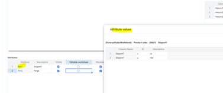

If the changes made also will reflect on the P&L transactions produced, the model should also be processed. This is done by clicking the “Process …” button.

### Define calculations

Access the calculation pop-up by clicking the “Set” action link for a measure in the input model setup to reveal the following dialogue:

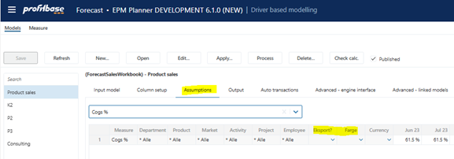

There are two types of calculations:

- Cell-calculations: simple arithmetic calculations (+ - * /) between measures of a model. These calculations are performed automatically, as-you-type, when editing data in the input model.

Note that when defining the cell-calculation formula, the measures are defined by the measure id enclosed in square brackets, for example [SalesQty] * [SalesUnitPrice].

- Button-click calculations: more complex calculations involving for example conditionals. Such calculations are defined as sql statements and will not calculate automatically, as-you-type, when editing data in the input model. These calculations will require the click of a button to execute, specifically the “Recalculate” button.
  - For button-click calculations it is possible to set a periodic offset on the calculation, for example if measure a for a period should be calculated based on measures b and c for an offset period (+ or -). This offset can extend to the last 12 month actual periods.

Note that the entire calculation will be performed based on values on the relevant offset period. So for example if the offset was -1, the calculated value for measure a for period 2 will be based on measures b and c for period (2-1) = 1.

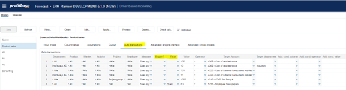

A measure defined to be a button-click calculation can also be hidden by un-ticking the Visible check-box.

In the calculation dialogue, one can also enter more elaborate descriptions using the “Calculation description” fields.

Note that the calculations that are button-click, are indicated with a red left border and that the calculation formula (cell-calculation only) and calculation description will be displayed when clicking the calculation symbol.

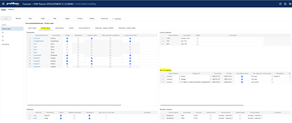

Make sure to validate that the calculations used actually work before publishing the model. This can be done using the “Check calc.” button:

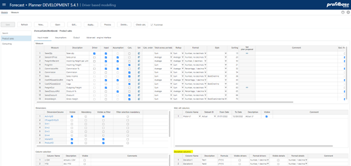

Any errors will be reported and must be corrected. The following shows a no-errors situation:

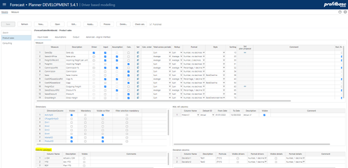

### Define dimensionality

The dimensionality of a model is defined in the following table:

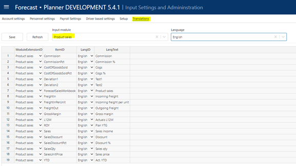

The Department dimension is always mandatory whereas the Product and Market dimensions are default and normally mandatory in any model. Product and/or Market can, however, be omitted.

| Column | Description |
| --- | --- |
| DimensionColumn | The dimension column id. Preset. |
| Visible | Indicates whether dimension is visible (checked) or not (unchecked) in the input sheet of the model. |
| Mandatory | Indicates whether user must select a value from the dimension drop down when adding a row (checked) or not (unchecked) to the input sheet of the model. |
| Visible as filter | Some of the dimensions are available for selection as input filters (slicers). Indicates whether dimension is also an input filter (checked) or not (unchecked). |
| Filter selection mandatory | Indicates whether it is mandatory to set a value for the filter (checked) or not (unchecked) |
| Default filter value | Allows for a default value for the filter to be set. This can be a leaf level value or an aggregate level value. Editable only if dimension is visible and is used as a filter. Note that this is a default filter value, implying that if the model is started from the plan overview with a specific filter value set, the default will not apply. |
| Group source data | Indicates whether any source data should be grouped by this dimension (checked) or not (unchecked) when updating the model from source data. |
| Sorting | Optional sorting of dimensional data which may be useful for models making use of multiple dimensions. If not filled in a default sorting of dimensional data is used. Accepts integer values (1,2,3...) |
| Comment | Optional comment |

The dimensions are shared between models. If a dimension drop-down list of a certain model should not display a certain member, it can be excluded for that model by clicking the action link in the “DimensionColumn” column to reveal the following dialogue:

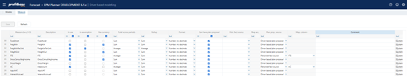

Add dimension members to excluded and click the “Save” button.

For details on dimension management, please refer to Data management.

Note on CPLegalEntityID (counterparty): this dimension is available in all modules, but it is only the Sales (IC) and Loans (IC) financial engines that creates counter transactions. Providing counterparty information to transactions that are not handled by the mentioned financial engines will NOT have it’s counter transactions automatically posted. Hence, when enabling this dimension, make sure that is understood by the client. Accounts piped through the Sales (IC) engine are set up in the Finance Settings workbook and the Account to engine mapping configuration.

### Define attributes

Up to two attributes can be used in any one driver based model. As opposed to dimensionality, attributes are not part of the key or uniqueness of an input row i.e. they can make up the properties of a certain key and be used for tuning an assumption lookup and/or the generation of auto transactions.

Attributes can be individually named and take values defined per model. Visibility, editability and whether or not they are mandatory to a certain model can be controlled:

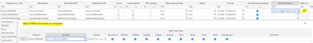

By clicking the attribute itself, a table of attribute values can be maintained making up the values that appear in the drop down for that attribute in the specific model:

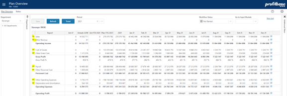

| Column | Description |
| --- | --- |
| Attribute | The attribute column id. Preset. |
| Description | The heading for the attribute column in the input sheet of the model. |
| Visible | Indicates whether attribute is visible (checked) or not (unchecked) in the input sheet of the model. |
| Editable worksheet | Indicates whether attribute is editable (checked) or not (unchecked) in the input sheet of the model. |
| Mandatory | Indicates whether user must select a value from the attribute drop down when adding a row (checked) or not (unchecked) to the input sheet of the model. |
| Upd. From src. fact data | Indicates whether the attribute should be updated from source fact data (checked) or not (unchecked) when updating the model from source fact data. |
| Comment | Optional comment |

The visible attributes in a certain model are selectable in the model’s assumption and auto transaction setup:

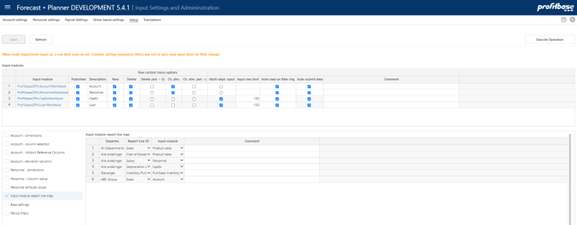

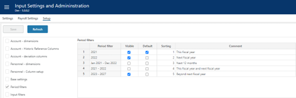

### Define historical reference columns

The last 12 months of actuals will be included for measures where historical data exists.

There is a preset number of historical reference columns to choose from. The historic reference columns of a model is defined in the following table:

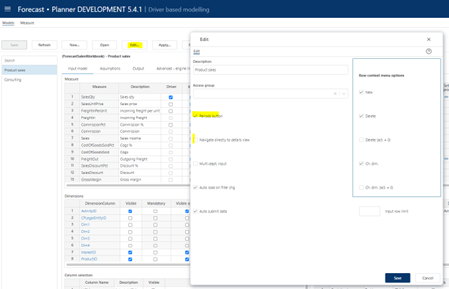

| Column | Description |
| --- | --- |
| Column Name | The internal historical reference column id, Historic1, Historic2, Historic3, Historic4 and Historic5. Select from the drop-down list. |
| DatasetID | The dataset origin for the historical reference data. Select from the drop-down list. |
| From Date | The start date for the historical reference data |
| To Date | The end date for the historical reference data |
| Use relative dates | Indicates whether a relative date expression (relative to version’s plan start) is used (checked) or not (unchecked). If no relative data expression is used, explicit from and to dates must be used. |
| Rel. date (rel. to plan start) | Set if “Use relative dates” is checked. Preset selection of relative data expressions such as “This year”, “Last year”, etc. available for selection. When using a relative date expression, the expression is evaluated to explicit from and to dates automatically when deploying a new version. |
| Description | The column default name. Translations can be added in the Translations tab. |
| Visible | Indicates that the column is visible in the input sheet for the model or not (checked \| unchecked) |

For maintaining source fact data, please refer to Data management.

### Define deviation columns

There is a preset number of deviation (calculated) columns to choose from. The deviation columns of a model is defined in the following table:

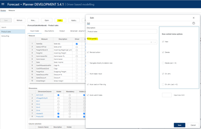

| Column | Description |
| --- | --- |
| Column Name | The internal deviation column id, Deviation1, Deviation2. |
| Formula | See * below |
| ColumnName_Description | The column’s default name. Translations can be added in the Translations tab. |
| Visible drivers | Indicates that the column is visible in the driver page or not (checked \| unchecked) |
| Format drivers | The number format that the calculated deviation will display in the driver page, select from drop down list. |
| Visible details | Indicates that the column is visible in the driver details (pop up) page or not (checked \| unchecked) |
| Format details | The number format that the calculated deviation will display in the details (pop up), select from drop down list. |

*

There are several internal columnids that can be referenced in the formulae:

- Historic1 to Historic5 – historic reference columns, requires that historic reference columns are configured.
- YTD – Year to date (Actuals)
- ROY – Rest of year plan (rest of first plan year, that is from plan start to the end of first plan year)
- TY – This year (first full plan year, comprised of YTD actuals and ROY plan)
- NY – Next year plan (second full plan year)
- L12M – Last 12 months (Actuals)
- N12M – Next 12 months plan (first 12 months of plan)
- NYPlus1 – Third full plan year, requires that long term planning is used.
- NYPlus2 – Fourth full plan year, requires that long term planning is used.
- NYPlus3 – Fifth full plan year, requires that long term planning is used.
- NYPlus4 – Sixth full plan year, requires that long term planning is used.
- NYPlus5 – Seventh full plan year, requires that long term planning is used.

Please note that the internal columnids should be enclosed in [] and that + (plus), - (minus), * (multiplication) and / (division) mathematical operators can be used, for example:

- [NY] – [TY]

If, for example the deviation column is to show This year’s budget – Last year’s budget, and the two are stored in columns Historic1 and Historic2 respectively, the formula would be:

- [Historic1] – [Historic2]
### Select / unselect optional columns

A set of columns are optional related to actuals last 12 months, year to date and plan rest of year. The columns can be named (default name, see Translations for translations) and selected / unselected individually per model:

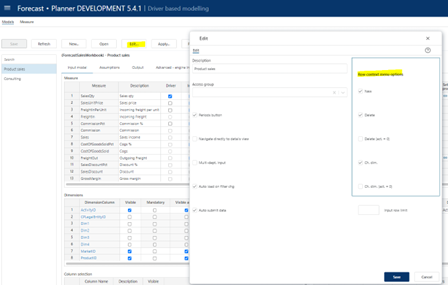

## Translations

Translations are added in the Translations tab of the Input Settings and Administration workbook.

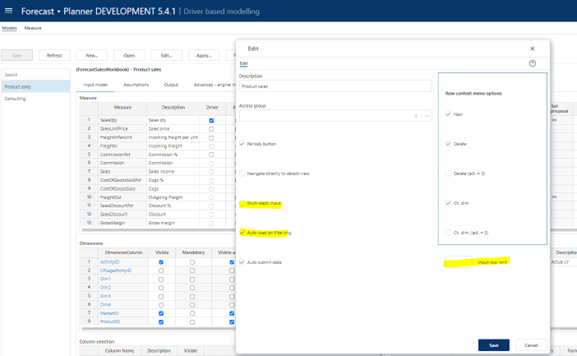

Select the model as the Input module and the language of choice.

Edit the Lang Text column of an item or add an item. The available ItemID are typically the various column and measure ids such as Deviation1, etc.

## Define measures

A set of measures is included when Planner is deployed. New measures may be added as needed.

Measures are defined in the “Measure” page:

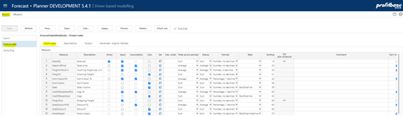

| Column | Description |
| --- | --- |
| Measure | Measure id. Mandatory. Attempts to use special characters when adding a new measure (non a-z, 0-9) will result in an error message. Attempts to delete a measure that is in use in models and/or assumptions and settings will result in an error message |
| Description | Default measure name. Optional. The name will typically be set when adding the measure to a model. |
| In use | Mandatory, default checked. Indicates whether measure is in use (checked) or not (unchecked). A measure that is not in use, will not be available for selection when adding measures to a model. |
| Is assumption | Mandatory, default unchecked. Indicates whether measure is an assumption (checked) or not (unchecked). A measure that is not an assumption, will not be available for selection when defining assumptions. |
| Has currency | Mandatory, default unchecked. |
| Total across periods | Mandatory, default Sum. Select from list. The value is used for calculating rest of year and next year totals correctly for lookup values (assumptions). |
| Format | Mandatory, default “Number, no decimals”. Select from list. The value is used for displaying lookup values (assumptions) in the correct format when defining assumptions. |
| Can have plan proposal | Plan proposals can be made for any measure of type input in each model that also has a check in this column. Default is checked (true). |
| Hist. fact source | Defines where a measure’s historical values are sourced from. The following options exist: |
|| (none): any historical values are input manually in the Source Data workbook. This is the default setting.|
|| Driver based external fact: any historical values are fetched from the driver external fact table (EPM datamart). This source is normally the target for import from external sources using the Data import & export workbook. |
|| General ledger external fact: any historical values are sourced from the finance general ledger table. A link to a pop-up to map accounts to this measure in the “Map acc.” column if this option is selected. |
|| Actualized driver-based plan data: When rolling forward, the data that is actualized is kept and can be used as a source for historical values. Actualized data for the last 12 months are kept in the actualized driver-based plan data source. |
| Map acc. | Link to pop-up where general ledger accounts can be mapped to as source for historical values to the specific measure. The link will only appear if “General ledger external fact” is selected as the “hist. fact source” for measure. |
| Plan prop.source | Define plan proposal source. Default is Driver based plan proposal. In applications when using a driver based model for payroll planning, Personnel fact source can be used. For cases when Personell fact is used as a plan proposal source, a mapping between the measure and a Personnel fact column is required, see “Map column” |
| Map column | Relevant only if “Plan prop. Source” is defined to be “Personnel fact source”. Used to explicitly define the Personnel fact column to be linked with the measure in question. |
| Comment | Optional comment. |
| Owned by | `$System` for measures that initially came with the system. The user id for the user that added the measure for measures added to the solution post-deployment. |

## Attach module to input report

The module can be attached to the action link button of one or more report lines of the “Plan Overview” report:

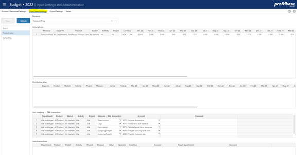

To attach the module to a report line, go to the “Setup” page of the “Input settings and administration” workbook:

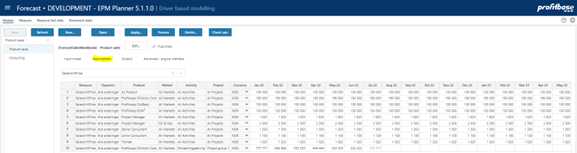

| Column | Description |
| --- | --- |
| Departm. | Source department. Ranked input. Mandatory.
Through the use ranked input (high level selection), different modules may attach to a given report line for different part of the department dimension (organization). |
| Report Line ID | Report line to which input module is to attach. Select from list. Mandatory. |
| Input module | Input module to attach. Select from list. Mandatory. |

## Period filters

The input module contains a period filter in which (time) periods can be selected. The content of this filter can be configured in the “Period filters” table found in the “Setup” page in the “Input Settings and Administration” workbook:

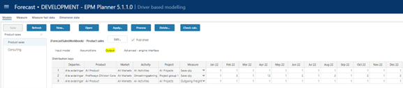

Note that this configuration is global to all input module workbooks and the “Plan Overview” workbook.

| Column | Description |
| --- | --- |
| Period filter | Available filters, preset. |
| Visible | Makes filter visible (checked) or not visible (unchecked) |
| Default | Makes it the default period filter |
| Sorting | Controls the sorting in the filter drop down |
| Comment | Optional comment |

## Edit…

Clicking the Edit.. button reveals a pop-up with the option to edit the name (default name, see Translations for translations), as well as:

### Period button and navigation

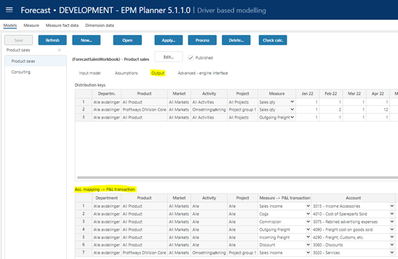

The Periods button is default visible and active. To hide and make inactive, un-tick the “Periods button” option.

By default, the drivers view is loaded and displayed when selecting in the Department dimension. The details view can be viewed per driver combination by clicking the go-to-details icon on the driver-row in question.

In circumstances where there is always just one driver row per department (all non-department dimensions have the default empty member, i.e. #), the “Navigate directly to details view” can be ticked thereby taking the user directly to the details view. This option I by default un-ticked.

### Limit access to specific models

By default, the access set up for the Driver based workbook applies to all driver-based models as they all shar the same workbook.

If needed, access to an individual model can be limited to a specific access group of the Default category by clicking the Edit button:

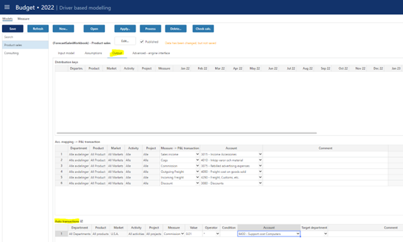

### Control row context menu options (right-click)

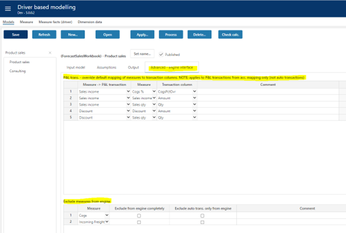

Some of the row context menu options can be controlled:

| Column | Description |
| --- | --- |
| Row context menu options (right-click) | Row context menu options (right-click) |
| New | Insert new row and Insert copy of row is allowed (true) or not allowed (false). Default is true. |
| Delete | Delete row is allowed (true) or not allowed (false). Default is true. |
| Delete (act. = 0) | Delete row is allowed only if row contains no actuals (true). Available for selection only if “Delete” is true. |
| Ch. dim. | Change dimensionality is allowed (true) or not allowed (false). Default is true. |
| Ch. dim. (act. = 0) | Change dimensionality is allowed only if row contains no actuals (true). Available for selection only if “Ch. dim.” is true. |

### Multi-department input

By default, input is only allowed at the lowest departmental level. In certain situations, this may not be desirable if for example users act on multiple departments. For this reason, multi-department input is used:

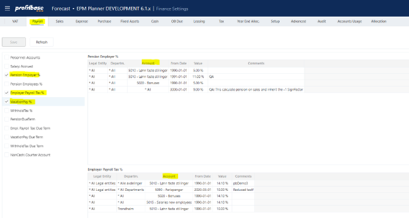

| Column | Description |
| --- | --- |
| Multi-dept. input | Input only allowed at lowest department level input is the default (false). If set to true, input can (given that access control allows) be given at higher-level nodes of the department dimension.
NOTE: when multi-department input is no (true), other filter should be used to narrow down the data set operated on. |
| Input row limit | Max. row limit returned that allows input. If row limit is reached, data is limited, and a warning is given to say that data set must be narrowed down to allow input. When multi-department input is set to true, a row limit must be set. |
| Auto load on filter chg. | By default, data is loaded automatically on filter change (true). When multi-department input is used, it may be desirable to first set all filters and then load the data. If this is the case, set this option to false. End user will have to use the Refresh button to load data. |

### Auto submit data

By default, data is submitted (i.e. processed through to the Plan Overview) once saving the data. By unchecking this option, a Submit button is displayed and the Save action will only save the input data and a manual click on the Submit button is required to actually submit the data through to the Plan Overview.

# Settings

Driver based models are configured in the “Driver based modelling” workbook and the “Models” page.

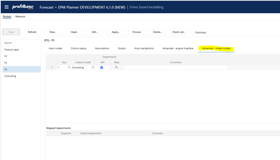

Multiple input models can be created and published to users. Select a model in the filter-list on the far left to activate buttons and display content.

Note that the most common settings (as outlined below) may also be maintained in the “Input Settings and Administration” workbook that may be convenient to avoid giving users access to model setup:

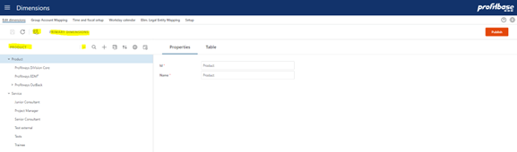

## Assumptions

Assumptions are lookup value and should exist for any measure that is defined as a lookup. For a measure to be eligible for assumptions, it must be defined as an assumption measure, see Define measures for details.

Assumptions are maintained in the “Assumptions” tab:

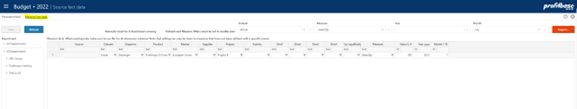

Select a measure from the dropdown list. The currently existing assumptions will display. Maintain assumption values as needed. To see the effect of any change, click Save and the Process for the model in question.

Assumptions are common across models.

| Column | Description |
| --- | --- |
| Measure | Measure to which the assumption is attached. Automatically set based on filter dropdown selection. Mandatory. |
| Departm. | Source department. Ranked input. Mandatory. |
| Product | Source product. Ranked input. Mandatory. Note that if the Product dimension is not visible in the model, any relevant assumption must be defined for the All product level. |
| Market | Source market. Ranked input. Mandatory. Note that if the Market dimension is not visible in the model, any relevant assumption must be defined for the All market level. |
| Activity | Source activity. Ranked input. Mandatory. Note that if the Activity dimension is not visible in the model, any relevant assumption must be defined for the All activities level. |
| Project | Source project. Ranked input. Mandatory. Note that if the Project dimension is not visible in the model, any relevant assumption must be defined for the All projects level. |
| Currency | Currency for assumption values. Mandatory for measures that have currency, see Define measures for details.
Note that if there exist legal entities having different home currencies, assumptions must exist for each of the currencies, i.e. there will be no currency conversion when the lookup is done. For legal entity A with home currency EUR, it is expected that an assumption set with currency EUR exists for the lookup to return values. |
| Monthly period columns | Numeric lookup values for individual months. Column headings will be dynamic and will change as plan rolls forward. |
| NY Plus 1– NY Plus 5 columns | Numeric lookup values for years beyond next year. Column headings will be dynamic and will change as plan rolls forward. Applicable if long-term planning is done. |

Please note that the assumption table will roll forward in time in accordance with the plan rolling forward.

## Distribution keys

Distribution keys are specified by the combination of the department, product, and market dimensions.

The dimensional values are selected using the ranked input selector. For details on using the ranked input selector and making rank changes between rows, please refer to Common functionality for details.

As a general rule-of-thumb, it is advisable not to use too specific distribution keys.

Distribution keys are maintained in the “Output” tab:

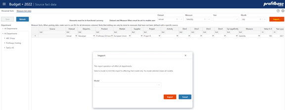

| Column | Description |
| --- | --- |
| Department | Source department. Ranked input. Mandatory |
| Product | Source product. Ranked input. Mandatory. Note that if the Product dimension is not visible in the model, any relevant assumption must be defined for the All product level. |
| Market | Source market. Ranked input. Mandatory. Note that if the Market dimension is not visible in the model, any relevant assumption must be defined for the All market level. |
| Activity | Source activity. Ranked input. Mandatory. Note that if the Activity dimension is not visible in the model, any relevant assumption must be defined for the All activities level. |
| Project | Source project. Ranked input. Mandatory. Note that if the Project dimension is not visible in the model, any relevant assumption must be defined for the All projects level. |
| Measure | Source measure. Select from list. Mandatory. |
| Monthly distribution key weight (heading dynamic) | Numeric values. Mandatory.
When distributing a year-total value over monthly periods, the weight given to a specific month is its distribution key weight divided by the sum of the distribution key weights for all the months for that year. |
| Comments | Optional comment. Note that if a comment is added, the contributor will see the comment when viewing the distribution key of an input row. |

## Measure to account mapping

For every model, any measure that is expected to generate a P&L transaction must be mapped to an account.

The measure to account mapping is maintained in the “output” tab:

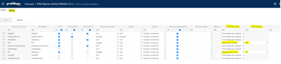

| Column | Description |
| --- | --- |
| Department | Source department. Ranked input. Mandatory. |
| Product | Source product. Ranked input. Mandatory. Note that if the Product dimension is not visible in the model, any relevant assumption must be defined for the All product level. |
| Market | Source market. Ranked input. Mandatory. Note that if the Market dimension is not visible in the model, any relevant assumption must be defined for the All market level. |
| Activity | Source activity. Ranked input. Mandatory. Note that if the Activity dimension is not visible in the model, any relevant assumption must be defined for the All activities level. |
| Project | Source project. Ranked input. Mandatory. Note that if the Project dimension is not visible in the model, any relevant assumption must be defined for the All projects level. |
| Measure | Source measure. Select from list. Mandatory. |
| Account | The target account, i.e. that account that the generated P&L transaction will be tied to. |
| Comment | Optional comment |

## Auto transactions (optional)

Auto-transactions may be used to trigger additional transactions based on user input. For example, the input to a certain account should always generate an additional transaction to another account amounting to 10% of the input or source transaction.

The auto transactions are maintained in the “Output” tab:

| Column | Description |
| --- | --- |
| Department | Source department. Ranked input. Mandatory |
| Product | Source product. Ranked input. Mandatory. Note that if the Product dimension is not visible in the model, any relevant assumption must be defined for the All product level. |
| Market | Source market. Ranked input. Mandatory. Note that if the Market dimension is not visible in the model, any relevant assumption must be defined for the All market level. |
| Activity | Source activity. Ranked input. Mandatory. Note that if the Activity dimension is not visible in the model, any relevant assumption must be defined for the All activities level. |
| Project | Source project. Ranked input. Mandatory. Note that if the Project dimension is not visible in the model, any relevant assumption must be defined for the All projects level. |
| Measure | Source measure. Mandatory. Select from list. |
| Value | The value and the operator define how the amount of the target transaction will be calculated. In the example above, the amount of the target transaction will be 10% o
Numeric value. Mandatory. |
| Operator | Select from list. Mandatory. |
| Condition | Optional. Special condition to apply when validating whether to execute the rule or not.
For example:
Month() > 6 indicating that rule will be executed only for transactions with a transaction date with month number greater than 6 (June)
CurrentPeriodValue() > 1000 indicating that rule will be executed if value currently processed is greater than 1000
Operators:
Equality: ==
Greater than or equal to: >= Greater than: >
Less than or equal to: <= Less than: <
Logical and: &&
Logical or: \|\| |
| Account | Mandatory. The account that the target transaction will have. |
| Target department | Optional. Leave empty if target department should equal the source department. Select from drop down is target department should differ from source department |
| Comment | Optional comment. |

## Advanced – engine interface (optional)

Please note that this is an advanced topic that requires in-depth knowledge of the Profitbase Planner financial engines.

All output transactions from the models (i.e. those mapped to an account plus those being produced by auto transaction) will be candidates for processing though the financial engines for balance and cash flow.

By default, all measure values are mapped to the Amount field of the transaction table. The transaction table does, however, contain several additional columns that may be desirable to use in certain circumstances to obtain a specific behavior from the financial engine.

At the same time, some output measures may not be desirable to send through the financial engines and should be explicitly excluded.

This can be done in the “Advanced – engine interface” tab (note: has no effect on what is displayed in the “Plan Overview” workbook):

| Column | Description |
| --- | --- |
| Measure -> P&L transaction | Output P&L transaction stemming from the account mapping. Mandatory. Select from list. |
| Measure | Model measure to obtain value from. Mandatory. Select from list. |
| Transaction column | Transaction column to map measure value to. Mandatory. Select from list. |
| Comment | Optional comment. |

### Override default mapping of measures to transaction columns

In stead of the default mapping of measure value to transaction table Amount field, the mapping can explicitly set. As shown in the example above, for the output transaction of the Sales income measure:

- measure value from “Cogs %” is mapped to transaction column “CogsPctOvr”
- measure value from “Sales income” is mapped to transaction column “Amount”
- measure value from “Sales Qty” is mapped to transaction column “Qty”

The values are taken from the same model based on equality of dimensions and time.

NOTE: It is possible to map measures to social cost rate fields. In these cases, account setup for the appropriate social cost must still be done for transactions to be produced as the mapping of measures only provide override values (rates) and do not control nor define the accounts to which the social costs are booked.

Social cost rate fields are:

- VacationPayPctOvr
- EmployerTaxPctOvr
- PensionEmployerPctOvr

Accounts associated with social cost are defined here:

### Exclude measures from engine.

If certain output transactions are to be excluded from the financial engines altogether, this can be achieved in the “Exclude measures from engine” table.

| Column | Description |
| --- | --- |
| Measure | Measure output from the model either through the account mapping or the auto transactions. Mandatory. Select from list. |
| Exclude from engine completely | Any output transaction for selected measure will be excluded (checked). |
| Exclude auto trans. only from engine | Optional selection to single out only auto transactions stemming from selected measure to be excluded from engine. |
| Comment | Optional comment. |

## Advanced – linked models

There are cases where automatic linking of models is useful when the output of one model affects the input of a second model.

An example could be a car dealership where the number of cars sold may drive the workshop and after-market (parts/accessories) sales.

Linking a model to a second model implies that the second model is automatically processed after the source model is processed. More than one model can be linked, as might be the case in the car dealership example if, for example, a workshop model and an after-market model are both linked to a new car sales model.

The organizational (department) context that the linked models are executed is executed can either be the same as the source (self) or an explicit organizational map of source and linked departments.

Linked models:

| Column | Description |
| --- | --- |
| Seq | Execution sequence of the link(ed) model(s). Lowest executed first. |
| Linked model | The linked model, select from drop down. |
| Self | Indicates whether organizational context for linked model is the same as the source model (checked) or not (unchecked). Note that if not checked a map of departments must be defined. |
| Map | Link to map of departments – use if “Self “ is unchecked. |
| Comment | Optional comment. |

Mapped departments (click the “Map” in the relevant linked model row):

| Column | Description |
| --- | --- |
| Departm. | Source department |
| Linked department | The linked department, meaning that the linked model should execute for selected “Linked department” whenever source model is executed for selected “Departm.”. |
| Comment | Optional comment |

NOTE: using a custom assumption view to relay measure output of a single model dynamically to another model (for example measure QtySold in Car dealership example) is often relevant in these case as is a dynamic department map based on for example user input as opposed to an explicit map as described above. This is possible using established customization patterns and are described in the “Planner Customization Patterns” document.

# Data management

Data management comprises of dimension management and source fact data management.

The driver based module uses the department, product, and market dimensions with the optional addition of extra dimensions supplier, project, activity, counterpart and dim1 to dim4.

The driver based source fact data contains the historical data per measure for relevant dimension combinations.

## Dimensions

The dimensions available in the driver-based module are Product, Market, Supplier, Activity, Project, and dimensions D1 to Dim4.

Dimensions maintained in the Dimensions workbook, selecting the appropriate dimension:

Note that dimensions in Planner are centrally managed (primary dimension) with the option of maintaining version specific copy using the solution picker.

Maintain as appropriate, save the changes, and then click the “Publish” button to publish. Note that when publishing a dimension, the target versions must be selected.

## Source fact data

A simple input tool for maintaining historical data is available in the “Source fact data” workbook:

Select a value in the “Dataset” and “Measure” filter at the top and click the “Refresh” button to enable the save button.

Note that only measures that are set up without a specific “Hist. fact source” are available for input here, see Define measures. Measures with a specific “Hist. fact source” set can be viewed but not changed, they are sourced from the configured source.

Add new rows as needed or paste selection. When pasting data, make sure to paste dimension ids. A dropdown will evaluate the id against the corresponding dimension and render the dimension description. If no description is rendered, just the id, this indicates that the id does not exist in the dimension.

| Column | Description |
| --- | --- |
| DepartmentID | Department id. Mandatory. |
| ProductID | Product id. Mandatory. |
| MarketID | Market id. Mandatory. |
| ProjectID | Project id. Optional. If no value is provided, the default value # is set |
| ActivityID | Market id. Optional. If no value is provided, the default value # is set |
| SupplierID | Supplier id. Optional. If no value is provided, the default value # is set |
| Dim1 | Dim1 id. Optional. If no value is provided, the default value # is set |
| Dim2 | Dim2 id. Optional. If no value is provided, the default value # is set |
| Dim3 | Dim3 id. Optional. If no value is provided, the default value # is set |
| Dim4 | Dim4 id. Optional. If no value is provided, the default value # is set |
| CPLegalEntityID | Counterpart legal entity id. Optional. If no value is provided, the default value # is set |
| Value | Numeric |
| Year yyyy | 4-digit year, for example 2020. Mandatory |
| Month 1-12 | Month number, 1-12. Mandatory |

Department, Product, Market, Year and Month are mandatory columns.

Any amounts must be given in the home currency.

Value will default to 0 if no value is provided.

Dimension combinations found in the source and not in the input module for either the last 12 months actuals or any of the (optional) historical reference columns, will automatically be processed into the module on plan rollover.

The input models are updated by clicking the “Import..” button and selecting the appropriate model:

The input models can also be updated manually by clicking the “Apply…” button in the “Models” page of the “Driver based modelling” workbook.

### Using Personnel fact source

In certain applications such as payroll planning, it may be desirable to use Personnel fact source as the plan proposal for a driver based model. It is also possible to control whether the model’s input values should be updated or not from the Personnel fact source.

Possibility to link measures to plan proposal source Personnel Fact and map to available measure columns in Personnel Fact:

When used in model(s), option to control whether or not these measure's input columns will be updated from the plan proposal source when the model is updated (server operations such as Update and Process operation, Roll forward, etc) if plan proposal source is set to Personnel fact:

Updating of these measure's input numbers during server operations will be controlled overall by:

In the same way as for the Personnel module. When FALSE, no input columns are updated regardless of the setting in the model's individual measures. If set to TRUE, the setting in the model's measures are used.

A measure that is linked to plan proposal from Personnel fact can no longer have a plan proposal from the plan proposal workbook.

When importing and applying changes to models from the UI, existence of measures that take their proposals from Personnel fact is detected and the user is given an option whether to update existing plan (input) columns:

Checking the Update existing plan data option will update input fields in the models for measures that are marked for update.