# Loan module

Profitbase

25.05.2025

Version 3.5

# Abstract, intended audience and pre-requisites

The Profitbase Planner Configuration and Operation series consist of several documents dealing with the configuration and operation of individual Planner modules and functions.

The intended audience of this document is implementation partners configuring the solution initially and solution administrators responsible for operating it thereafter.

This document assumes that a Profitbase Planner solution has been deployed and that access to this solution is given to the reader.

The Loan module is included as a standard Profitbase Planner.

# Common functionality

Changes made to input sheets are not saved automatically. To save changes, click the “Save” button. The “Save” button will remain disabled until a change has been made.

To undo all unsaved changes, click the “Refresh” button.

To undo the last of a series of unsaved changes, click the Ctrl and Z keys simultaneously.

To insert new rows to an input sheet, right-click in the sheet and select one of the available options:

- Insert row
- Insert row below
- Insert copy of row

To delete a row from an input sheet, right-click the row in question and select:

- Delete row

Inserting and deleting rows can be controlled as part of the configuration, see Publish and name module, control row context right-click menu options.

Please note, that although the row is no longer visible in the input sheet, the change must be committed using the “Save” button or undone using the “Refresh” button.

In input sheets, editable fields are distinguished from non-editable fields by fill color, editable fields have by default a white fill color.

In setting tables, a so-called ranked input concept is often used for the dimensional context. Ranked input allows for a high-level selection of dimensional nodes and gives the opportunity to alter the rank or specificity between rows.

A ranked input cell can be set through the ranked input selector by clicking the cell value (cell will display 3 dots if no value is set):

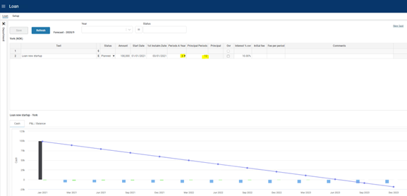

The ranked input selector will display the dimensional hierarchy and allows for the selection of a high-level dimensional node. The selection of a high-level node implies that the setting applies to all sub-ordinate nodes.

Select node and click “OK”.

Click “Cancel” to leave the selector without selecting.

In a table containing multiple rows, the rank or specificity of individual rows can be altered by moving the row up (decrease specificity) or down (increase specificity) by right-click the row in question and selecting:

- Move up
- Move down

The less specific the setting is, row should be high up in the table. The more specific the setting is, the further down in the table the row should reside.

# Principle of operation

## Loan types handled including examples

Handles loans; both taken and issued. Calculates interest (accrued and due), installments and fees on term (serial) and annuity loans, including balloon loans.

### Term loans

For term loans, the default is to define the number of installment periods and let the system calculate the serial principal.

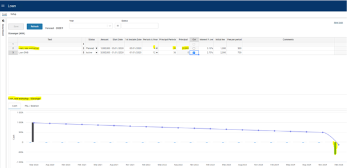

A so-called “balloon loan” is defined by setting both the number of installment periods and the principal amount. When the number of installment periods is reached, the total residual value will be due.

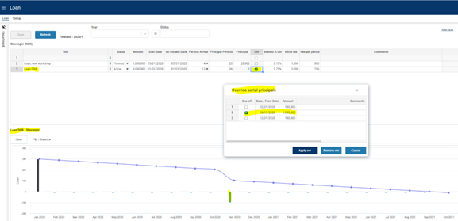

If you need a grace period or adjust the principal amount you can override the automatically generated serial principals, by right clicking the “Ovr” column depending on the input sheet setup. In the following dialogue, principals may be specified individually.

The adjustment will take effect on the following rollover (as 1st Period Date).

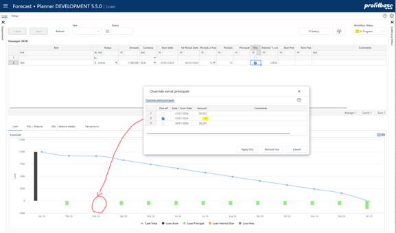

To set one specific principal to 0 and then resume the payments thereafter, set -1 in the period that should be 0 (-1 = -100%) and then the original principal amount in the next period as shown in the image below

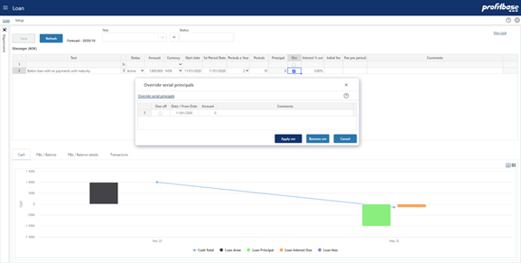

To define a Balloon loan with no payments until maturity, override the principal and set it to 0 (not empty) – first image below - and check the All int due at maturity – second image below.

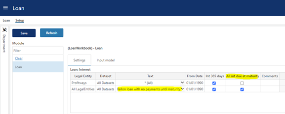

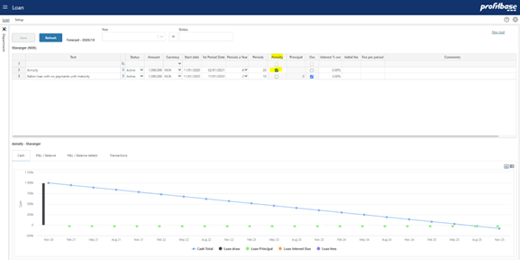

### Annuity loan

To input annuity loans, the “Annuity” check box column must be included in the input sheet (not included by default).

Please refer to Column setup for details on column setup.

Once included, check the “Annuity column”:

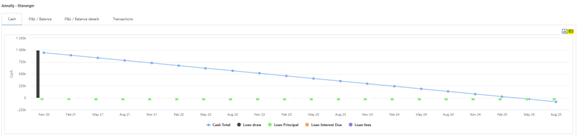

Set the start date, first instalment (1st Instalm. Date) to exactly 1 period length from start date (*), instalments a year (Periods A Year) and the total number of instalments (Periods); system will calculate every changing mix of interest and instalment for each term until maturity.

(*) If date for 1st installment is set prior to the “normal” start of 1st term, the interest calculation will switch to advance payment.

### Intercompany loan

Loans can also be set up as intercompany loans with a counterpart legal entity defined as the loaner depending on the input sheet setup.

An intercompany loan must be marked as a “Loan out” from the lender and the loaner must be set as the counterparty.

## Analyze the financial effect of portfolio and individual loans

Click the icon to view the transactions generated from the individual loan in question, note the tab control to switch between the reports:

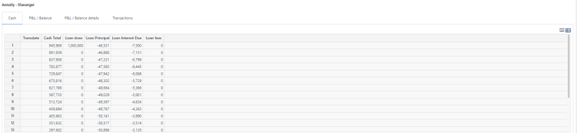

- Cash report

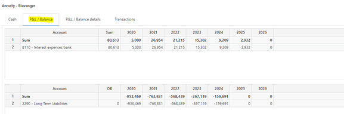

Click the tabular icon to display the data:

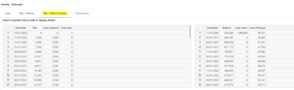

- P&L / Balance

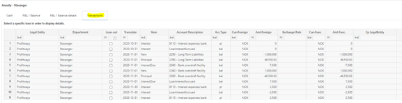

- P&L / Balance details (requires a specific loan to be selected)

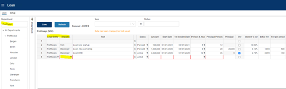

- Transactions (requires a specific loan to be selected)

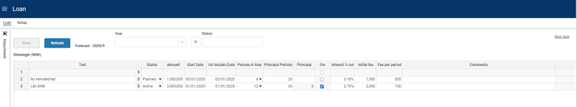

## Flexible organizational input level

Loans can be input from anywhere in the organizational dimension. Each loan must, however, be attached to a department.

If a department is selected when input is done, this department is automatically assumed to be the department for the loan.

If at a higher level, the legal entity and department columns are automatically visible and relevant values must be selected from the dropdown lists attached to the columns:

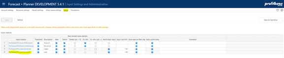

## Flexible input sheet

### Input columns

Depending on the variety of loans to support, annuity, serial, intercompany loans, etc., the input sheet may be configured differently.

By default, the input sheet is set up to support external serial loans with the option of overriding the serial principals.

The loan account is by default a lookup and the interest rate is by default an input field (“Interest % ovr”), and fields for inputting establishment and periodic fees are visible:

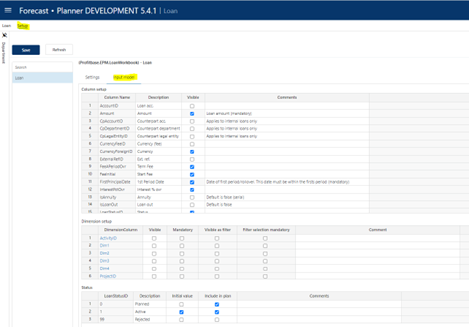

This can be changed by excluding and/or including input columns as appropriate. For details on defining input columns, please refer to Column setup for details.

Please note that the input sheet works in conjunction with various setting (lookup) tables associated with the loan module. For example, the interest rate may be a lookup value as opposed to an input field. For this to work, the appropriate setting for Interest % must be set up.

Please refer to Settings for details on loan settings.

### Dimensionality

The basic dimensionality of the Loan module is department and the individual investment.

Extra dimensionality may be added as needed, please refer to Dimension setup for details.

### Loan status

A Loan status table can be defined with behaviors such as include in plan which determines whether loans of a certain status is to be included in the plan or not.

Please refer to Loan status for details.

# Module configuration

## Publish and name module, control row context right-click menu options

Select the “Input Settings and Administration” workbook and go to the “Setup” page, and edit the “Input modules” table:

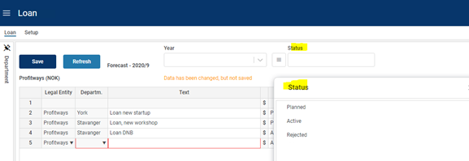

| Column | Description |
| --- | --- |
| Input module | The name of the input module. The Input module column is an action link that will open the module in admin mode that means that changes are possible regardless of the “Published” column setting. |
| Published | Indicates that the input module is Published or not (checked \| unchecked). If not published (unchecked), changes will not be possible unless opening the input module using the action link in the “Input module” column. |
| Description | The module’s default name. Translations can be added in the Translations tab. |
| Row context menu options (right-click) | Row context menu options (right-click) |
| New | Insert new row and Insert copy of row is allowed (true) or not allowed (false). Default is true. |
| Delete | Delete row is allowed (true) or not allowed (false). Default is true. |
| Delete (act. = 0) | Delete row is allowed only if row contains no actuals (true). Available for selection only if “Delete” is true. |
| Ch. dim. | Change dimensionality is allowed (true) or not allowed (false). Default is true. |
| Ch. dim. (act. = 0) | Change dimensionality is allowed only if row contains no actuals (true). Available for selection only if “Ch. dim.” is true. |
| Multi-dept. input | Always true for this module. |
| Input row limit | Max. row limit returned that allows input. If row limit is reached, data is limited, and a warning is given to say that data set must be narrowed down to allow input. When multi-department input is set to true, a row limit must be set. |
| Auto load on filter chg. | By default, data is loaded automatically on filter change (true). When multi-department input is used, it may be desirable to first set all filters and then load the data. If this is the case, set this option to false. End user will have to use the Refresh button to load data. |

## Setup of the Loan module

The Loan module is configured in the “Setup” page of the “Loan” workbook. In the “Setup” page, select the “Input model” tab:

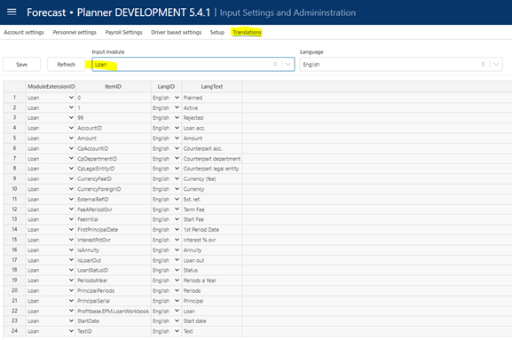

The module can be published by checking the “Published” checkbox and clicking the “Save” button. Conversely, the module can be taken offline by unchecking the “Published” checkbox.

## Column setup

The module contains several input columns that may or may not be used depending on what kind of loan functionality is relevant by selecting and/or deselecting input columns.

The following columns are always present and thus not available for selection:

TextID: Describes the loan (mandatory)

Amount: Loan amount (mandatory)

Start date: Start date for loan (mandatory)

1st Period Date: Date of first period/rollover.

This date must be within the firsts period (mandatory)

PeriodsAYear: Number of periods/rollovers a year (mandatory)

PrincipalPeriods: Number of periods/rollovers in total for the loan lifecycle (mandatory)

Ovr: Indication (non-editable) of whether the serial principals are overridden by the user. An override function is available by right-clicking the Ovr column.

The columns available for selection are selected in the “Column setup” table:

| Column | Description |
| --- | --- |
| Column Name | The internal column id. Preset. |
| Description | The column’s default heading. Translations can be added in the Translations tab. |
| Visible worksheet | Indicates whether the column is visible in the input sheet (checked) or not (unchecked) |

AccountID: The loan balance account. This may be input directly in the input sheet. The default is, however, that the loan account is established based on the setting Loan: Accounts. The column is by default not visible.

CpAccountID: Counterpart - Account balance. Used for intercompany loans. Specifies the loan balance account of the loaner. The column is by default not visible.

CpDepartmentID: Counterpart – DepartmentID. Used for intercompany loans. Specifies the department of the loaner. The column is by default not visible.

CpLegalEntityID: Counterpart – LegalEntityID. Used for intercompany loans. Specifies the legal entity of the loaner. The column is by default not visible.

CurrencyFeeID: CurrencyID for fees. By default, the home currency is assumed, but if fees are in foreign currencies, this column may be used to specify that foreign currency. The column is by default not visible.

CurrencyForeignID: CurrencyID. By default, the loan amount is assumed to be in the home currency. If the loan amount is in a foreign currency, this column is used to specify that foreign currency. The column is by default not visible.

ExternalrefID: Free column to use when appropriate, could be used for attaching an assetid or similar, the column is by default not visible.

FeeAPeriodOvr: Used for specifying a term fees per principal period, the column is by default visible. Note that the setting table Loan: Fee A Period may be used to lookup fees instead of inputting the fee.

FeeInitial: Used for specifying any establishment fee, the column is by default visible.

InterestPctOvr: Used for specifying the loan interest rate, the column is by default visible. Note that the setting table Loan: Interest % may be used to lookup interest rates instead of inputting the rate.

IsAnnuity: Used to indicate whether the loan is an annuity loan, the column is by default not visible and any loans are thus assumed to be term loans by default.

IsLoanOut: Used to indicate whether the loan is taken (unchecked) or issued (checked). If this is an intercompany loan, the loaner information must be specified in the Cp (counterpart) columns.

LoanStatusID: Loan status dropdown, the column is by default visible. For details on defining loan statuses, please refer to Loan status.

PrincipalSerial: The principal serial amount. Relevant to term loans.

## Dimension setup

The department and individual loan dimensions are always present. In addition, there is a pre-set number of extra dimensions to select and name: Project, Activity, Dim1, Dim2, Dim3 and Dim4.

| Column | Description |
| --- | --- |
| DimensionColumn | The dimension column id. This column is preset with the available dimensions Dim1, Dim2, Dim3 and Dim4. |
| Visible Input | Indicates that the column is visible and editable in the input worksheet or not (checked \| unchecked) |
| Mandatory | Indicates that this dimension is mandatory, when adding a new loan, i.e. it is required to select a valid dimension member from the associated dropdown list. |
| Visible as filter | Some of the dimensions are available for selection as input filters (slicers). Indicates whether dimension is also an input filter (checked) or not (unchecked). |
| Filter selection mandatory | Indicates whether it is mandatory to set a value for the filter (checked) or not (unchecked) |
| Default filter value | Allows for a default value for the filter to be set. This can be a leaf level value or an aggregate level value. Editable only if dimension is visible and is used as a filter. Note that this is a default filter value, implying that if the model is started from the plan overview with a specific filter value set, the default will not apply. |
| Group source data | Not relevant for this module |

Note on CPLegalEntityID (counterparty): this dimension is available in all modules, but it is only the Sales (IC) and Loans (IC) financial engines that creates counter transactions. Providing counterparty information to transactions that are not handled by the mentioned financial engines will NOT have it’s counter transactions automatically posted. Hence, when enabling this dimension, make sure that is understood by the client. Accounts piped through the Sales (IC) engine are set up in the Finance Settings workbook and the Account to engine mapping configuration.

## Loan status

Loan statuses can be used to filter out certain loans. A filter is tied to the status in the “Loan” tab.

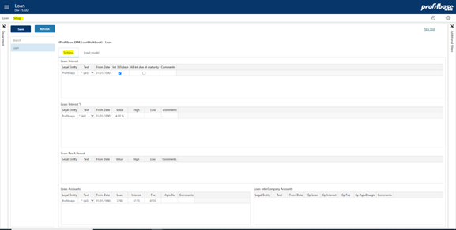

For statuses to be selectable by the contributor, the “LoanStatusID” column must be visible, see Column setup for details.

| Column | Description |
| --- | --- |
| LoanStatusID | The loan status id. Input field. |
| Description | The column’s default heading. Translations can be added in the Translations tab. |
| Initial value | Indicates that this loan status is the default status given to a loan when added to the input sheet (checked). Only one status should have the “Initial value” checked. |
| Include in plan | Indicates that loans holding this status is included in the plan, i.e. that they are included in official reports such as Finance Report and Plan Overview. |

## Translations

Translations are added in the Translations tab in the Input Settings and Administration workbook.

Select Loan as the Input module and the language of choice.

Edit the Lang Text column of an item or add an item. The available ItemID are typically the various column ids such as IsAnnuity, etc.

# Settings

The loan settings are defined in the “Setup” page of the “Loan” workbook. Select the “Settings” tab:

## Loan: Interest

This table is used to define how interest should be calculated for each loan.

| Column | Description |
| --- | --- |
| Legal entity | The source legal entity. Ranked input. Mandatory. |
| Text | The source loan or “All”. Select from list. Mandatory. |
| From date | The date from which the setting applies. Mandatory. |
| Int 365 days | Checked = actual days per month, Unchecked = 30 days per month |
| All int due at maturity | Checked = all interest paid at due end, Unchecked = at term end |
| Comments | Optional comment. |

## Loan: Interest %

The interest percent table allows defining interest for each loan identified by Legal Entity, and Text. Using the From Date, allows for changing interest over time.

Note, however, that the default is that the interest rate is input directly per loan in the “InterestPctOvr” column, please refer to Column setup for details.

This setting table may be used when a direct input is not practical and when changes in interest rates over time are planned.

| Column | Description |
| --- | --- |
| Legal entity | The source legal entity. Ranked input. Mandatory. |
| Text | The source loan or “All”. Select from list. Mandatory. |
| From date | The date from which the setting applies. Mandatory. |
| Value | The interest rate (baseline scenario). Mandatory. |
| High | The interest rate (high value). Optional. |
| Low | The interest rate (low value). Optional. |
| Comments | Optional comment. |

## Loan: Fee A Period

Setting table to define lookup value for periodic fees. Note that the default is that the periodic fee is input directly per loan in the “FeeAPeriodOvr” column, please refer to Column setup for details.

This setting table may be used when a direct input is not practical and when changes in periodic fees over time are planned.

| Column | Description |
| --- | --- |
| Legal entity | The source legal entity. Ranked input. Mandatory. |
| Text | The source loan or “All”. Select from list. Mandatory. |
| From date | The date from which the setting applies. Mandatory. |
| Value | The fee amount (baseline scenario). Mandatory. |
| High | The fee amount (high value). Optional. |
| Low | The fee amount (low value). Optional. |
| Comments | Optional comment. |

## Loan: Accounts

Basic setting table for defining lookup for the accounts associated with a loan.

Note that the loan account itself can also be input directly through the column “AccountID” although this is not the default, please refer to Column setup for details. The loan account is by default a lookup instead of a direct input column.

| Column | Description |
| --- | --- |
| Legal entity | The source legal entity. Ranked input. Mandatory. |
| Text | The source loan or “All”. Select from list. Mandatory. |
| From date | The date from which the setting applies. Mandatory. |
| Loan | Loan balance account. Type in a valid balance account. |
| Interest | Loan interest account. Type in a valid profit & loss account. |
| Fee | Loan fee account. Type in a valid profit & loss account. |
| Agio dis | Loan account for agio / disagio. Type in a valid profit & loss account. |
| Comments | Optional comment. |

## Loan: InterCompany Accounts

Relevant for intercompany loans.

When defining counterparty the loan is posted both on the original party and the counterparty. The Intercompany Accounts table are used to set the accounts to be used for the counterparty transaction.

Note that the loan intercompany account itself may be input directly through the column “CpAccountID”, please refer to Column setup for details.

| Column | Description |
| --- | --- |
| Legal entity | The source counterpart legal entity. Ranked input. Mandatory. |
| Text | The source loan or “All”. Select from list. Mandatory. |
| From date | The date from which the setting applies. Mandatory. |
| Cp Loan | Loan balance account for counterpart. Type in a valid balance account. Mandatory. |
| Cp Interest | Loan interest account for counterpart. Type in a valid profit & loss account. Mandatory. |
| Cp Fee | Loan fee account for counterpart. Type in a valid profit & loss account. Mandatory. |
| Cp Agio disagio | Loan account for agio / disagio for counterpart. Type in a valid profit & loss account. Mandatory. |
| Comments | Optional comment. |

