# Personnel module

Profitbase

26.05.2025

Version 3.5

# Abstract, intended audience and pre-requisites

The Profitbase Planner Configuration and Operation series consist of several documents dealing with the configuration and operation of individual Planner modules and functions.

Planner modules are operational input modules that contributors to the plan processes use to prepare the Profit & Loss (P&L) of their respective areas of responsibility. Different modules will typically cover parts of the P&L such as sales, personnel, cost, etc.

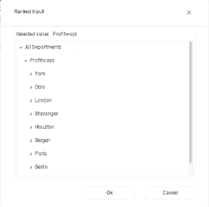

The modules are accessed from the Plan overview workbook of a given version and the input provided by the contributors are transformed into P&L transactions and fed back to the Plan overview workbook resulting in a P&L work-in-progress overview.

The intended audience of this document is implementation partners configuring the solution initially and solution administrators responsible for operating it thereafter.

This document assumes that a Profitbase Planner solution has been deployed and that access to this solution is given to the reader.

# Common functionality

Changes made to input sheets are not saved automatically. To save changes, click the “Save” button. The “Save” button will remain disabled until a change has been made.

To undo all unsaved changes, click the “Refresh” button.

To undo the last of a series of unsaved changes, click the Ctrl and Z keys simultaneously.

To insert new rows to an input sheet, right-click in the sheet and select one of the available options:

- Insert row
- Insert row below
- Insert copy of row

To delete a row from an input sheet, right-click the row in question and select:

- Delete row

Inserting and deleting rows can be controlled as part of the configuration, see Publish and name module, control row context right-click menu options.

Please note, that although the row is no longer visible in the input sheet, the change must be committed using the “Save” button or undone using the “Refresh” button.

In input sheets, editable fields are distinguished from non-editable fields by fill color, editable fields have by default a white fill color.

In setting tables, a so-called ranked input concept is often used for the dimensional context. Ranked input allows for a high-level selection of dimensional nodes and gives the opportunity to alter the rank or specificity between rows.

A ranked input cell can be set through the ranked input selector by clicking the cell value (cell will display 3 dots if no value is set):

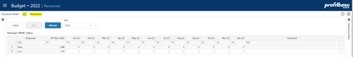

The ranked input selector will display the dimensional hierarchy and allows for the selection of a high-level dimensional node. The selection of a high-level node implies that the setting applies to all sub-ordinate nodes.

Select node and click “OK”.

Click “Cancel” to leave the selector without selecting.

In a table containing multiple rows, the rank or specificity of individual rows can be altered by moving the row up (decrease specificity) or down (increase specificity) by right-click the row in question and selecting:

- Move up
- Move down

The less specific the setting is, row should be high up in the table. The more specific the setting is, the further down in the table the row should reside.

# Principle of operation

The Personnel module provides an input sheet for contributors to plan their FTEs (Full Time Equivalents) and HCs (Headcounts) and associated cost and from it creates P&L transactions for payroll related expenses including associated social cost such as vacation pay, employer tax, pension cost and so on.

## Driver-based

The Personnel module uses a driver-based principle in which FTEs (Full Time Equivalents) or HCs (Headcount) are the drivers subject to the configuration used, see Select and name input columns, set the driver.

The FTE/HC is maintained in the FTE or HC pages respectively:

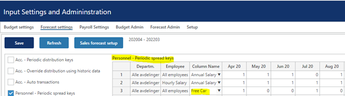

Any user input is thus provided per FTE/HC per month.

This further implies that periodic spread keys are used (as opposed to distribution keys) to lay out the per-FTE/HC-per-month input values over time:

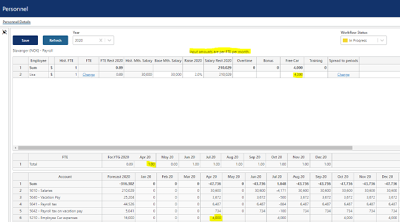

An input value translates to a Profit & Loss amount for a given month as:

[Input amount] * [FTE/HC for the month] * [Periodic spread key for month]

In the case of April 2020 for employee Lisa:

4000 * 1 * 1 = 4000

Click the icon to view the P&L transactions generated from the row in question.

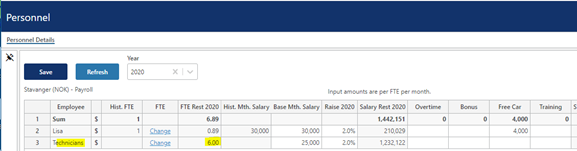

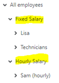

## Plan by individual and/or groups

The planning dimensionality used comprise of the Department and Employee dimensions and optionally dimensions as outlined here Select additional dimensionality.

Note that the Employee dimension may be set up with individuals or groups or a combination of the two:

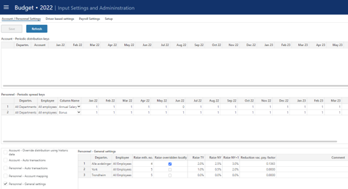

As Personnel-related settings are differentiated by the Employee dimension hierarchy, it is advisable to use appropriate group levels in the dimensional hierarchy to allow for a useful differentiation, for example:

For details on dimension maintenance and personnel source data, please refer to Data management.

## Salary calculation and distribution

Salary is always driven by FTE.

Specific to the salary calculation, is the annual salary increase and for which month in the year it occurs.

The Base monthly salary is the (average) monthly salary at the start of the plan and will be automatically updated when rolling over to a new year (see Plan roll forward actions for details).

The salary raise – percentage and raise month - may be set centrally with the option of local adjustment or not:

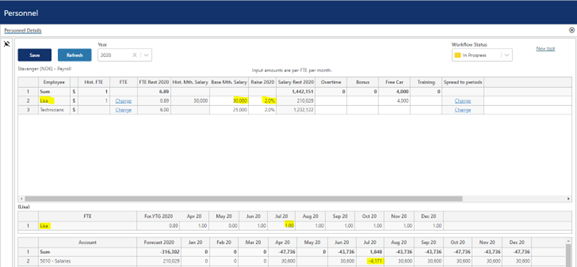

These settings may be differentiated using more specific Department levels (and optionally employee) as shown in the example above.

The input Base monthly salary is spread, taking into account the raise settings, based on the Annual Salary spread key:

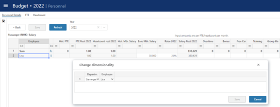

If vacation pay is relevant, the Annual Salary key should reflect this by setting the key for the vacation pay month(s) to a value between 0 and 1 as show above.

For situations in which the vacation does not reflect exactly one month, the “Reduction vac. Pay factor” in the “General Settings” may be used. The “Reduction vac. Pay factor” will be applied as a reduction factor to the salary for vacation pay months.

Salary for vacation months is calculated as:

[FTE July] * [Base Mth. Salary] * (100 + [Raise 2020])/100 * [1- Annual Salary Spread key July 2020] * [Reduction vac. Pay factor] * -1

Example employee Lisa:

1 * 30000 * ((100 + 2)/100) * (1 – 0) * 0.1363 * -1 = - 4171

Calculation example above based on:

- Base Mth. Salary: 30000 NOK
- Raise 2020: 2% from April 2020
- Vacation pay month: July 2020
- FTE July 2020: 1
- Reduction vac. Pay factor: 0.1363
## Dimensionality

The basic dimensionality of the personnel module is department and employee.

Extra dimensionality, Project, Activity, Counterpart and 4 free dimensions Dim1, Dim2, Dim3 or Dim4 may be added as needed.

Please refer to Select additional dimensionality for details.

## Attributes

In some cases, attributes define the input row. Attributes differ from dimensional ids in that they do not define the uniqueness of a row. An attribute represents additional information associated with a row such as employment type, etc.

Attributes are optional. Up to two attributes may be defined.

Please refer to Select and name input columns, set the driver for details.

### Change dimensionality of an input row

The current dimensionality of an existing input row may be changed (subject to the configuration, see Publish and name module, control row context right-click menu options) by right-clicking the row in one of the dimensional columns and selecting “Change dimensionality”. This will reveal a pop-up in which a new dimensionality can be set:

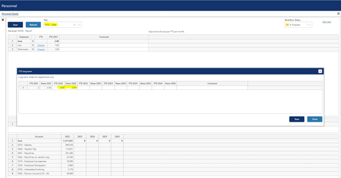

## Planning horizon

The planning time horizon is controlled in the Finance Settings workbook:

This time horizon applies to all input modules.

Long-term planning (beyond this year and next year) allows for a year-total input only. When saving the plan, the long-term year-totals are automatically distributed to months using the distribution that is relevant to the next year’s plan for the corresponding dimensionality.

Note that there is also a period filter setting that you may want to consider if you change the plan horizon. The period filter setting control which period filter will be available and which one will be the default, please refer to Period filters.

## Long-term planning

For long-term (beyond next year) planning, the level of detail is less – input is done for the department as a whole:

- FTE for given year
- Expected annual salary raise for given year

The detailed plan for next year is used as a basis for scaling the long-term plan based on the change in FTE and annual salary raise. The periodic distribution for next year is replicated for the long-term plan.

## Plan roll forward actions

### Source data

The input module will be updated with source data when rolling forward.

Any new dimensional combinations that exist in the personnel source fact data will automatically be processed into the input module and the FTE, HC and monthly salary data for the plan will be initiated from the values in the source fact data.

Existing input rows can be updated automatically on forecast rollover if the following base setting is set to TRUE:

The following setting controls which input columns are updated:

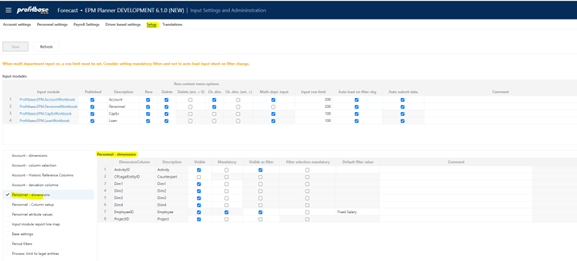

Make sure to keep the personnel source fact data current. Please refer to Data management for details.

### Calculations

For every rollover during a year FTE and HC (the drivers) for the new month(s) added, will attain the value of the last month prior to the rollover. As FTE or HC are the drivers, this means that the personnel cost will be automatically calculated also for new months.

For rollover to new year, the following logic is applied:

- Base Mth. Salary is updated to reflect Raise this year.
- Raise this year is updated to reflect what was the raise next year prior to rollover.
- Raise next year is updated to reflect what was the raise next year +1 prior to rollover.
- Raise next year + 1 is fetched from the “Personnel – General Settings” table
- If long-term planning is done, the FTE/HC and Raise values for the long-term years is shifted to reflect the rollover to the new year. The new last year will retain the value for the last year prior to rollover.
# Module configuration

## Publish and name module, control row context right-click menu options

Select the “Input Settings and Administration” workbook and go to the “Setup” page:

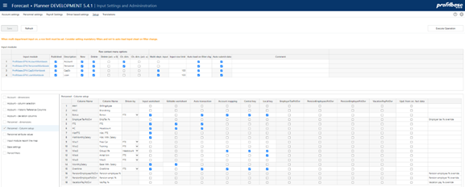

| Column | Description |
| --- | --- |
| Input module | The name of the input module |
| Published | Indicates that the input module is Published or not (checked \| unchecked) |
| Description | The module’s default name. Translations can be added in the Translations tab. |
| Row context menu options (right-click) | Row context menu options (right-click) |
| New | Insert new row and Insert copy of row is allowed (true) or not allowed (false). Default is true. |
| Delete | Delete row is allowed (true) or not allowed (false). Default is true. |
| Delete (act. = 0) | Delete row is allowed only if row contains no actuals (true). Available for selection only if “Delete” is true. |
| Ch. dim. | Change dimensionality is allowed (true) or not allowed (false). Default is true. |
| Ch. dim. (act. = 0) | Change dimensionality is allowed only if row contains no actuals (true). Available for selection only if “Ch. dim.” is true. |
| Multi-dept. input | Input only allowed at lowest department level input is the default (false). If set to true, input can (given that access control allows) be given at higher-level nodes of the department dimension.
NOTE: when multi-department input is no (true), other filter should be used to narrow down the data set operated on. |
| Input row limit | Max. row limit returned that allows input. If row limit is reached, data is limited, and a warning is given to say that data set must be narrowed down to allow input. When multi-department input is set to true, a row limit must be set. |
| Auto load on filter chg. | By default, data is loaded automatically on filter change (true). When multi-department input is used, it may be desirable to first set all filters and then load the data. If this is the case, set this option to false. End user will have to use the Refresh button to load data. |
| Auto submit data | By default, data is submitted (i.e. processed through to the Plan Overview) once saving the data. By unchecking this option, a Submit button is displayed and the Save action will only save the input data and a manual click on the Submit button is required to actually submit the data through to the Plan Overview. |

## Select additional dimensionality

Select the “Input Settings and Administration” workbook and go to the “Setup” page:

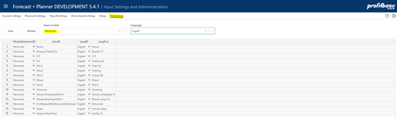

There is a preset number of additional dimensions to choose from.

| Column | Description |
| --- | --- |
| Dimension Column | The internal dimension column (preset). |
| Visible | Indicates that the column is visible and editable in the input worksheet or not (checked \| unchecked) |
| Mandatory | Indicates that the column is mandatory in the input worksheet, i.e. that when inserting a new row, the user will have to select a value from the attached drop-down list. |
| Visible as filter | Some of the dimensions are available for selection as input filters (slicers). Indicates whether dimension is also an input filter (checked) or not (unchecked). |
| Filter selection mandatory | Indicates whether it is mandatory to set a value for the filter (checked) or not (unchecked) |
| Default filter value | Allows for a default value for the filter to be set. This can be a leaf level value or an aggregate level value. Editable only if dimension is visible and is used as a filter. Note that this is a default filter value, implying that if the model is started from the plan overview with a specific filter value set, the default will not apply. |
| Comment | Optional comment. |

Note on CPLegalEntityID (counterparty): this dimension is available in all modules, but it is only the Sales (IC) and Loans (IC) financial engines that creates counter transactions. Providing counterparty information to transactions that are not handled by the mentioned financial engines will NOT have it’s counter transactions automatically posted. Hence, when enabling this dimension, make sure that is understood by the client. Accounts piped through the Sales (IC) engine are set up in the Finance Settings workbook and the Account to engine mapping configuration.

## Select and name input columns, set the driver

Select the “Input Settings and Administration” workbook and go to the “Setup” page:

There is a pre-set number of columns to select and name.

| Column | Description |
| --- | --- |
| Column Name | The internal column id |
| Column Name | The column default name. Translations can be added in the Translations tab. |
| Driven by | Whereas salary is always driven by FTE, the driver for the optional cost columns may be selected as either FTE or HC. |
| Input worksheet | Indicates that the column is visible in the input worksheet or not (checked \| unchecked) |
| Editable worksheet | Indicates that the column is editable in worksheet or not (checked \| unchecked). A cell, even though not editable, is however always editable until the row is saved for the first time. |
| Auto transaction | Indicates that the column is eligible for auto transactions or not (checked \| unchecked). For details on auto transactions, see Auto transactions (optional) |
| Account mapping | Indicates that the column is eligible for account mapping or not (checked \| unchecked). Note that any column which input is to be included in the Profit & Loss plan, need to be mapped to an account, see Define input column to account mapping |
| Central key | Indicates that the column is eligible for central spread key or not (checked \| unchecked). For details on maintaining central spread keys, see Spread keys |
| Local key | Indicates that the column is eligible for the end user to set locally in the Personnel module or not (checked \| unchecked). |
| EmployerTaxPctOvr | Indicates whether column should be affected by this ovr setting for social cost or not (checked \| unchecked) |
| PensionEmployeesOvr | Indicates whether column should be affected by this ovr setting for social cost or not (checked \| unchecked) |
| PensionEmployerPctOvr | Indicates whether column should be affected by this ovr setting for social cost or not (checked \| unchecked) |
| VacationPayPctOvr | Indicates whether column should be affected by this ovr setting for social cost or not (checked \| unchecked) |
| Upd. from src. fact data | By default, new dimensional combinations are processed into the input module. Existing input rows can, however, also be updated and this setting defines which input columns are to be updated from the source. |

Note that any override enabled for social cost (ovr columns) will always apply to the calculated salary. For additional cost columns (Overtime, Bonus, Misc 1..5), the above configuration will control whether or not that particular additional cost columns is affected the ovr column.

Note that a value in an ovr column for a particular input row, will set aside any payroll related setting regime for that payroll cost for that column.

## Translations

Translations are added in the Translations tab.

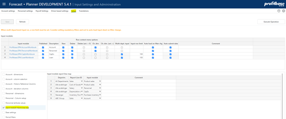

Select Personnel as the Input module and the language of choice.

Edit the Lang Text column of an item or add an item. The available ItemID are typically the various column ids such as Misc1, etc.

## Attach module to input report

The module can be attached to the action link button of one or more report lines of the Plan overview report:

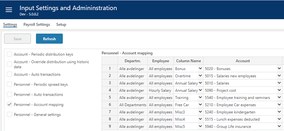

To attach the module to a report line, go to the “Setup” page of the “Input settings and administration” workbook:

| Column | Description |
| --- | --- |
| Departm. | Source department. Ranked input. Mandatory.
Through the use ranked input (high level selection), different modules may attach to a given report line for different part of the department dimension (organization). |
| Report Line ID | Report line to which input module is to attach. Select from list. Mandatory. |
| Input module | Input module to attach. Select from list. Mandatory. |

## Define input column to account mapping

The Annual Salary must be mapped to an account for the P&L transactions to be generated.

The same applies to any additional input columns defined and that should generate P&L transactions.

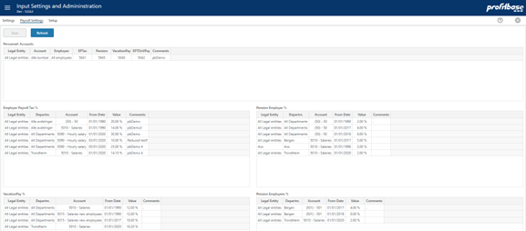

| Column | Description |
| --- | --- |
| Department | Source department. Ranked input. Mandatory. |
| Employee | Source employee. Ranked input. Mandatory. |
| Column Name | Input column for which the account mapping applies. The drop-down list will by default contain Sales and Cogs. If additional input columns are defined and they should produce P&L transactions, they will have to be set up with an “Account mapping”, check mark in the input column setup. Please refer to Select and name input columns for details. |
| Account | The target account, i.e. that account that the generated P&L transaction will be tied to. |

## Period filters

The input module contains a period filter in which (time) periods can be selected. The content of this filter can be configured in the “Period filters” table found in the “Setup” page in the “Input Settings and Administration” workbook:

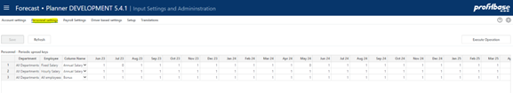

Note that this configuration is global to all input module workbooks and the “Plan Overview” workbook.

| Column | Description |
| --- | --- |
| Period filter | Available filters, preset. |
| Visible | Makes filter visible (checked) or not visible (unchecked) |
| Default | Makes it the default period filter |
| Sorting | Controls the sorting in the filter drop down |
| Comment | Optional comment |

# Settings

## Payroll settings

The “Payroll settings” define rules and rates for the calculation of social cost such as vacation pay, employer tax and so on.

“Payroll settings” are maintained in the “Input settings and administration” workbook in the “Payroll settings” page:

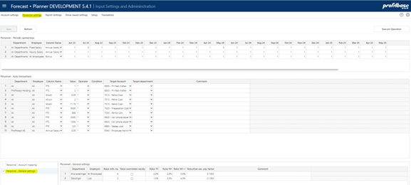

Note that ovr (override) input columns can be used to set aside the payroll setting regime for one or more of the payroll costs (vacation pay rate, employer tax rate, pension rate). Please refer to Select and name input columns for details.

### Personnel: Accounts

This table defines the rules for the target accounts to be used for the calculated social cost.

| Column | Description |
| --- | --- |
| Legal entity | Source legal entity. Ranked input. Mandatory. |
| Dataset | Source dataset. Ranked input. Mandatory. |
| Account | Source account. Ranked input. Mandatory. |
| Employee | Source employee. Ranked input. Mandatory. |
| EP Tax | Target account for calculated employer tax. Enter valid P&L account. |
| Pension | Target account for calculated pension cost. Enter valid P&L account. |
| Vacation Pay | Target account for calculated vacation pay. Enter valid P&L account. |
| EPTOnVPay | Target account for calculated employer tax on calculated vacation pay. Enter valid P&L account. |
| Comments | Optional comment |

### Employer Payroll Tax %

This table defines the rates to be used when calculating employer payroll tax.

| Column | Description |
| --- | --- |
| Legal entity | Source legal entity. Ranked input. Mandatory. |
| Department | Source department. Ranked input. Mandatory. |
| Dataset | Source dataset. Ranked input. Mandatory. |
| Account | Source account. Ranked input. Mandatory. |
| From date | The date from which the rate applies. Mandatory. Enter date. |
| Value | The employer payroll tax %. Mandatory. Enter numeric value. |
| Comments | Optional comment |

Please refer to Personnel: Accounts for details on defining the target account.

### Vacation Pay %

This table defines the rates to be used when calculating vacation pay.

| Column | Description |
| --- | --- |
| Legal entity | Source legal entity. Ranked input. Mandatory. |
| Department | Source department. Ranked input. Mandatory. |
| Dataset | Source dataset. Ranked input. Mandatory. |
| Account | Source account. Ranked input. Mandatory. |
| From date | The date from which the rate applies. Mandatory. Enter date. |
| Value | The vacation pay %. Mandatory. Enter numeric value. |
| Comments | Optional comment |

Please refer to Personnel: Accounts for details on defining the target account.

### Pension Employer %

This table defines the rates to be used when calculating the employer’s contribution to pension cost.

| Column | Description |
| --- | --- |
| Legal entity | Source legal entity. Ranked input. Mandatory. |
| Department | Source department. Ranked input. Mandatory. |
| Dataset | Source dataset. Ranked input. Mandatory. |
| Account | Source account. Ranked input. Mandatory. |
| From date | The date from which the rate applies. Mandatory. Enter date. |
| Value | The employer’s contribution to pension %. Mandatory. Enter numeric value. |
| Comments | Optional comment |

Please refer to Personnel: Accounts for details on defining the target account.

### Pension Employee %

This table defines the rates to be used when calculating the employee’s contribution to pension cost.

| Column | Description |
| --- | --- |
| Legal entity | Source legal entity. Ranked input. Mandatory. |
| Department | Source department. Ranked input. Mandatory. |
| Dataset | Source dataset. Ranked input. Mandatory. |
| Account | Source account. Ranked input. Mandatory. |
| From date | The date from which the rate applies. Mandatory. Enter date. |
| Value | The employee’s contribution to pension %. Mandatory. Enter numeric value. |
| Comments | Optional comment |

Please refer to Personnel: Accounts for details on defining the target account.

## Spread keys

Spread keys are specified by the combination of the department and employee dimensions.

The dimensional values are selected using the ranked input selector. For details on using the ranked input selector and making rank changes between rows, please refer to Common functionality for details.

As a general rule-of-thumb, it is advisable not to use too specific spread keys.

Spread keys are maintained in the “Input settings and administration” workbook in the “Personnel Settings” page:

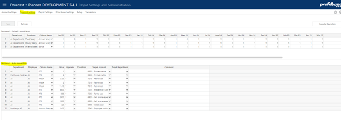

| Column | Description |
| --- | --- |
| Department | Ranked input. Mandatory |
| Employee | Ranked input. Mandatory. |
| ColumnName | The column name for which the spread key applies, see |
| Monthly spread key weight (heading dynamic) | Numeric values. Mandatory.
When spreading an input month value over multiple months, that input month value is multiplied with the individual spread key values to calculate the actual value for individual months |
| Comments | Optional comment. Note that if a comment is added, the contributor will see the comment when viewing the distribution key of an input row. |

## General settings

General settings on raise month and actual pay raise rates are maintained in the “Input settings and administration” workbook in the “Personnel Settings” page:

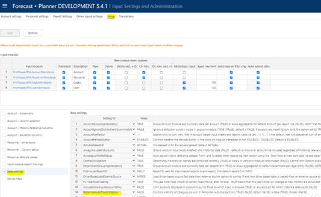

| Column | Description |
| --- | --- |
| Departm. | Ranked input. Mandatory |
| Employee | Ranked input. Mandatory. It is highly recommended not to specify settings on Employee unless absolutely required and if so, to use the employee hierarchy to reflect the differentiation in settings. The default value should be the “all employee” setting making the setting generic to all employees. |
| Raise mt. no. | The month number (e.g. 4= April) in which the annual pay raise occurs. |
| Raise overridden locally | Indicates whether the pay raise columns are editable for contributors (checked) or not (unchecked). |
| Raise TY | The annual pay raise for this year. |
| Raise NY | The annual pay raise for next year. |
| Raise NY + 1 | The annual pay raise beyond next year. |
| Reduction vac. pay. Factor | For situations in which the vacation does not reflect exactly one month, the “Reduction vac. Pay factor” in the “General Settings” may be used. The “Reduction vac. Pay factor” will be applied as a reduction factor to the salary for vacation pay months. |

## Auto transactions (optional)

Auto-transactions may be used to trigger additional transactions based on user input. For example, the input to a certain account should always generate an additional transaction to another account amounting to 10% of the input or source transaction.

The auto transactions are maintained in the “Input settings and administration” workbook and the “Personnel Settings” page:

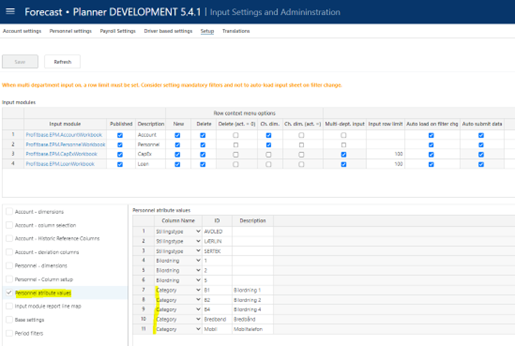

| Column | Description |
| --- | --- |
| Department | Source department. Ranked input. Mandatory |
| Employee | Source employee. Ranked input. Mandatory. |
| Column Name | Source column name (column from input sheet). Mandatory. Select from list. |
| Value | The value and the operator define how the amount of the target transaction will be calculated. In the example above, the amount of the target transaction will be 10% o
Numeric value. Mandatory. |
| Operator | Select from list. Mandatory. |
| Condition | Optional. Special condition to apply when validating whether to execute the rule or not.
For example:
Month() > 6 indicating that rule will be executed only for transactions with a transaction date with month number greater than 6 (June)
CurrentPeriodValue() > 1000 indicating that rule will be executed if value currently processed is greater than 1000
Operators:
Equality: ==
Greater than or equal to: >= Greater than: >
Less than or equal to: <= Less than: <
Logical and: &&
Logical or: \|\| |
| Target Account | Mandatory. The account that the target transaction will have. |
| Target department | Optional. Leave empty if target department should equal the source department. Select from drop down is target department should differ from source department |
| Comment | Optional comment |

If attributes are used, these are available as defining attributes of auto transactions:

| Column | Description |
| --- | --- |
| Attr1 | Optional. Drop down list of attribute 1 values and “any”. The “any” (blank) option is default. |
| Attr2 | Optional. Drop down list of attribute 2 values and “any”. The “any” (blank) option is default. |

In some cases, a substantial number of rules are used, and categorization may be desirable. The following base setting (if set to TRUE) enables categorization:

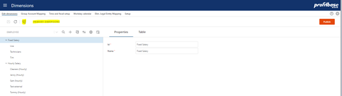

This will enable an optional category column and a category filter associated with the auto transaction table. If no category is selected, “any” (blank) is selected.

The content of the category drop down is controlled in the Personnel attribute values table (ColumnID = Category):

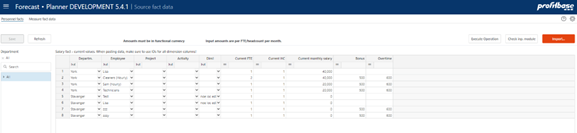

# Data management

Data management comprises of dimension management and source fact data management.

The personnel module uses the department and employee dimensions.

The personnel source fact data contains the current FTE and monthly salary for relevant department/employee combinations.

## Employee dimension

The employee dimension is maintained in the Dimensions workbook, selecting the employee dimension:

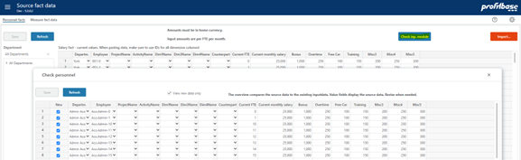

Note that dimensions in Planner are centrally managed (primary dimension) with the option of maintaining version specific copy using the solution picker.

Maintain as appropriate, save the changes, and then click the “Publish” button to publish. Note that when publishing a dimension, the target versions must be selected.

## Fact source data

The fact source data contain current FTE, monthly salary and additional personnel cost data and attributes (subject to configuration) per department/employee (and other optional dimensions) combinations:

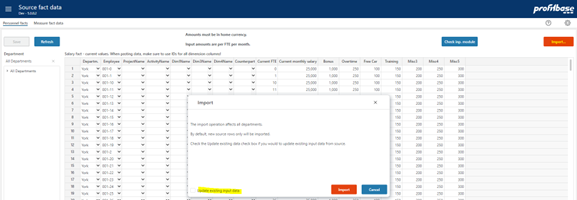

| Column | Description |
| --- | --- |
| Departm. | The department id. Mandatory. |
| Employee | The employee id. Mandatory. |
| Addtional dimension columns (subject to configuration) | Optional dimension columns Project, Activity, Dim1..4, Counterpart as configured. |
| Current FTE | The current FTE position of the employee at the given department. |
| Current HC | The current headcount of the employee at the given department |
| Current monthly salary | The current monthly salary for a full time FTE for the employee at the given department. |
| Additional cost columns (subject to configuration) | Current data for additional columns used. In the example above, “Bonus”, “Overtime”, “Free Car” and “Training” |
| Ovr (override) columns for payroll cost (subject to configuration) | Optional columns for setting override values for payroll cost rates such as vacation pay rate, employer tax rate, pension rate. |
| Attribute columns (subject to configuration) | Current data for attribute columns Attr1 and Attr2 if configured |

Add new rows as needed or paste selection. When pasting data, make sure to paste dimension ids. A dropdown will evaluate the id against the corresponding dimension and render the dimension description. If no description is rendered, just the id, this indicates that the id does not exist in the dimension.

Dimension combinations found in the source and not in the input module will automatically be processed into the module on plan rollover.

To check which combinations will be processed into the personnel module, click the “Check inp. module” button. Revise data as appropriate and keep the source fact data current.

Module can be updated manually by clicking the “Import…” button:

Note that the default is to import new combinations only (i.e. add new rows only to the input store). If existing rows should be updated, the check box “Update existing input data” must be checked. The following setting table defines which columns are in fact updated:

For typical “backend” or server operations such as roll forward, the following base setting controls whether the Personnel input module should be affected or not:

If set to FALSE (default), no input fields will be affected during server operations nor will new source rows be added.

If set to TRUE, new source rows will be added and input fields for existing rows will be affected if the above mentioned “Upd. from src. fact data” setting is checked.

