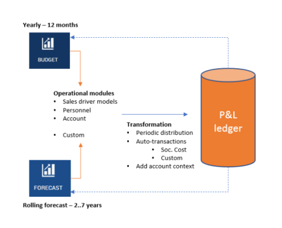

## Abstract, intended audience and pre-requisites
The Profitbase Planner Configuration and Operation series consist of several documents dealing with the configuration and operation of individual Planner modules and functions.
 

## Modules
Planner modules are operational input modules that contributors to the work processes use to prepare the Profit & Loss (P&L) of their respective areas of responsibility. Different modules will typically cover parts of the P&L such as sales, personnel, cost, etc.

 

### List of Modules
- [Account Module](/planner/modules/account)
- [Personnel Module](/planner/modules/personnel)
- [CapEx Module](/planner/workbooks/financial-planning/capex)
- [Loan Module](/planner/workbooks/financial-planning/loan)

**Applies to:**  Planner 5 or later

- [Driver based module](/planner/modules/driver-based)

**Applies to:**  Planner 4.x

- [Sales by GM Module](/planner/modules/sales-gm)
- [Sales Forecast Module](/planner/modules/sales-forecast)

The modules are typically accessed from the:

**Applies to:**  Planner 5 or later

[Plan overview](/planner/workbooks/financial-planning/plan-overview) 

or 

**Applies to:**  Planner 4.x

[Budget](/planner/workbooks/financial-planning/budget) and [Forecast](/planner/workbooks/financial-planning/forecast) summary workbooks

and the input provided by the contributors are transformed into P&L transactions and fed back to the summary workbooks resulting in a P&L work-in-progress report summary.
 

## Audience
The intended audience of this document is Planner end users although some of the documentation refers to aspects relevant to implementation partners configuring the solution initially and solution administrators responsible for operating it thereafter.
 

## Related Pages
-  [Common functionality](/planner/getting-started/common-functionality)
