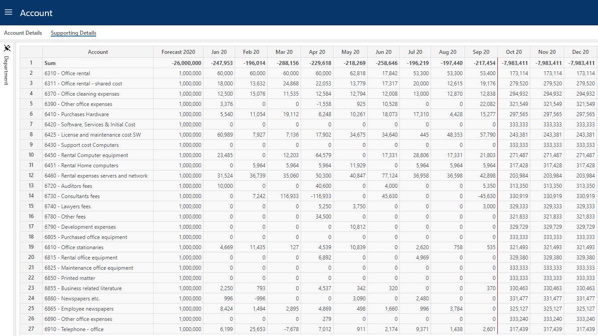

This is the report page of the Account module and displays the transactions produced from the input given. The Account module comes in two versions, one for the Budget process and one for the Forecast process. The examples shown below refer to the Forecast version.
 

## Column Descriptions

- **Account:** 
The account of the transaction produced. In most cases this will correlate to the input account but in some cases additional transactions are produced based on the input, examples being vacation pay, employer tax and so on.

- **Year ("Forecast 2020" in the example):** 
The year total, i.e. the sum of the periodic values for the year in question.

- **Periods ("Jan 20 - Dec 20" in the example):** 
The periodic values. Note that for the forecast process, the current years periods are comprised of actual periods and plan periods. A red vertical line indicates the cut off between actuals and plan.

 

