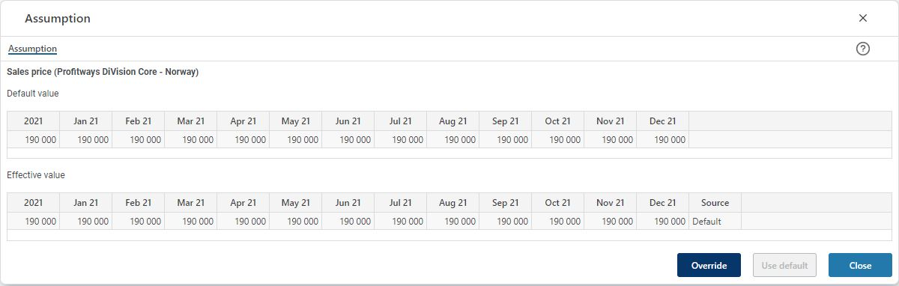

## Overview
Display the assumption values for a measure of that type, i.e. a lookup type of measure, for example a unit price. 
Subject to configuration, you may override the central (default) value and revert to use the central (default) value. 
 

To override a central (default) value, click the "Override" button (availability subject to configuration). 
To revert from an override to a default value, click the "Use default" button.
To close, click "Close".
