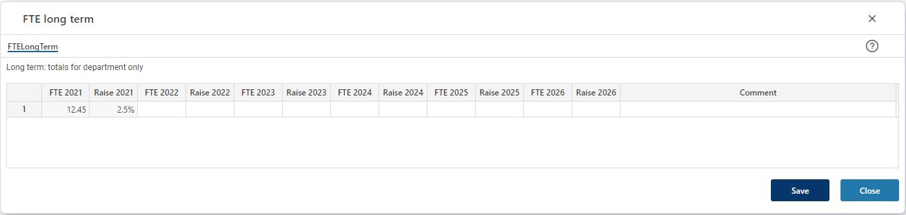

## Overview
For long-term (beyond next year) forecasting, the level of detail is less – input is done for the department as a whole: 
- FTE for given year 
- Expected annual salary raise for given year 
The detailed forecast for next year is used as a basis for scaling the long-term forecast based on the change in FTE and annual salary raise. The periodic distribution for next year is replicated for the long-term forecast. 
 

When changes have been made, click the "Save" button. This will update Personnel details page from which the FTE long term page (this page) was triggered from. 
To discard any changes made or to close the page, click the "Close" button.

## Column Descriptions

- **FTE next year ("2021" in the example):** 
The sum of FTEs planned for next year for the department in question. This is a reference value and not editable in this (long term) view. 

- **Raise next year ("2021" in the example):** 
The average annual raise planned for all employees/employee categories for the department in question. This is a reference value and not editable in this (long term) view.

- **FTE next year plus 1-5 ("2022-2026" in the example):** 
The total FTEs planned for next year plus 1-5 for the department in question (1-5 subject to solution configuration). These are input fields. 

- **Raise next year plus 1-5 ("2022-2026" in the example):** 
The average annual raise planned for the department in question (1-5 subject to solution configuration). These are input fields. 

- **Comment**  
Input field enabling textual comments to be associated with the input for a specific line.

 
