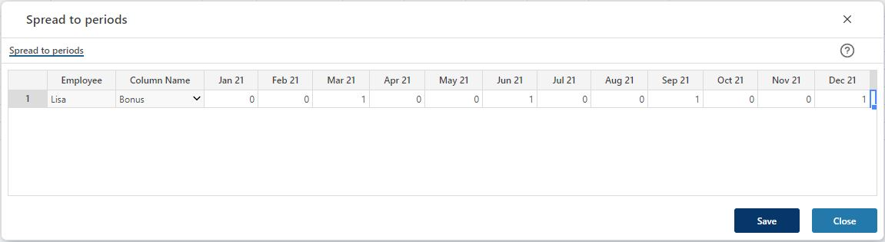

## Overview
This is the page for defining how per-month-per-FTE input values given for an employee/employee category should be spread to periods. The default spread is an even spread, that is the per-month-per-FTE input value is spread to all periods with a value identical to the input value.
 

When changes have been made, click the "Save" button. This will update the Personnel details page from which the spread to periods page (this page) was triggered from. 
To discard any changes made or to close the page, click the "Close" button.

To add a new spread key, hover the mouse over the data area, right-click and select one of the "Insert new row.." options.

In the example, a spread key for Bonus has been added to employee Lisa. The effect of the spread key will be to apply the per-month-per-fte value Bonus value for Lisa given in the Personnel details page quarterly in March, June, September and December.

 

## Column Descriptions

- **Employee:** 
The employee/employee category to apply the spread key to.

- **Column Name:** 
The input column to apply the spread key to.

- **Periods ("Jan 21 - Dec 21" in the example):** 
The numeric spread key values.

 

