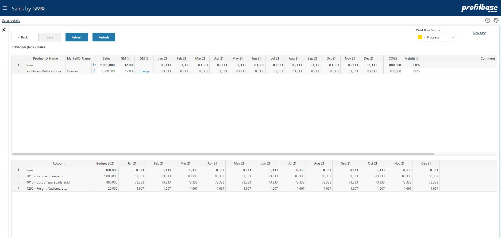

## Overview
This is the the Sales by GM% input module and is where any detailed budgeting of sales per product and market (and possibly other dimensions) takes place. 
 

1. **Back button**  
This button is active when the module is launched from the Budget or Forecast summary workbook. Clicking the Back button will launch the summary workbook in the same browser window. If there are unsaved changes made in the Sales by GM% module, a prompt will appear requesting confirmation.
2. **Periods button**  
The Periods button toggles the input mode between a year-total input and a periodic input. Any year-total input will automatically be distributed to the periods. Input made to periods will automatically be summed to the year-total.
3. **GM% Change icon**  
The GM% column contains a "Change" link that takes you to a pop-up window in which you can override the GM% per period. 
4. **Workflow**  
The workflow enables you to set the state of the plan for the department selected. Setting the state to Finished will by default disable any further input (depends on user's access level).
5. **Account report**  
The account report display the financial effect of the input made and is updated as input data is saved.

 

## Video
[Introduction](https://profitbasedocs.blob.core.windows.net/enduserhelp/videos/SalesGMInput.mp4)

 

## Column Descriptions

- **Product, Market and possibly other dimensions depending on the configuration** 

The main planning dimensions for sales budget related planning are Product and Market. These act as categories for the sales forecast. 

Note that the heading of the individual dimensions may be set individually per model and may thus differ from the example.

Right-click and select one of the "Insert new row.." options to add new rows.

- **Financial report - "$" icon** 

The Financial report icon will trigger the reports for the row clicked. Clicking the icon for the sum row, will trigger the reports for all rows.

- **Sales** 

The year-total sales amount.

- **GM%** 

The average GM% (Gross Margin %). Note that this can either be input as an average value the will be applied to each period. It can also overridden per period by clicking the "Change" link in the GM% column to the right, see immediately below.

- **GM% (containing the "Change" link)** 

Clicking the "Change" link takes you to a pop-up window in which you can override the GM% per period. 

- **Periods (Jan 21 - Dec 21 in this case)** 

The individual periods. 

The Periods button toggles the mode between editing the year-total and the individual periods.

- **Additional input columns depending on configuration (Freight% in the example)**  

Input fields, depending on configuration, for additional income or cost driven by the sales amount. In the example, the Freight% column is a percentual value that will be multiplied to the sales per period and associated with the configured account for Freight.

- **Comment**  

Input field enabling textual comments to be associated with the input for a specific line.

 

## How to`s

 

> [Create new task](/planner/workbooks/process-and-tasks/tasks/create-edit-task) 

