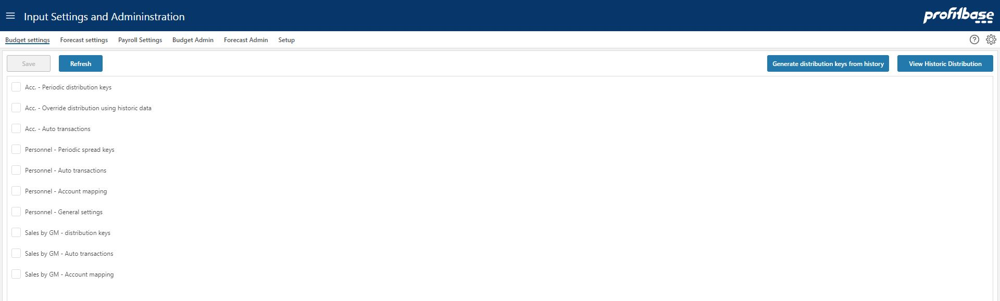

**Applies to:**  Planner 4.x

## Overview
This page contains a collection of central settings for the budget modules Sales by GM, Personnel and Account, such as distribution and spread keys, setup for auto transactions and so on. 
 

Please refer to the relevant module document in the "How to's" section below for details.

## How to`s

 

> [Configure the Account module](https://profitbasedocs.blob.core.windows.net/enduserhelp/files/Planner%20Account%20module.pdf) 
> [Configure the Personnel module](https://profitbasedocs.blob.core.windows.net/enduserhelp/files/Planner%20Personnel%20module.pdf) 
> [Configure the Sales by GM module](https://profitbasedocs.blob.core.windows.net/enduserhelp/files/Planner%20Sales%20By%20GM%20module.pdf) 

