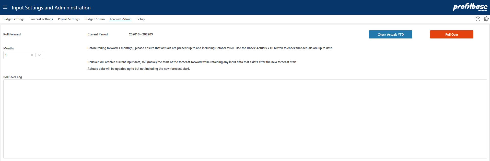

**Applies to:**  Planner 4.x

## Overview
This is the page where the forecast is rolled forward. Rollover will archive current input data, roll (move) the start of the forecast forward while retaining any input data that exists after the new forecast start. 
Actuals will be updated up to but not including the new forecast start. 
 

1. Set the number of months that the forecast should be rolled (moved) forward. 
2. Check that actuals up to the new forecast start is available by clicking the "Check Actuals YTD" button. This will open a pop-up in which actuals data can be viewed. Make necessary checks and close the pop-up. 
3. Click the "Roll Over" button. This will open the "Confirm rollover" pop-up in which the name of the new forecast is set. Input the name and click the "Execute" button. 

The progress of the roll forward process is displayed in the log in the lower part of the page.

## Video
[Roll forward forecast - under construction](#)

 
