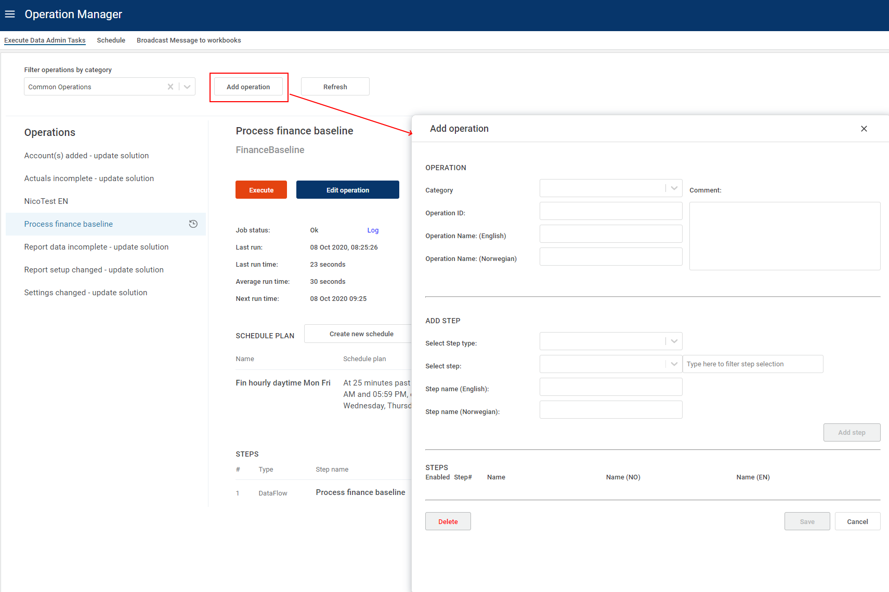
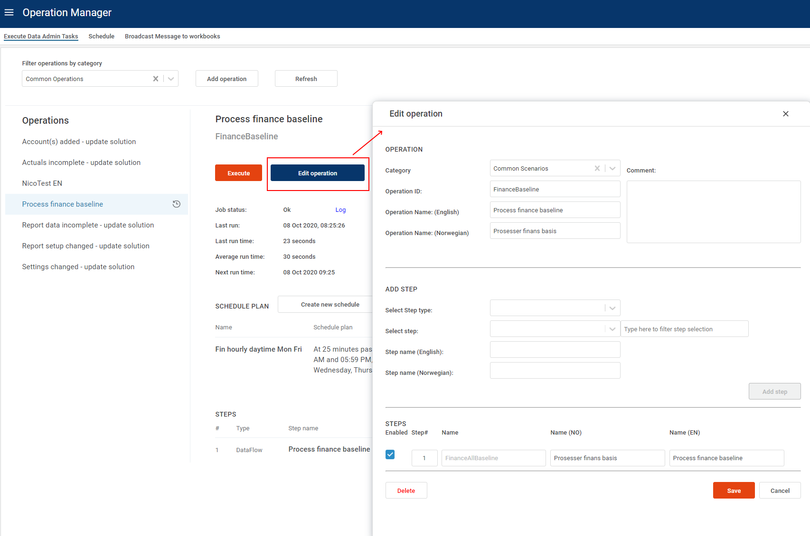
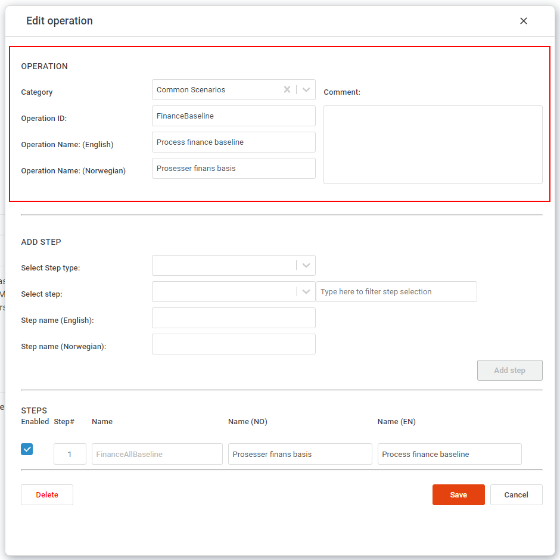
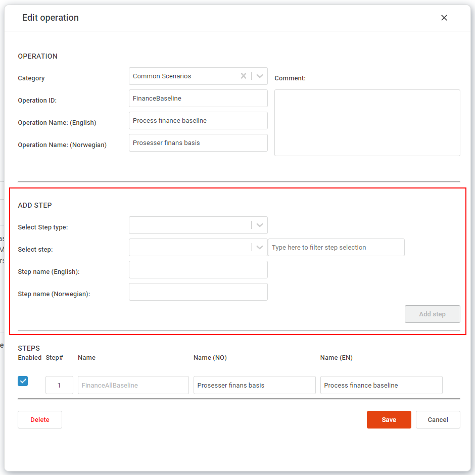
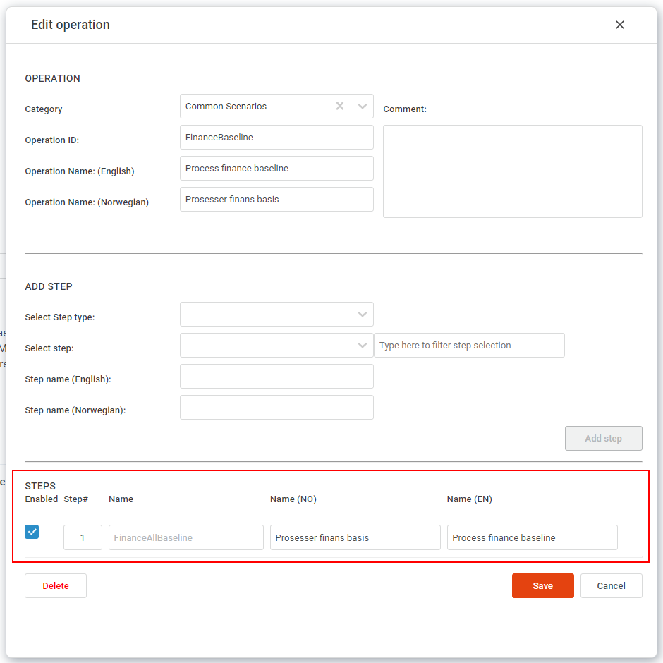
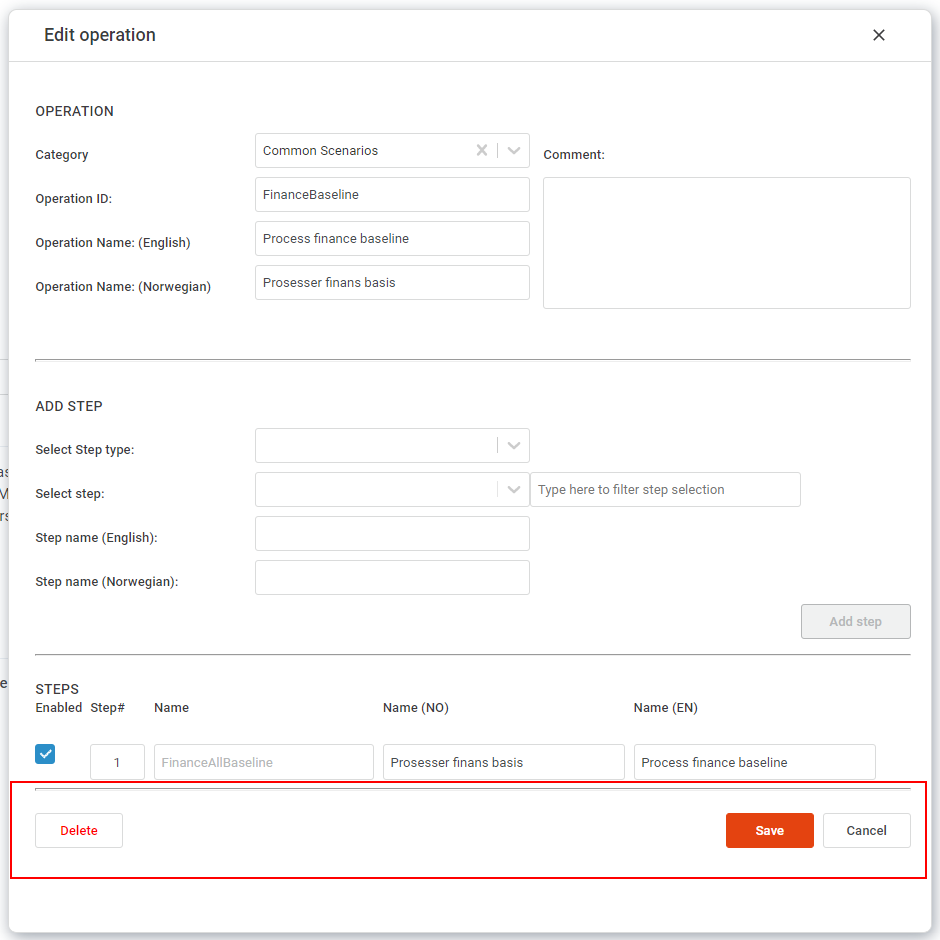

 **Applies to:**  Planner 4.x
 
## Overview

From the [Execute Data Admin Tasks](execute-data-admin-tasks.md) page, you can either add or edit an operation using these buttons:

 

1. **Top section - Operation information** 

- **Category:** Select a category from the list.
- **OperationID:** Unique ID for the operation. Form validation will not allow duplicate names.
- **Operation name (English):** a text field for a user-friendly name in English of the operation.
- **Operation name (Norwegian):** a text field for a user-friendly name in Norwegian of the operation.
- **Comment:** Any additional information to describe what the operation does.

2. **Add Step** 

- **Select Step type:** DataFlow or Script.
- **Select step**: Select the step to add to the operation. This list is filtered by the selected type (Script or DataFlow).
If the list is very long, you can type part of the name in the textbox "Type here to filter step selection" to find it faster.
- **Step name (English)**: A user friendly text for the step, in English.
- **Step name (Norwegian)**: A user friendly text for the step, in Norwegian.
- **Add Step button**: This button becomes active once the necessary data has been provided for the step.

 

3. **Steps**

- **Enabled:** Checkbox to disable or enable the step.
- **Step#:** The ordering of steps.
- **Name:** The name of the step. This is the system defined name of the Script or DataFlow, and cannot be edited from this form.
- **Name (NO)**: The user-friendly name of the operation in Norwegian. Can be updated at any time here.
- **Name (EN)**: The user-friendly name of the operation in English. Can be updated at any time here.

4. **Buttons**

- **Delete:** Deletes the entire operation. A warning will pop up asking for confirmation. There is no "undo".
- **Save:** Saves the operation (add or update).
- **Cancel:** Disregard all changes and close the popup.

