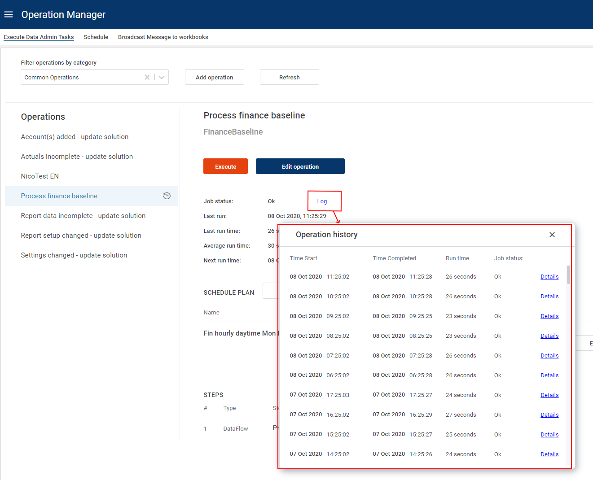
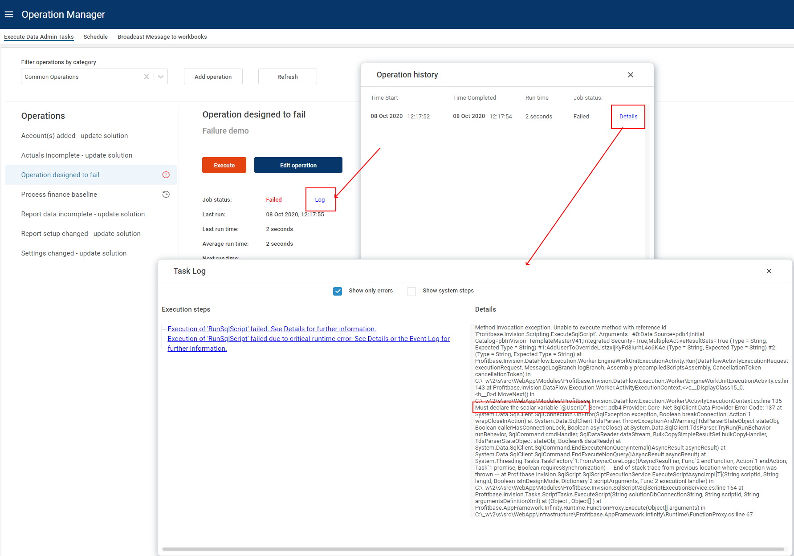

 **Applies to:**  Planner 4.x
 
## Overview

The execution history of an operation can be found here:

This displays the start and end time for every execution.
**Job status** indicates whether it succeeded or failed.

The **Details** link opens a more detailed execution log for the operation execution.
This is especially useful when the job has failed, and you want to see the system error message.

Example of failed operation:

Let's open the log and find the detailed error information:

Open the "Details" link in the log:

A system administrator can find out why the operation has failed using the log.
In this example, the error was a missing parameter that was not provided to the script.
